# The NEMO Dots Assembly: Single-Particle Tracking and Analysis

This example shows how to:
- detect and track particles (SPT) 
- calculate motion statistics (MDT) and
- use the statistics to test a hypothesis

It will recreate the analysis described in the article [The NEMO Dots Assembly: Single-Particle Tracking and Analysis](https://doi.org/10.1007/978-3-030-22386-1_4) (Tinevez, Jean-Yves & Herbert, Sébastien, 2020) using GA3. 

Original data referenced in the paper can be obtained [here](https://zenodo.org/record/1341987#.YFmlw69Kg-U). There are multiple datasets, in our example we will use the Cell_02.tif file in the NEMO-IL1 folder. When using the original data, the time interval and calibration must be set to get correct results. Time interval is 0.5s and the pixel calibration is 0.16 µm/px.

We converted the original dataset into ND2 and edited all necessary metadata. The analysis recipe and source ND2 file can be downloaded from this repository:
- [GA3_NEMO_Dots_Assembly_example.ga3](GA3_NEMO_Dots_Assembly_example.ga3)[^1]
- [GA3_NEMO_Dots_Assembly_example.nd2](GA3_NEMO_Dots_Assembly_example.nd2)[^2]

#### The source image data:

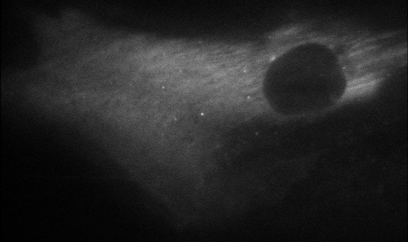
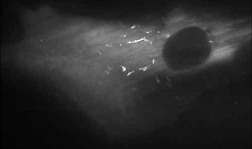

#### Complete recipe:

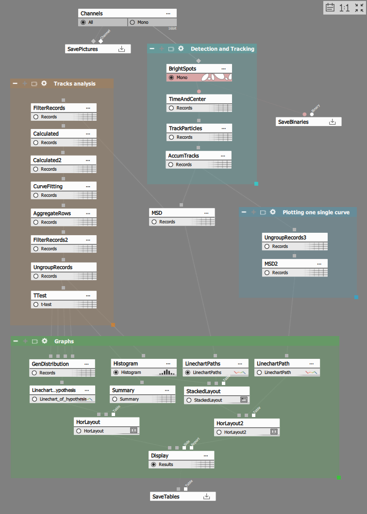

## Detecting and tracking particles

### 1. Spot detection

Particles are perfect use-case for spot detction:

1) Set the typical object diameter and
2) filter the objects using contrast

Optionally, filter them using absolute intensity value if appropriate. 

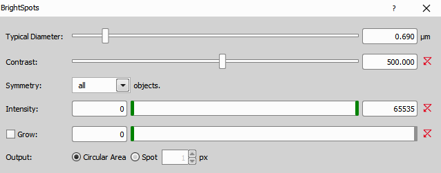

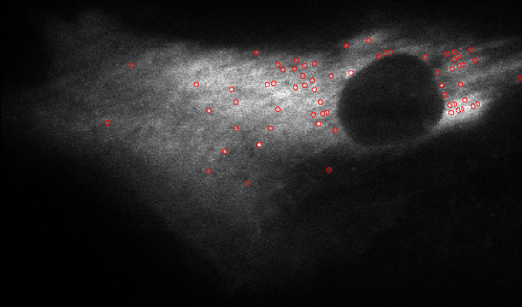

### 2. Measure Time&Center

In order to track particles we need its position and time to provide it to tracking algorithm.

### 3. Particle tracking and AccumTracks

Particle tracking predicts posiotion of an object based on iys previous positions. The algorithm uses only center of mass and time of every object.

Particle tracking connects to input table with time, position X, position Y (ev. position Z) for each object and outps a table with TrackId column added. 

1) select/verify the columns with input data,
2) select the motion model,
3) play with stdev mult. factor, maximum speed/distance and close gap.

- **Motion model** can be set to random - where the predicted postion in the current frame is the same is in previous frame - and constant speed - where current position is predicted from the last position using the average velocity vector of each object so far.
- **The Stdev mult. factor** is how much the particle real position can vary from the predicted position in terms of times of stdev so far.
- **Maximum speed and distance** are bound together and define how dar can a particle travel between frames.
- **Close gaps up to** is the number of gaps where the particle can be missing.

Lower number means more restricting setting leading to braking of traks. On the other hand increasing the numbers leads to more erratic motion.
There is a sweet spot combination.

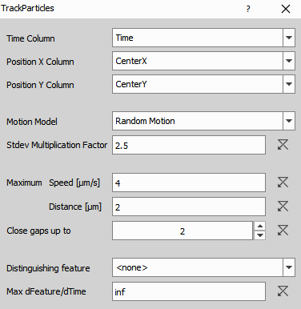

In order to see the tracks over the image, the AccumTrack node must be inserted and track must be visualized in records table.

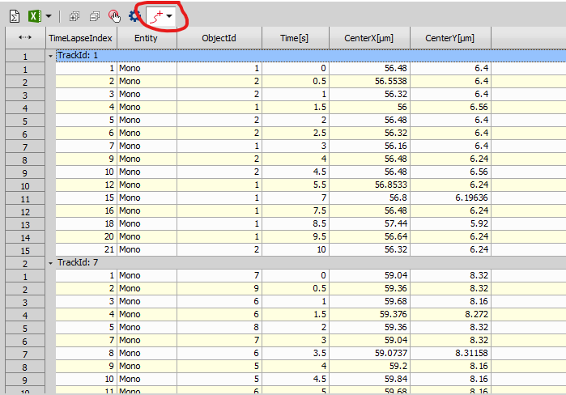

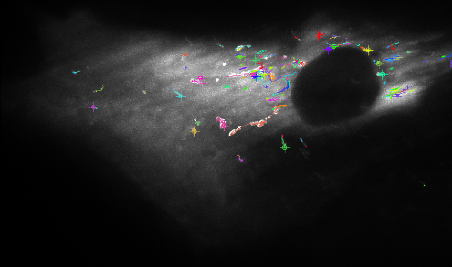

## Calculate Mean Squared Displacement (MSD)

We calculate [MSD](https://en.wikipedia.org/wiki/Mean_squared_displacement) for each track (MSD node) and for all tracks combined (MSD2 node) and show them in graph.

The MSD node takes Accumulated tracking results as an input and outputs a MSD table where each row is a displacement of i-th frame from the first.
The node (as many other statistics node) respects grouped table by calculating the statistics per group.

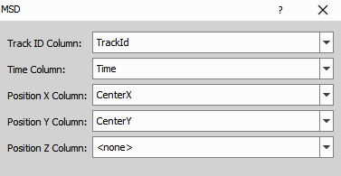

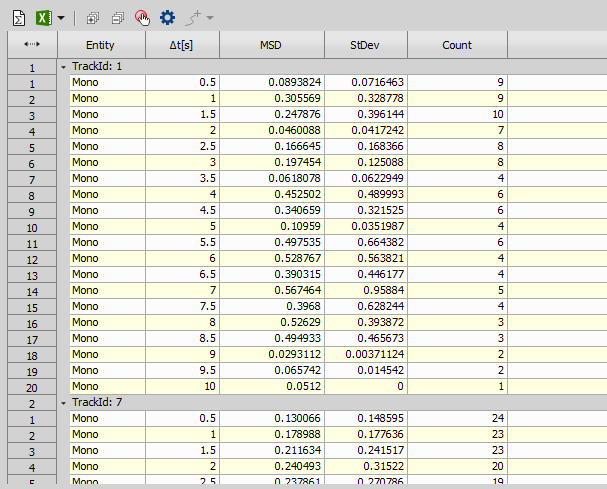

LineCharts of MSD per track and average for all tracks.

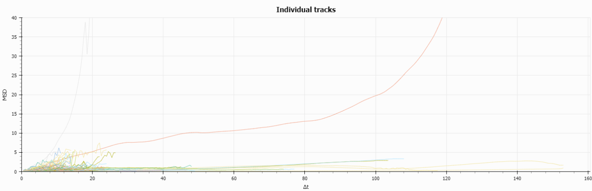

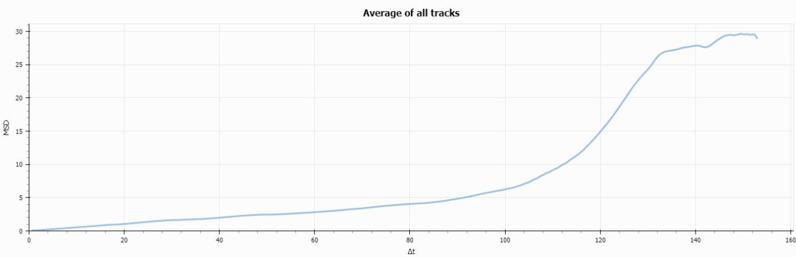

## MSD analysis

We will calculate the mean log-log slope of the MSD curve on the first 10 intervals (5secs) as they have large number of observations.

1) keep only oews where: $\Delta{t} \leq 5$ 

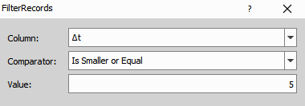

2) calculate $log(\Delta{t})$ and $log(MSD)$

")
")

3) do linear fit of $log(\Delta{t})$ vs $log(MSD)$ for each track

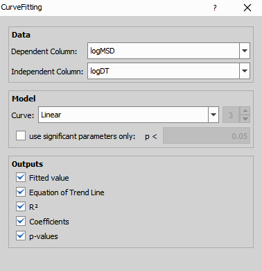

4) filter fits to include only fits with $R^2 \geq 0.5$

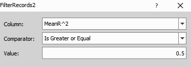

5) show histogram of slopes $a_1$ with $\mu = 0.615$ and $\sigma=0.3293$

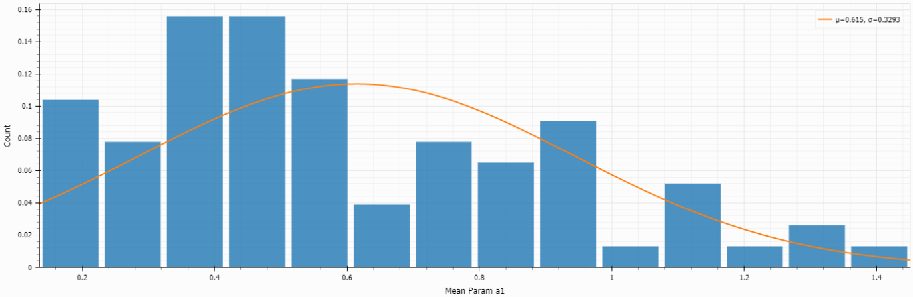

## Hypothesis testing: t-test

We can test a null hypothesis that particles are *freely diffusing* at confidence level 0.9, that is:
> H0: Mean slope $a_1 = 1$

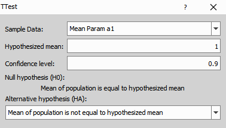

From the resulting t-test we can *reject* the null hypothesis H) at confidence level 0.9.

## Final results presentation

Many tables and graphs can be grouped into layouts and displayed as needed.

In this example we 

1. used summary table to transpose the t-test results,
2. put the t-test summary side by side with the t-test graph in left part of the display,
3. put histogram and MSD lines into stack layout together with averaged MSD line

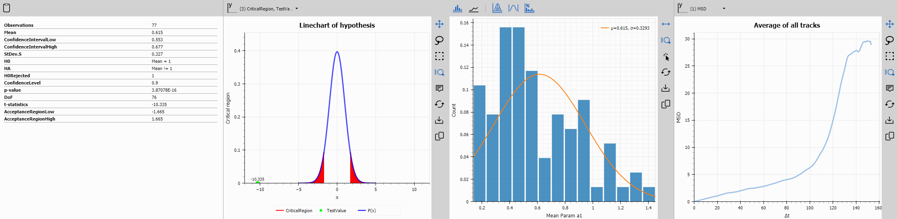

[^1]: Laboratory Imaging
[^2]: Tinevez, J.-Y., Laplantine, E., & Tarantino, N. (2018). Tracking-NEMO-movies_subset. In Journal of Cell Biology (Vol. 204, pp. 2231–245). Zenodo. https://doi.org/10.5281/zenodo.1341987

