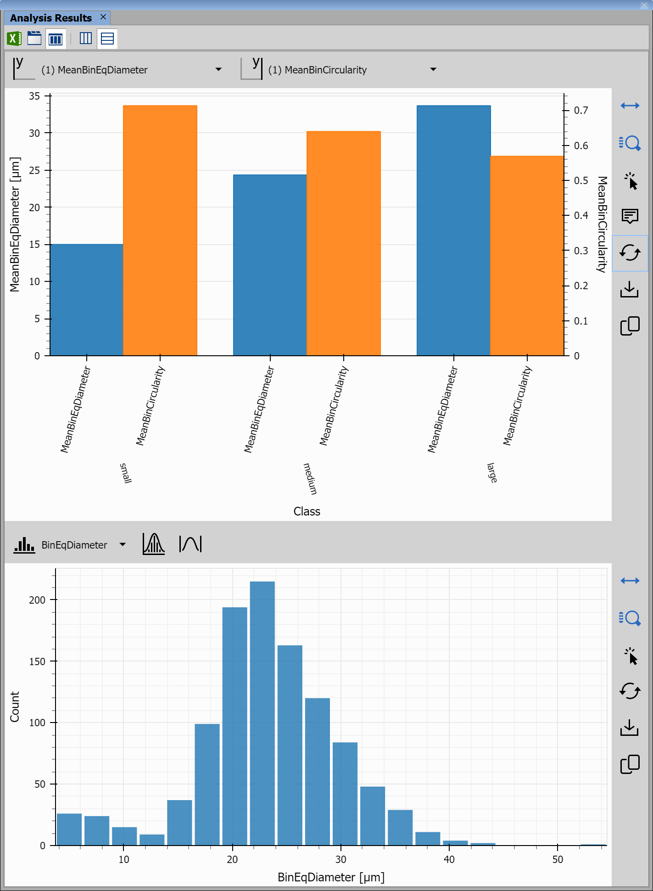
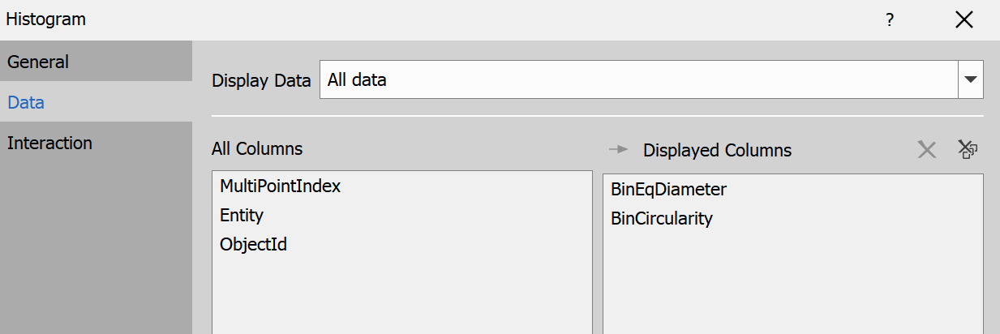

# Analysis of cell size

This example shows how to:

- Detect cells in an image and determine their size
- Bin cells into groups based on their size
- Plot results using bar charts and histograms

## Input files

Original ND2 image and analysis recipe can be downloaded from this repository:

- ND2 file [[View on GitHub](./GA3_Cell_Size_Analysis_example.nd2)] [[Download file](https://laboratory-imaging.github.io/GA3-examples/NIS_v6.10/10-Cell_Size_Analysis/GA3_Cell_Size_Analysis_example.nd2)]

- GA3 file [[View on GitHub](./GA3_Cell_Size_Analysis_example.ga3)] [[Download file](https://laboratory-imaging.github.io/GA3-examples/NIS_v6.10/10-Cell_Size_Analysis/GA3_Cell_Size_Analysis_example.ga3)]

### The source image data

The original image shows a collection of white cells on a black background:

### Complete recipe

The GA3 recipe used in this analysis is also available as an interactive HTML file [[View on GitHub](./recipe.html)] [[View Online](https://laboratory-imaging.github.io/GA3-examples/NIS_v6.10/10-Cell_Size_Analysis/recipe.html)]

## Result

This analysis will detect and highlight cells as shown here:

We will use the sizes of the cells to plot the following bar chart and histogram:

## Analysis

We will split the analysis into 4 steps:

1) [Segment cells and determine their size and circularity](#1-segment-cells-and-determine-their-size-and-circularity)
2) [Plot histogram of sizes](#2-plot-histogram-of-sizes)
3) [Bin cells based on size, plot frequencies](#3-bin-cells-based-on-size-plot-frequencies)
4) [Bin cells based on size, plot relation between size and circularity](#4-bin-cells-based-on-size-plot-relation-between-size-and-circularity)

### 1. Segment cells and determine their size and circularity

In the first step of the analysis we will segment the cells using the Threshold node and get properties of each cell using the ObjectMeas node.

**Threshold** node will select parts of the image above a specified brightness, it will also smooth those parts, remove small cells from the binary and separate cells when needed, this is done using the following settings:

This will highlight and segment cells like this:

**ObjectMeas** node is then used to get the diameter and circularity for each cell, those are the settings for this node:

And this is the table with calculated columns for diameter and circularity:

### 2. Plot histogram of sizes

**Histogram** node will be used to complete step 2, we will simply connect this node to the result of step 1 and select the calculated diameter and circularity attributes as display columns like this:

We will get 2 histograms, you can switch between them in the upper left corner in the Analysis Results window, this is the histogram for diameter attribute:

As we can see from the diagram, the mode is found at around 20-24 µm, but there is also a cell with a diameter over 50 µm, overall data mostly follows a normal distribution.

This is the plot for circularity attribute:

Here we can see most cells have a circularity between 0.5 - 0.8.

### 3. Bin cells based on size, plot frequencies

**FrequencyTable** node will bin together cells of similar size AND immediately count the cells for each bin, those are the settings for this node:

And this is the result:

**Barchart2** node will simply present this table as a bar chart, those are the settings for this node:

And this is the generated bar chart:

### 4. Bin cells based on size, plot relation between size and circularity

At last we will bin cells based on size similar to step 3, but without summarizing frequencies, for each binned size we will get the average circularity and we will plot the results on another bar chart to see the relation between size and circularity.

**Binning** node will be used to bin cells with similar size, the binning will be stored as a new attribute called *Class*, these are the settings for this node:

And this is the result table, we can see the new attribute *Class* with categorical attribute for size, attribute *Order* was also added in this node for later sorting, as categorical strings like "small", "medium" and "large" do not store which is bigger.

**ReduceRecords** node will use this categorical variable to calculate average size and circularity for each group using following settings:

**SortRecords** node will simply sort records on *Order* column, which was added during binning, this is the result table after this node:

**Barchart** node will be once again used to plot a bar chart, this time it will be used to plot data grouped by size category. These are the settings for this node, it is important to select correct nesting order to show grouped data correctly:

And this is the result:

In this image we can see that with growing diameter, the circularity is decreasing, in other words the larger the cell, the more irregular it's shape.

## Conclusion

In this analysis we have segmented cells, found their size and circularity and created several graphs to visualize cell size and the relationship between the size of a cell and its circularity.
