# Inside and border of cells

This example shows how to:

- Detect cells in an image, create inner circle and outer ring
- Calculate intensity for both the circle and the ring of each cell
- Calculate circle/ring intensity ratio for each cell and for all cells

## Input files

Original ND2 image and analysis recipe can be downloaded from this repository:

- ND2 file [[View on GitHub](./GA3_Inside_and_border_of_cell_example.nd2)] [[Download file](https://laboratory-imaging.github.io/GA3-examples/NIS_v6.10/11-Circle_Ring_Ratio/GA3_Inside_and_border_of_cell_example.nd2)]

- GA3 file [[View on GitHub](./GA3_Inside_and_border_of_cell_example.ga3)] [[Download file](https://laboratory-imaging.github.io/GA3-examples/NIS_v6.10/11-Circle_Ring_Ratio/GA3_Inside_and_border_of_cell_example.ga3)]

### The source image data

Original image shows a collection of cells, there are also image layers for showcasing cell bodies and cell nuclei, which we will use in the analysis, this is the combination of all input layers:

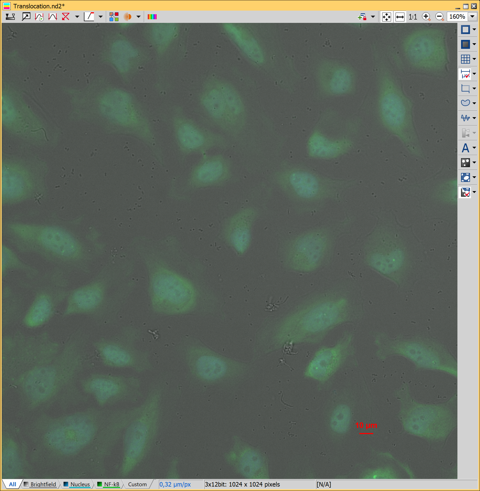

### Complete recipe

The GA3 recipe used in this analysis is also available as an interactive HTML file [[View on GitHub](./recipe.html)] [[View Online](https://laboratory-imaging.github.io/GA3-examples/NIS_v6.10/11-Circle_Ring_Ratio/recipe.html)]

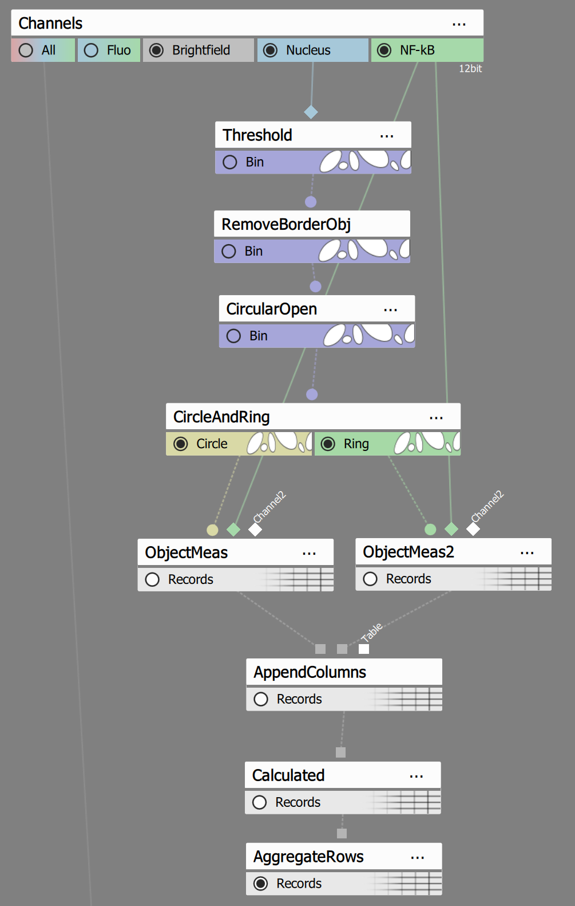

## Result

This analysis will detect those cells and draw inner circles and outer rings like this:

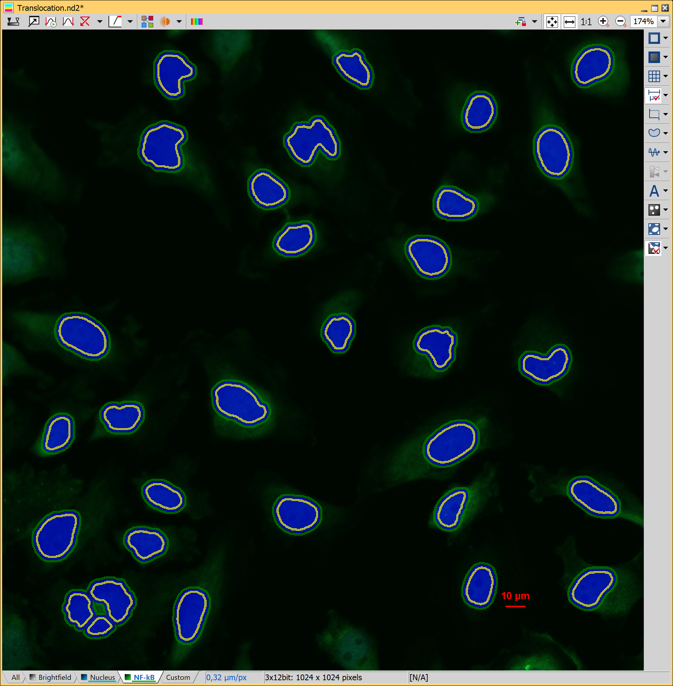

We will use those to calculate NF-kB intensities in each circle and ring and calculate circle/ring ratio for each cell:

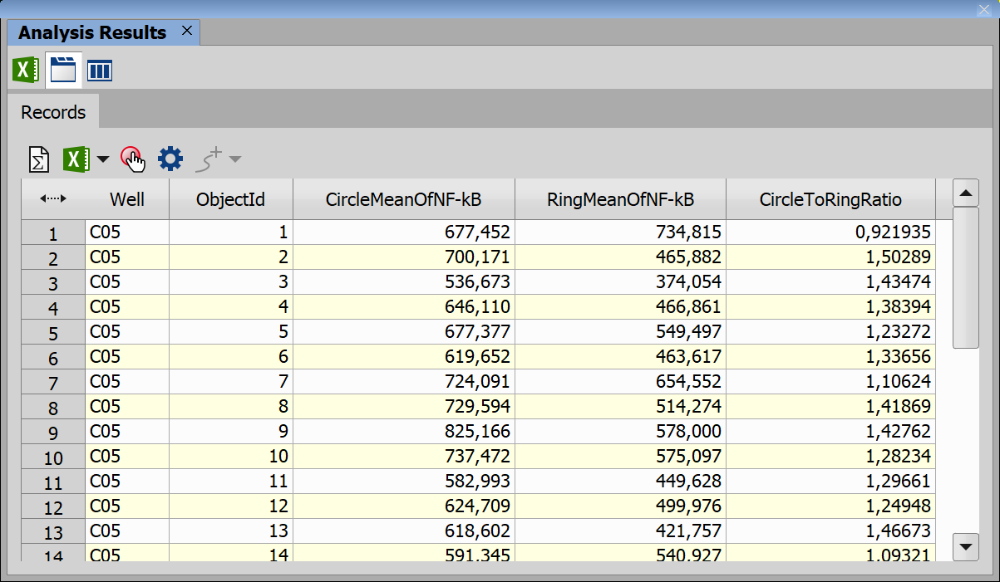

## Analysis

We will split the analysis into 3 steps:

1) [Find cells, their circles and rings](#1-find-cells-their-circles-and-rings)
2) [Calculate average intensity in each circle and ring](#2-calculate-average-intensity-in-each-circle-and-ring)
3) [Calculate circle to ring ratio for each cell and for all cells](#3-calculate-circle-to-ring-ratio-for-each-cell-and-for-all-cells)

### 1. Find cells, their circles and rings

We will use following nodes to find cells and their rings and circles:

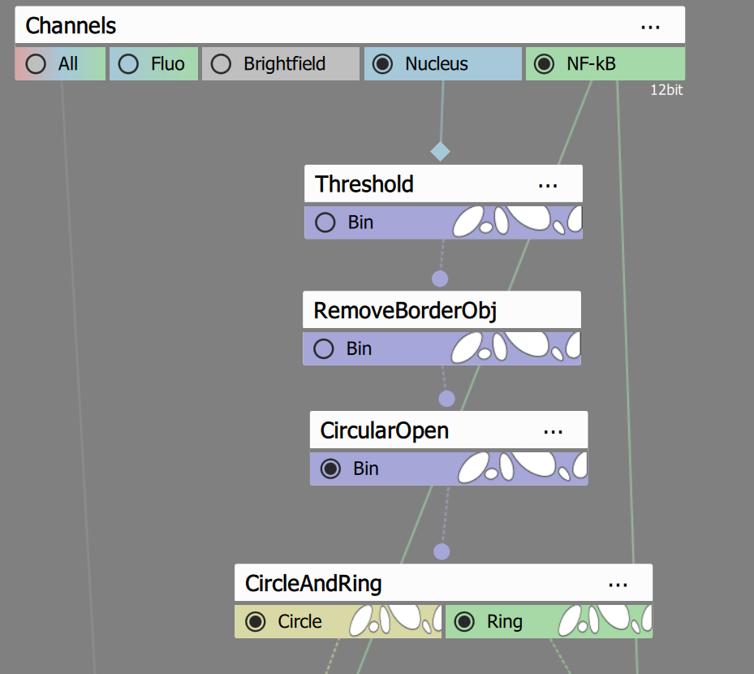

**Threshold** node will select areas with brightness above some set threshold, we will also smooth the found areas, delete those that are too small and separate neighboring ones by setting this node to following settings:

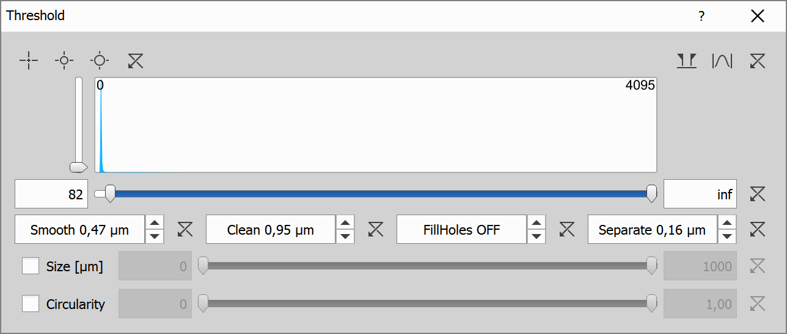

This node will highlight cells as shown in the image here:

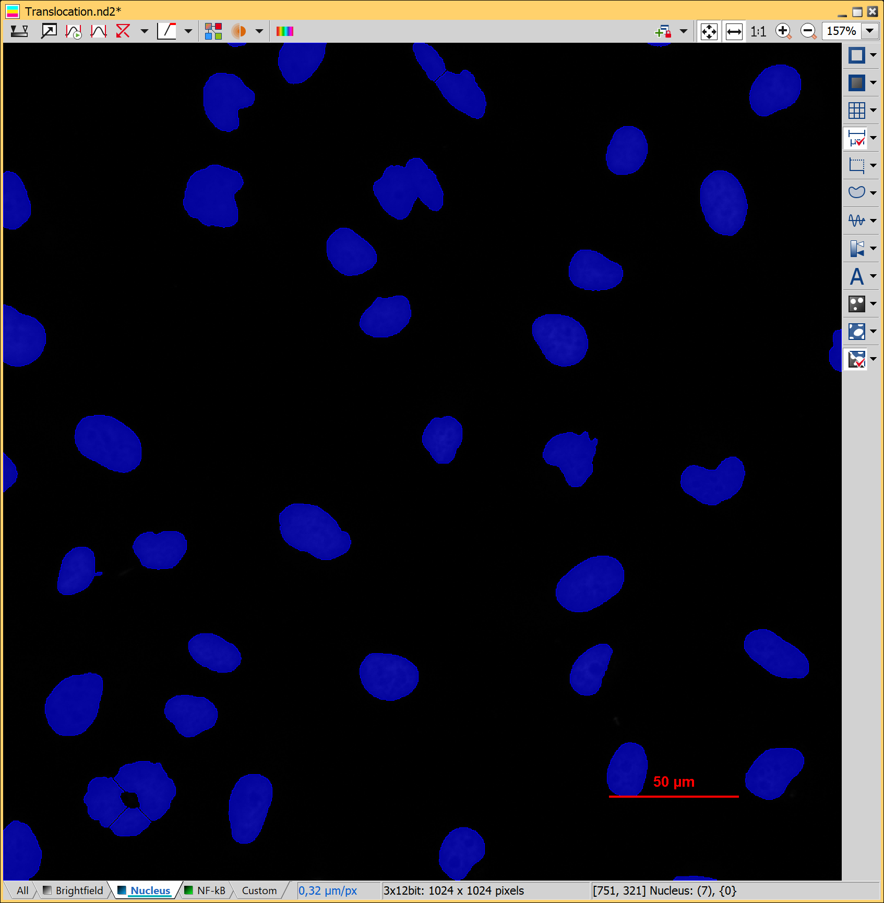

**RemoveBorderObj** node simply removes objects touching the edges of the image, we only want whole cells.

**CircularOpen** node will smooth out edges of cells to remove imperfections, the radius in the settings of this node is set to 5px.

**CircleAndRing** node will create circles inside the cell near the edge and a ring outside of the cell, this node has following settings:

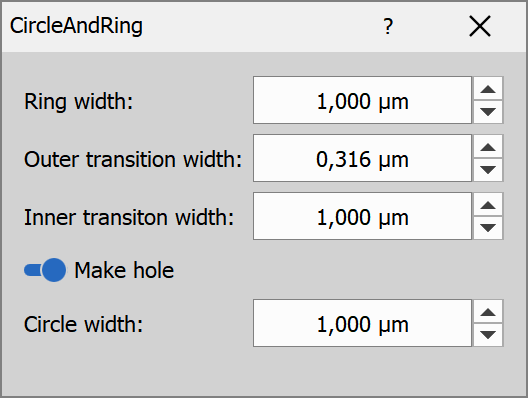

After this node we can see cells with inner circles and outer rings highlighted:


### 2. Calculate average intensity in each circle and ring

**ObjectMeas** node calculates average intensity of NF-kB layer in each inner circle, it has following settings:

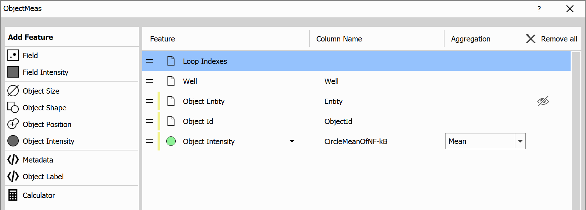

**ObjectMeas2** node does the same thing is previous node, but for the ring instead of a circle.

**AppendColumns** just joins tables from previous 2 nodes into a new table, this is the result table, as we can see it contains information about average intensity for both inner circle and outer ring.

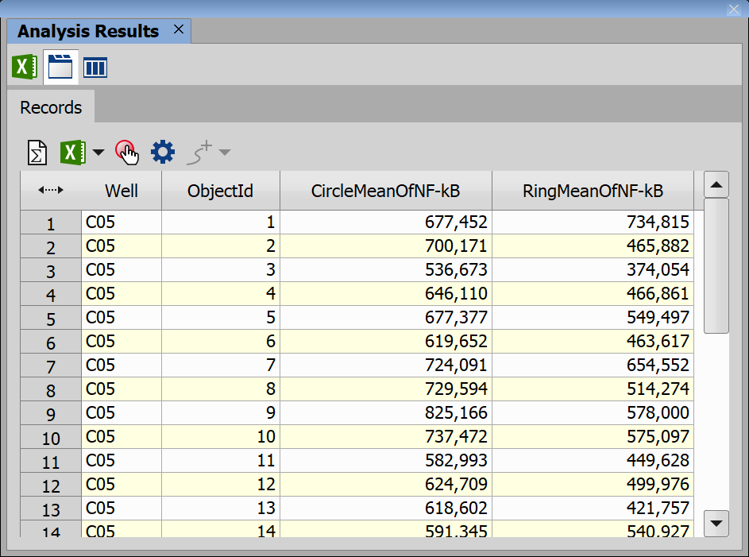

### 3. Calculate circle to ring ratio for each cell and for all cells

**Calculated** node will add a new column into a table and calculate it's value for each row, in this case we calculate ratio of circle / ring intensity, it uses following settings:

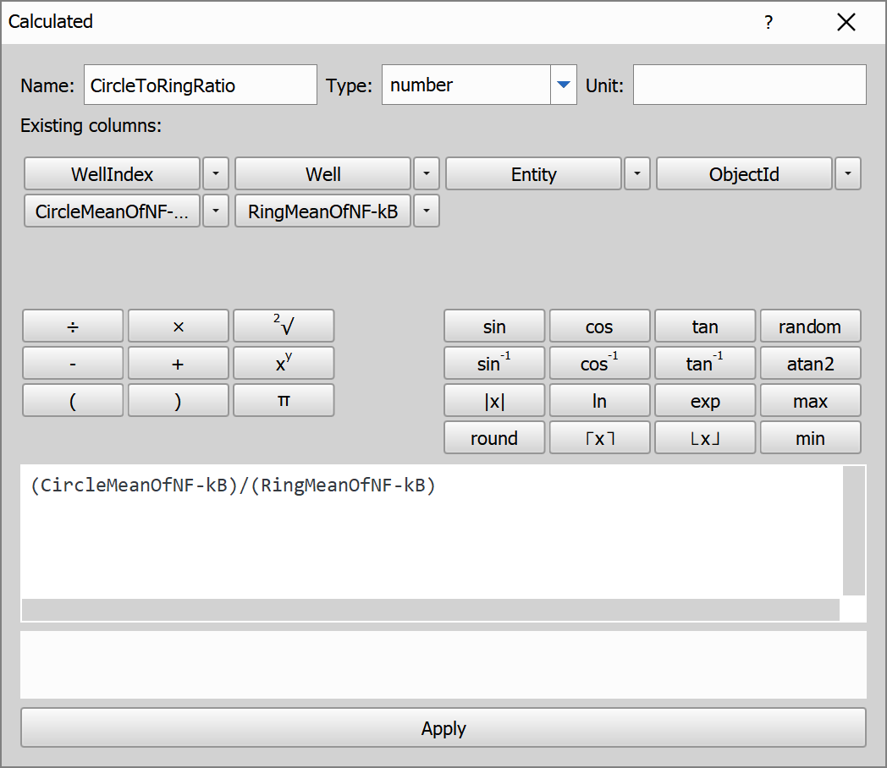

And here is the formula that is being calculated, we just divide intensities:

```js
(CircleMeanOfNF-kB)/(RingMeanOfNF-kB)
```

The result of this node is a table where for each cell, there is calculated circle to ring ratio:


**AggregateRows** node will then simply create a summary for all cells, here are the settings of this node:

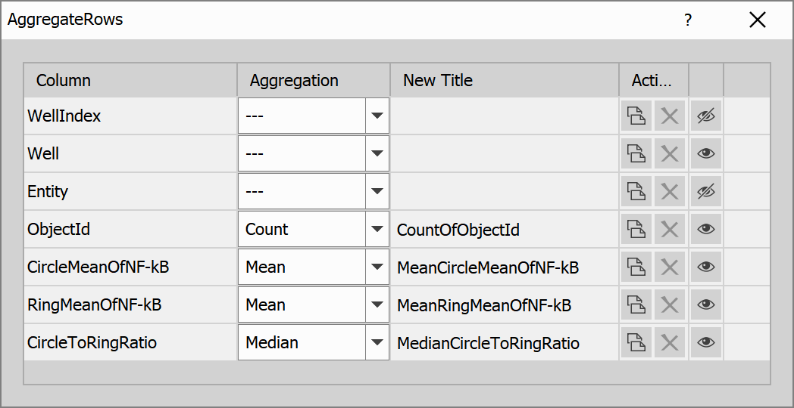

And these are the results:

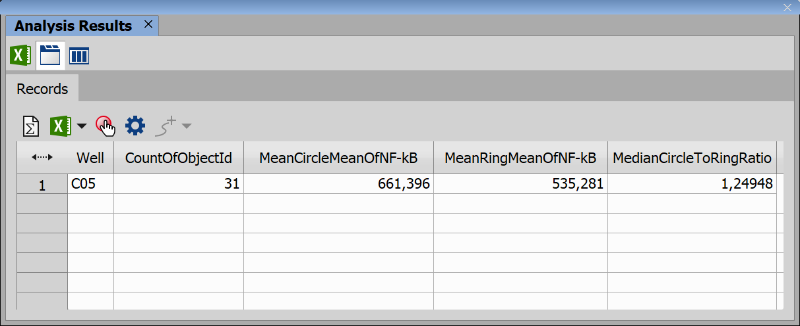

From this table we can see that the average circle to ring ratio in segmented 31 cells is almost 1.25, inner circle is thus 25% more intense in NF-kB layer then ring around a cell.

## Conclusion

In this analysis we have segmented cells and found their inner circles and outer rings, we calculated their intensity and found circle / ring ratio for each cell and for all cells in the image.
