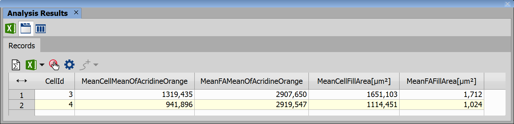

# Child-Parent relation

This example shows how to:

- Find cells and Focal Adhesions in an image
- Calculate features and statistics on Focal Adhesions in relation with their parent cell

## Input files

Original ND2 image and analysis recipe can be downloaded from this repository:

- ND2 file [[View on GitHub](./GA3_Child_Parent_Relation.nd2)] [[Download file](https://laboratory-imaging.github.io/GA3-examples/NIS_v6.10/12-Child_Parent_Relation/GA3_Child_Parent_Relation.nd2)]

- GA3 file [[View on GitHub](./GA3_Child_Parent_Relation.ga3)] [[Download file](https://laboratory-imaging.github.io/GA3-examples/NIS_v6.10/12-Child_Parent_Relation/GA3_Child_Parent_Relation.ga3)]

### The source image data

Original image shows a total of 5 cells, 2 of those cells in the third quadrant of the image also contain Focal Adhesions (FA) that are visible as light green spots.

### Complete recipe

The GA3 recipe used in this analysis is also available as an interactive HTML file [[View on GitHub](./recipe.html)] [[View Online](https://laboratory-imaging.github.io/GA3-examples/NIS_v6.10/12-Child_Parent_Relation/recipe.html)]

## Result

This analysis will detect those cells and FAs as visible here:

We will use those segmented features to measure the average intensity of AcridineOrange for FAs using both Children and Parent node:

## Analysis

We will split the analysis into 3 steps:

1) [Find cells and their FAs](#1-find-cells-and-their-fas)
2) [Find average FA intensity averaging each child](#2-find-average-fa-intensity-averaging-each-child)
3) [Find average FA intensity for each parent](#3-find-average-fa-intensity-for-each-parent)

### 1. Find cells and their FAs

Following nodes will be used to find cells and theirs FAs:

**Smooth** node will smooth AcridineOrange channel, those are the settings for this node:

**Threshold** node will then segments all FAs, as FAs are very bright, we can see that the range (**2043 - inf**) is relatively small, these are the settings for this node:

**Threshold2** node highlights whole cells and such, the range is much wider than it was in previous node highlighting just bright FAs, this node highlights pixels with threshold picked at 149, smoothing and cleaning is also done in this node, these are the settings for this node:

After this step, in the image we can see highlighted cells and their FAs as shown in the results section:

### 2. Find average FA intensity averaging each child

In this step we will find average intensity for each FA and then group FAs based on the cell they are in, this will be done using Children node and ReduceRecords node.

**Parent** node will measure parent and children and create a record for each child, in this case the cells are the parents and the FAs are the children, we are interested in the average intensity and the fill area of both, those are the settings for this node:

And this is the result, we can see that for each FA we have calculated its intensity and area, as well as the id of the cell it belongs to and intensity and area of the parent cell.

**ReduceRecords** node will group up the FAs based on the parent cell and calculate average FA intensity and size, those are the settings for this node:

And those are the results, we can only see 2 records, because even though there are 5 cells in the original image, only 2 of them contain FAs:

### 3. Find average FA intensity for each parent

We can get similar results with just one node using just one parent node which summarizes children for each parent (cell) directly.

**Parent** node will pair up parent with its children just like a child node, but it will create a record for each parent instead of each child, we will also get average intensity and area for both cell and its FAs, those are the settings for this node:

And these are the results of this node:

Let's display results of those 2 approaches side by side to showcase what are the differences in the results:

In this comparison we can see that the second approach calculates results for all cells, even if they do not contain a child, first approach omits those cells.

The values corresponding to the same cells are the same with the exception of a column calculating average intensity of FAs in a cell, this difference is caused by how each approach calculated the value, in the first approach we first calculated average intensity for each FA and then averaged those averages for each cell, in the second approach we average all the pixels of all FAs in the cell directly.

## Conclusion

In this example we have found cells and their FAs, calculated intensities and sizes for both, using two approaches, described their similarities and explained their differences.
