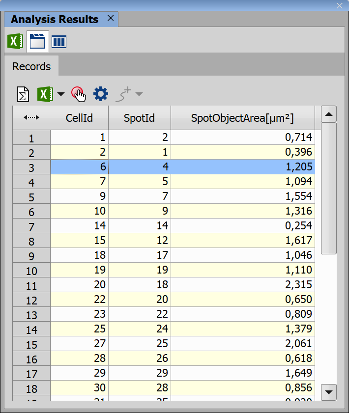
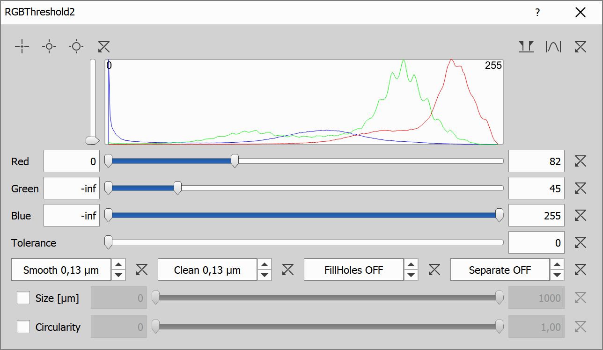

# Children node

This example shows how to:

- Find cells in an image and spots inside them
- Select biggest spot in each cell, if a cell has one

## Input files

Original ND2 image and analysis recipe can be downloaded from this repository:

- ND2 file [[View on GitHub](./GA3_Children_node_example.nd2)] [[Download file](https://laboratory-imaging.github.io/GA3-examples/NIS_v6.10/13-Children_Node/GA3_Children_node_example.nd2)]

- GA3 file [[View on GitHub](./GA3_Children_node_example.ga3)] [[Download file](https://laboratory-imaging.github.io/GA3-examples/NIS_v6.10/13-Children_Node/GA3_Children_node_example.ga3)]

### The source image data

Original image shows cells under a microscope, in some cells you can also see dark black spots, sometimes several ones in one cell.

### Complete recipe

The GA3 recipe used in this analysis is also available as an interactive HTML file [[View on GitHub](./recipe.html)] [[View Online](https://laboratory-imaging.github.io/GA3-examples/NIS_v6.10/13-Children_Node/recipe.html)]

## Result

This analysis will detect cells and their spots like shown here:

We will also find the biggest spot in each cell and show the size in a table:

## Analysis

In the analysis we will first find cells, then their spots, we will use found data to find the biggest spot and show results in a table.

**RGBThreshold** node will segments the cells in the picture using different threshold for each color in the picture, this node will also perform smoothing of the final binary, clean up small objects and separate cells if needed, those are the settings for this node:

**RGBThreshold2** will use the same node, but with different thresholds to segment spots in the image as well, those are the results for this node:

At this point we will see the image with highlighted cells and spots in them:

**Children** node will be used to pair up each child (spot) with its parent (cell), we will also get the size of each spot to later determine which spot in a cell is the largest, those are the settings for this node:

This is the result table produced by this node, in this image we can see that cell with id 6 has 2 spots inside them, next steps will focus on finding the biggest one:

**GroupRecords** node will simply group together rows based on some common attribute, in this case we group spots that are inside the same cell (that have same CellId), this is the final result of this node, once again we can see spots with id's 3 and 4 together in cell 6:

**SelectTop** node will be used to find and select the biggest spot in each cell, those are the settings for this node:

**UngroupRecords** node will simply ungroup the data back to a normal table, as we have reduced the number of spots in each cell to 1 (we picked the biggest spot), this is the result of this node:

Here we can see that for cell id 6 we have selected a spot with id 4 with size 1.205, which is bigger than the spot with id 3, which was only 1.126.

## Conclusion

In this example we have found cells and spots in them and we found the biggest spot in each cell and disregarded the rest.
