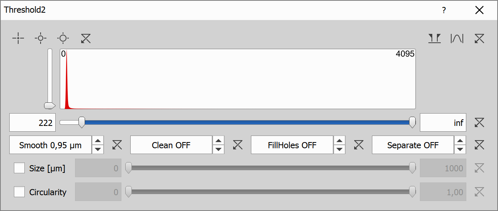

# Cell-Nucleus pairing

This example shows how to:

- Detect nuclei
- Detect cell layer
- Split cell layer based on nuclei proximity
- Pair up cell bodies with corresponding nuclei

## Input files

Original ND2 image and analysis recipe can be downloaded from this repository:

- ND2 file [[View on GitHub](./GA3_Cell_Detection_example.nd2)] [[Download file](https://laboratory-imaging.github.io/GA3-examples/NIS_v6.10/14-Cell_Nucleus_Pairing/GA3_Cell_Detection_example.nd2)]

- GA3 file [[View on GitHub](./GA3_Cell_Detection_example.ga3)] [[Download file](https://laboratory-imaging.github.io/GA3-examples/NIS_v6.10/14-Cell_Nucleus_Pairing/GA3_Cell_Detection_example.ga3)]

### The source image data

Original image shows cells in lime with respective nuclei in blue, image also already contains nucleus and cell layers that we will use in the analysis.

### Complete recipe

The GA3 recipe used in this analysis is also available as an interactive HTML file [[View on GitHub](./recipe.html)] [[View Online](https://laboratory-imaging.github.io/GA3-examples/NIS_v6.10/14-Cell_Nucleus_Pairing/recipe.html)]

## Result

This analysis will detect those cells and nuclei in them:

## Analysis

We will split the analysis into 3 steps:

1) [Find cell nuclei and their surroundings](#1-find-cell-nuclei-and-their-surroundings)
2) [Find layer of cell bodies, split it based on proximity to nuclei](#2-find-layer-of-cell-bodies-split-it-based-on-proximity-to-nuclei)
3) [Make cell - nucleus pairs](#3-make-cell---nucleus-pairs)

### 1. Find cell nuclei and their surroundings

In this step we will find the nuclei of all cells and split the whole image using watershed transformation.

**Threshold** node will select pixels brighter than specified threshold, in this analysis we will select pixels brighter than 403 in the nucleus layer essentially finding the nuclei of the cells, we will use smoothing, cleaning and separation, the settings for this node are:

After this operation we can see highlighted nuclei in the image:

**BrightSpots** node is an alternative way to find nuclei what we could use instead of Threshold node, it is not used in this example, but if it were, it would have following settings:

**Watershed** node is then used to split the whole image into segments corresponding to found nuclei based on nucleus layer intensity using watershed transformation **From Bright Regions**, this is the result:

### 2. Find layer of cell bodies, split it based on proximity to nuclei

In this step we will detect cells in which the nuclei reside, in this example we will use the Threshold node to detect the cells, but we could also use NIS.ai nodes that utilize trained AI models to perform the segmentation, namely nodes **Segment.ai** and **Segment Objects.ai**.

Let's stick to regular non AI nodes for the duration of this analysis.

**Threshold2** will select the cells in one layer without any separation as we will use the regions obtained from the watershed transformation in step 1 to split the cell layer with respect to the nuclei.

This node has following settings:

This node highlights the cells like this, notice that multiple cells are not separated as that will be done later:

**Close** node is redundant in this example as we do not use **Segment Objects.ai** from **NIS.ai**, if we did, it would be used to connect separated objects into one layer.

**And** node creates intersections between cell bodies layer from this step and nuclei regions from step 1, which splits the cell layer into separate cell bodies, this is the result:

### 3. Make cell - nucleus pairs

**MakeCell** node will make cell - nucleus pairs using nucleus binaries from step 1 and cell binaries from step 2, corresponding cells and nuclei will be assigned the same id, cells without nuclei are removed, this is the final result:

## Conclusion

In this example we have introduced several nodes to segment cells and their nuclei and pair them up.
