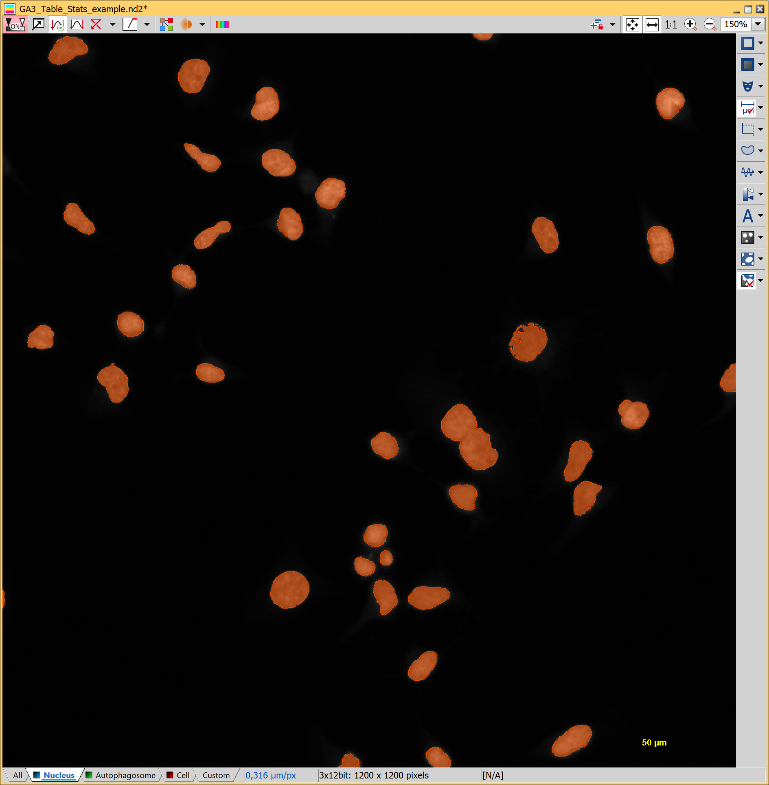
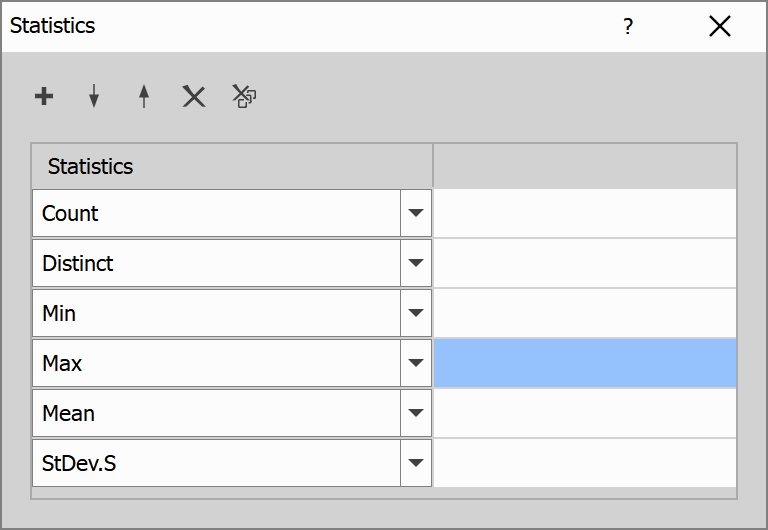

# Table statistics

This example shows how to:

- Detect nuclei of cells
- Calculate features of nuclei
- Calculate statistics of those features

## Input files

Original ND2 image and analysis recipe can be downloaded from this repository:

- ND2 file [[View on GitHub](./GA3_Table_Stats_example.nd2)] [[Download file](https://laboratory-imaging.github.io/GA3-examples/NIS_v6.10/15-Table_Stats/GA3_Table_Stats_example.nd2)]

- GA3 file [[View on GitHub](./GA3_Table_Stats_example.ga3)] [[Download file](https://laboratory-imaging.github.io/GA3-examples/NIS_v6.10/15-Table_Stats/GA3_Table_Stats_example.ga3)]

### The source image data

The original image shows a collection of white cells on a black background:

### Complete recipe

The GA3 recipe used in this analysis is also available as an interactive HTML file [[View on GitHub](./recipe.html)] [[View Online](https://laboratory-imaging.github.io/GA3-examples/NIS_v6.10/15-Table_Stats/recipe.html)]

## Result

This analysis will detect and highlight cells as shown here:

We will also measure features of those nuclei and calculate their statistics:

And we will present those statistics alongside measurements for each node:

## Analysis

**SimpleThreshold** node will be used to find nuclei in the image, in this example we will select pixels with brightness above 385, as this example mostly focuses on showcasing statistics, it is not required to segment cells with high precision.

These are the settings for this node:

**ObjectMeas** node will be used to calculate features of each found nucleus, we will calculate equivalent spherical diameter, diameter of the inscribed circle and maximum Feret's diameter. Those are the settings for this node:

The result is the following table:

**ModifyColumns** node will remove columns for measured features as those will be replaced by the aggregated statistics in the next node, these are the settings for this node:

**Statistics** node will calculate selected statistical data for all columns, in this example we will determine the total count, unique count, min and max, mean and standard deviation. These are the settings for this node:

**AppendColumns** node will be used to put those 2 tables together, this is the final table:

As we can see, we have more records in the well column than in any other one, we will remove those in the next step.

**FilterRecords** node will filter records based on some condition, in this example we will keep rows for which statistics column is not empty as shown here:

After this node we can see the table from the results section, here it is again:

**TableStats** node can be used to display both the features and the statistics in one interactive window by connecting Table relation to the table with features from ObjectMeas node and Stats relation to the result of previous node.

The result is a table that was also shown in the results section:

In this table we can see that the average equivalent spherical diameter is 13.218, diameter of the inscribed circle within a nucleus is on average 9.628 and the maximum Feret's diameter is 16.998 on average.

## Conclusion

In this example, we have found nuclei of cells, determined their features, and calculated statistics for those features, which were shown alongside the features in a table.
