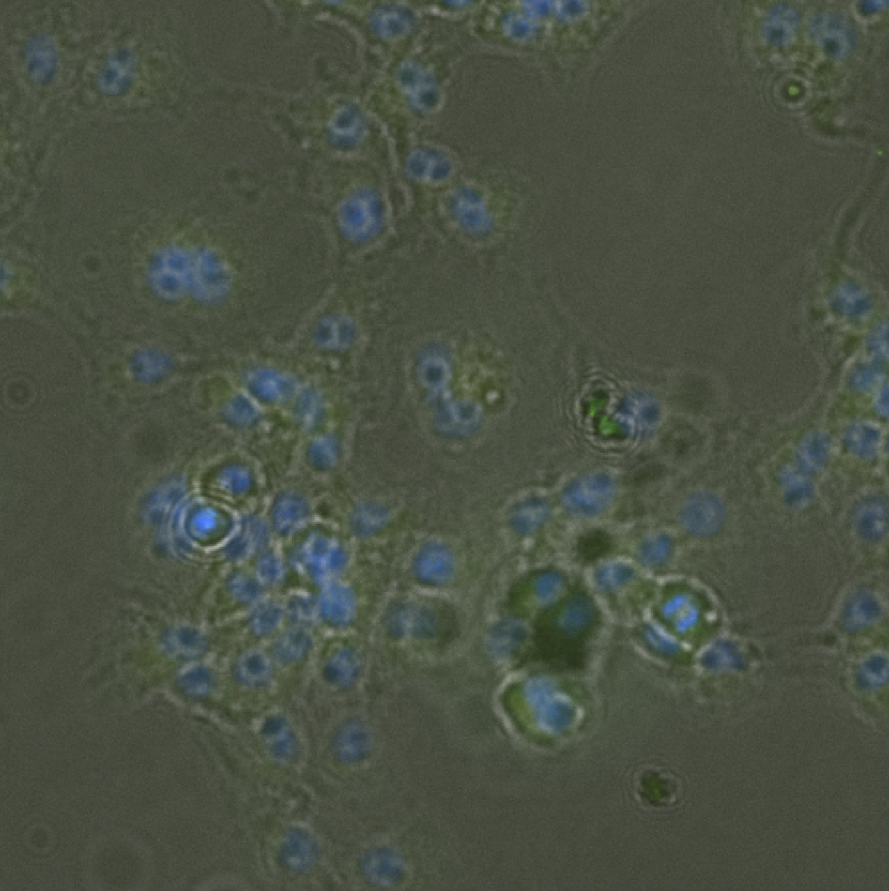
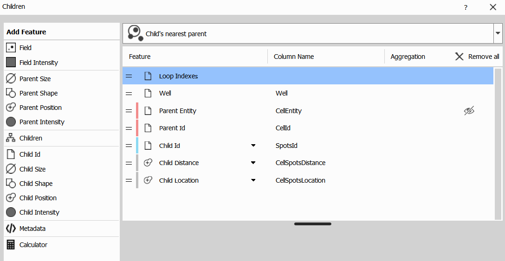
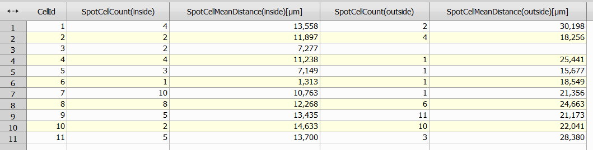
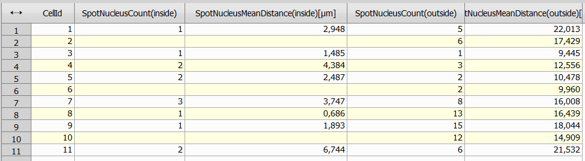

# Spot location analysis

This example shows how to:

- Select specific cell-nucleus pairs
- Find spots in the proximity of selected cells
- Classify position of a spot (outside cell / inside cell / inside nucleus) and use the position to color spots
- Calculate number of spots for each position in relation to a cell or a nucleus and average distance between them

## Input files

Original ND2 image and analysis recipe can be downloaded from this repository:

- ND2 file [[View on GitHub](./GA3_Spot_Location_example.nd2)] [[Download file](https://laboratory-imaging.github.io/GA3-examples/NIS_v6.10/26-Spot_Location/GA3_Spot_Location_example.nd2)]

- GA3 file [[View on GitHub](./GA3_Spot_Location_example.ga3)] [[Download file](https://laboratory-imaging.github.io/GA3-examples/NIS_v6.10/26-Spot_Location/GA3_Spot_Location_example.ga3)]

### The source image data

Original image shows a collection of cells:



This image also already has binary layers marking each cell, nucleus and each spot:


### Complete recipe

The GA3 recipe used in this analysis is also available as an interactive HTML file [[View on GitHub](./recipe.html)] [[View Online](https://laboratory-imaging.github.io/GA3-examples/NIS_v6.10/26-Spot_Location/recipe.html)]


## Result

This analysis will select cells based on nucleus / cell ratio, find spots nearby and color them based on their position in relation with a cell or nucleus:


In this image we can see selected red cells with light blue nucleus, for spots we use 3 colors to classify their position:

- Dark blue - Spot inside nucleus
- Green - Spot inside cell
- Yellow - Spot close to a cell, but outside of it

We will later use the classification of spots to calculate average distance between spot and cell / nucleus and how many spots there are.

## Analysis

As we can see in the recipe, this analysis will be done in 7 steps:

1) [Pair and filter cell-nucleus pairs](#1-pair-and-filter-cell-nucleus-pairs)
2) [Filter spots by distance from a cell](#2-filter-spots-by-distance-from-a-cell)
3) [Measure distance and location between a spot and cell / nucleus](#3-measure-distance-and-location-between-a-spot-and-cell--nucleus)
4) [Color spots based on their location](#4-color-spots-based-on-their-location)
5) [Calculate average distance between spot and cell / all cells](#5-calculate-average-distance-between-spot-and-cell--all-cells)
6) [Calculate average distance between spot and nucleus / all nuclei](#6-calculate-average-distance-between-spot-and-nucleus--all-nuclei)
7) [Join results into comprehensive tables](#7-join-results-into-comprehensive-tables)

### 1. Pair and filter cell-nucleus pairs

Pairing up and filtering cell-nucleus pairs can be done using those nodes:


**MakeCell** node processes cell and nuclei binaries, cells without nucleus are removed, only largest nucleus in each cell is kept, cell and its nucleus are also assigned same ID, we can also filter pairs with specific cell / nucleus area ratio, in this case we use following settings:


**And** node is redundant for now, could be used later for further filtering of spots, in this recipe we will filter out spots is following step.

### 2. Filter spots by distance from a cell

Filtering spots close to selected cells can be done using following nodes:


**Invert** node will invert area described by cells.

**DistanceFunction** node will display distance of each pixel to nearest boundary as intensity.

**FilterObjects** node will use the calculated intensity to filter out spots with small intensity = spots that are too far from a cell, this node has following settings:


After steps 1 and 2 we have selected following cells and spots around them:


### 3. Measure distance and location between a spot and cell / nucleus

In order to measure distance and location between a spot and cell / nucleus we can use following nodes:


**Children** node will be used to measure distance and location between a spot (child) and a nearest cell (parent), thus we connect the parent connection to Cell binary from *MakeCell* node from step 1 and child connection to filtered out Spots from node *And* also from step 1.

This node has following settings:



Notice that on top of this window, we are searching for child's nearest parents, for each child we calculate distance between cell and spot as number, we also calculate location of a child (if it is inside a parent cell or outside of it).

**Children2** node has similar settings as previous node, but we calculate distance and location between a spot and a nucleus (instead of a cell).

**JoinRecords** node simply joins those two tables using same SpotId, as an output we get a table where each spot is assigned a cell parent, there is also calculated distance and location to cell itself and to cell's nucleus, part of the table can be seen here:


### 4. Color spots based on their location

We can use inside / outside attribute of each spot in relation to cell / nucleus to assign each cell a color, this can be done using following nodes:


**Calculated** node uses calculated locations from step 3 to calculate new column (in this case named PlacementClass) with a value based on the overall location, this value is set as following:

- spot is inside nucleus - 0
- spot is inside cell - 1
- otherwise (spot is outside cell) - 2

The node has following settings:


This is the condition to determine calculated value:

```js
NucleusSpotsLocation == 'inside' ? 0 
: CellSpotsLocation == 'inside' ? 1 
: 2
```

**ColorByValue** node uses calculated PlacementClass attribute to assign each spot a color, it has following settings:


After this step we can see spots colored as described in the result section.


### 5. Calculate average distance between spot and cell / all cells

This step will be used to summarize distance and counts between individual cells and their spots and between all cells overall, this will be done using following nodes:


**ModifyColumns** removes duplicate and unnecessary columns from the table, as we are only interested cell-spot relation, we can remove columns related to nucleus-spot relation as well as duplicate SpotsId column using following settings:


After this node we will split analysis into 2 branches - left one will calculate number of spots and average distance for each cell, right one will do the same for all cells.

#### Left branch (aggregation per cell)

**ReduceRecords** node will group rows by each cell and per location of a spot (inside / outside a cell), we will then count how many spots are inside / outside each cell and the average distance between a cell and spots. This node has following settings:


This node will output following table:


**PivotTable** node can be used to create pivot table to split inside / outside locations into 2 columns, we also rename couple of columns to better describe column contents, this node has following settings:


And it has following output:



As we can see, for each cell we get a count of spots inside and outside them as well as the average distance, again both for spots inside and outside the cell.

#### Right branch (aggregation of all cells)

**ReduceRecords2** node has similar settings as in left branch, but as we aggregate results for all cells, we do not group rows by CellId, only by location, those are the settings for this node:


**PivotTable2** node once again has similar settings as *PivotTable* node in the left branch:


Pivot table in the right branch looks like this:


From this table we can see there is 46 spots inside cells with average distance of 11.5 µm from the cell and 40 spots outside cells with an average distance of 22.5 µm from the cell.

### 6. Calculate average distance between spot and nucleus / all nuclei

Step 6 contains exactly the same node and operations as step 5, but instead of calculating distances between a spot and a cell, we calculate distance between a spot and the nucleus.

Here are the result tables for step 6:




### 7. Join results into comprehensive tables

This step simply joins tables from left and right branches from steps 5 and 6 into 2 tables, this can be done with following nodes:


**JoinRecords2** node will join PivotTable and PivotTable3 (aggregation for each cell) using inner join on column CellId, this is the final result table:


In this table CellId 5 has been highlighted, let's take a look at the image to interpret the results, one column at a time:


- SpotCellCount(inside) counts spots in a cell (green + dark blue), there is 3 of those spots with average distance from the cell of 7.149

- SpotCellCount(outside) counts spots outside a cell (yellow), there is only 1 such spot with a distance of 15.677 from cell

- SpotNucleusCount(inside) counts spots in a nucleus (dark blue), there 2 such spots with average distance from the nucleus of 2.487

- SpotNucleusCount(outside) counts spots outside a nucleus (green + yellow), there 2 such spots with average distance from the nucleus of 10.478

**JoinRecords3** does the same thing, but aggregates data for all cells, thus it merges tables from PivotTable2 and PivotTable4 and joins those tables on WellIndex columns with following results:

- SpotCellCount(inside): 46 spots inside cells (average distance from cell = 11.544)

- SpotCellCount(outside): 40 spots outside cells (average distance from cell = 22.522)

- SpotNucleusCount(inside): 13 spots inside nuclei (average distance from nucleus = 3.499)

- SpotNucleusCount(outside): 73 spots outside nuclei (average distance from nucleus = 16.756)

## Conclusion

In this analysis we have selected specified cells, found nearby spots and calculated distance and location from each spot to closest cell and its nucleus and classified positions of the spots, we have also aggregated the data for an entire frame.
