# Sholl analysis

Sholl analysis is a method of quantitative analysis used in neural studies to compare and characterize the morphology of different types of neurons, in this analysis we will:

- highlight the neuron and find it's center
- create spherical shells around the neuron center
- find intersections of the neuron and the drawn circles
- count intersections and show their distance from the center, plot a graph line chart for this information

## Input files

Original ND2 image and analysis recipe can be downloaded from this repository:

- ND2 file [[View on GitHub](./GA3_Sholl_Analysis_example.nd2)] [[Download file](https://laboratory-imaging.github.io/GA3-examples/NIS_v6.10/28-Sholl_Analysis/GA3_Sholl_Analysis_example.nd2)]

- GA3 file [[View on GitHub](./GA3_Sholl_Analysis_example.ga3)] [[Download file](https://laboratory-imaging.github.io/GA3-examples/NIS_v6.10/28-Sholl_Analysis/GA3_Sholl_Analysis_example.ga3)]

### The source image data

Original image shows a neuron:

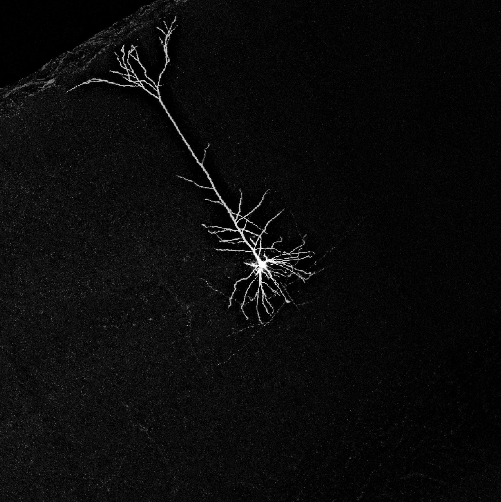

### Complete recipe

The GA3 recipe used in this analysis is also available as an interactive HTML file [[View on GitHub](./recipe.html)] [[View Online](https://laboratory-imaging.github.io/GA3-examples/NIS_v6.10/28-Sholl_Analysis/recipe.html)]

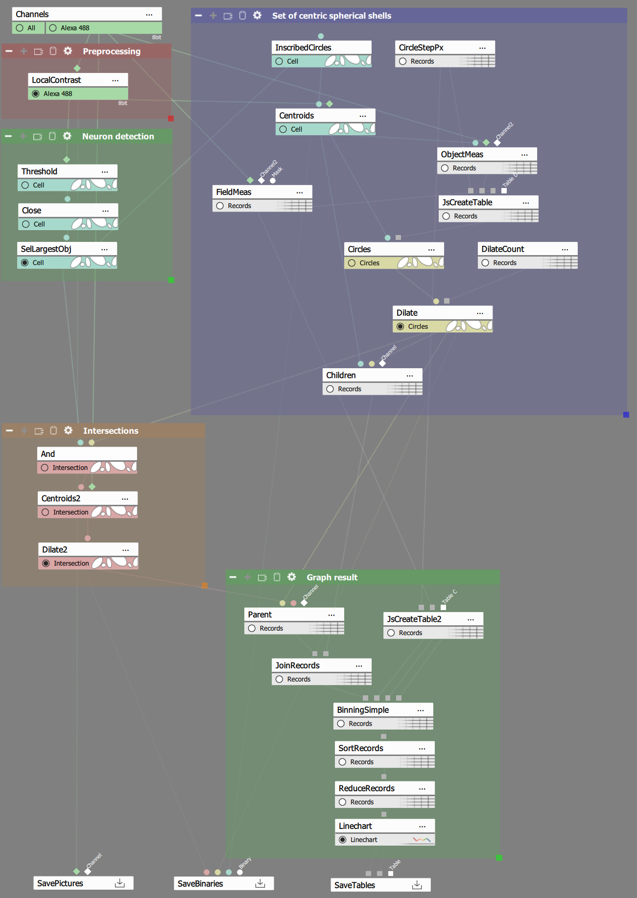

## Result

This analysis will find the center of the neuron, draw circles around the center and count the number of intersections between the neuron and the circles:

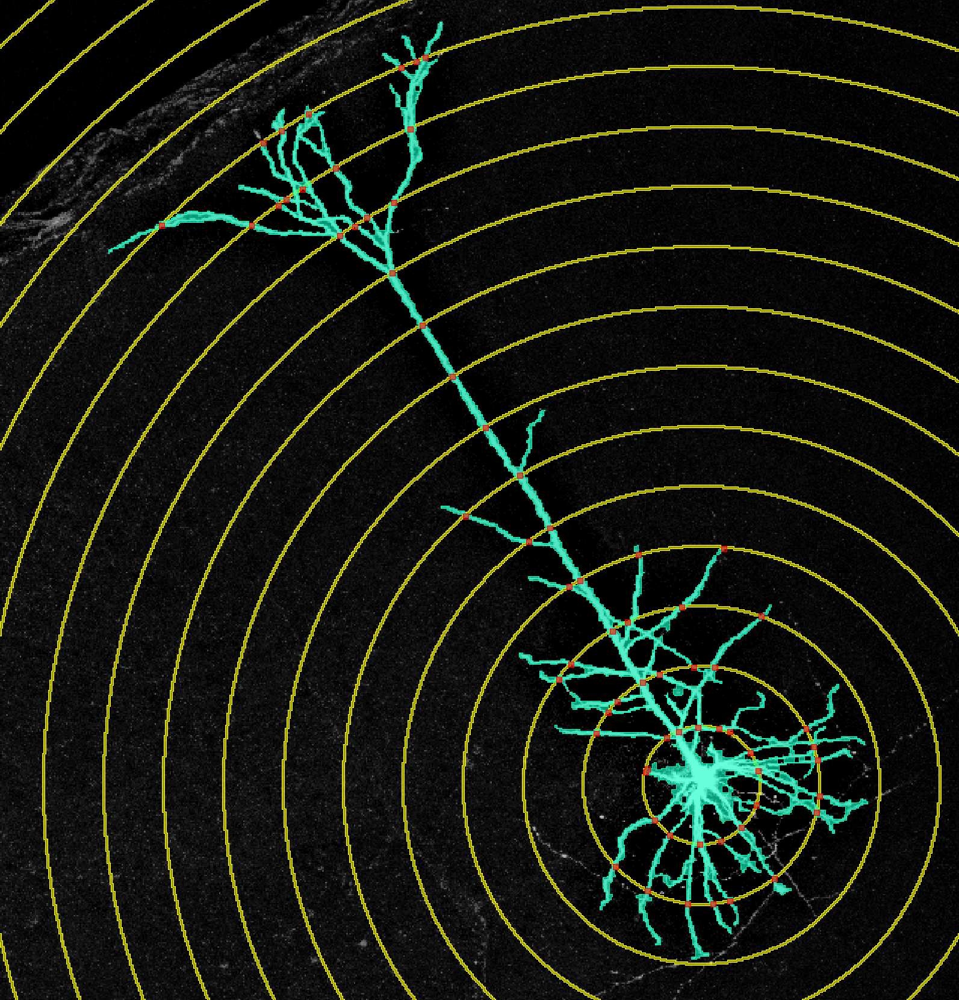

We will also plot a line chart for the number of intersections of the neuron with each circle.

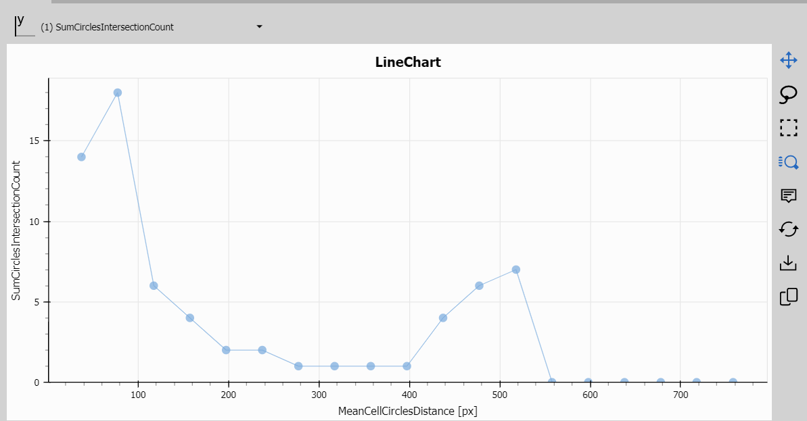

## Analysis

As we can see in the recipe, the analysis consists of 5 parts:

1) [Preprocessing of the input image](#1-preprocessing)
2) [Detecting whole neuron](#2-neuron-detection)
3) [Find center of neuron and create spherical shells](#3-find-center-of-the-neuron-and-create-spherical-shells)
4) [Highlight intersections of neuron branches and the spherical shells](#4-highlight-intersections-of-neuron-branches-and-the-spherical-shells)
5) [Plot the results in a graph](#5-plot-the-results-in-a-graph)

### 1. Preprocessing

Preprocessing is done using a single node to enhance the neuron in the image.

**LocalContrast** node enhances contrast in both bright and dark areas of the image, it has following settings:

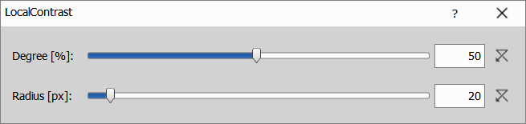

### 2. Neuron detection

Detecting the neuron in the image will be done with the following nodes:

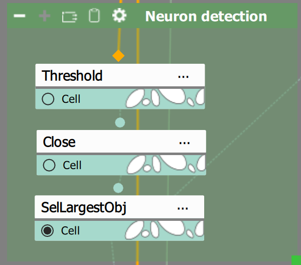

**Threshold** node will select pixels over specific brightness, this node has following settings:

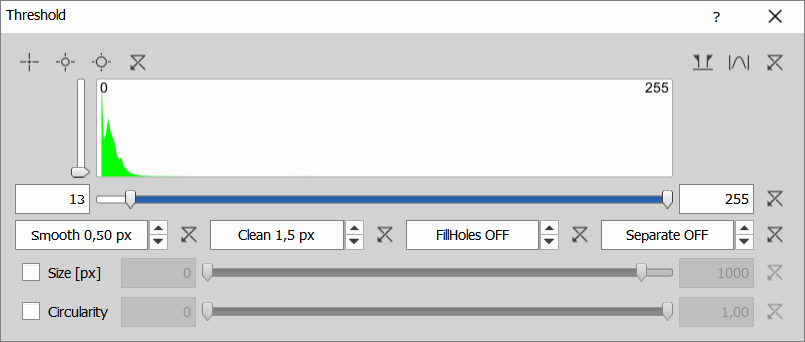

**Close** node is then used to fill small holes in the binary, it has following settings:


**SelLargestObject** will select biggest object from the selected binary layer, in this case only the object with the neuron is selected.

After step 2, we have highlighted the neuron in the image:

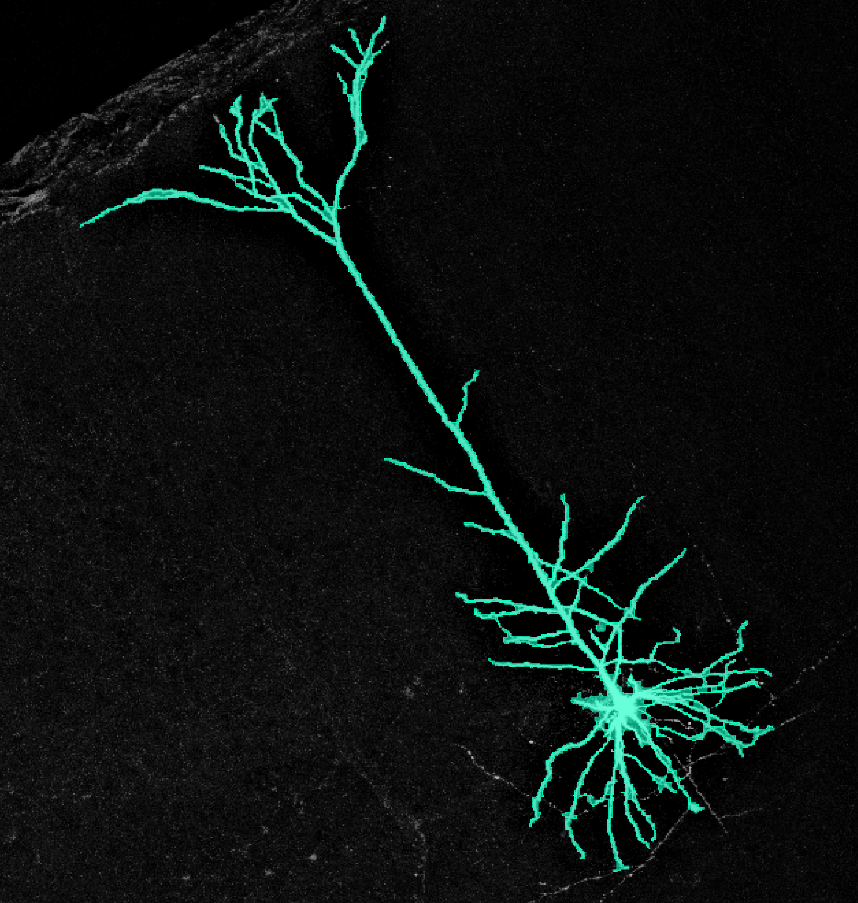

### 3. Find center of the neuron and create spherical shells

We will use following nodes to find the center of the neuron and create circles around it:

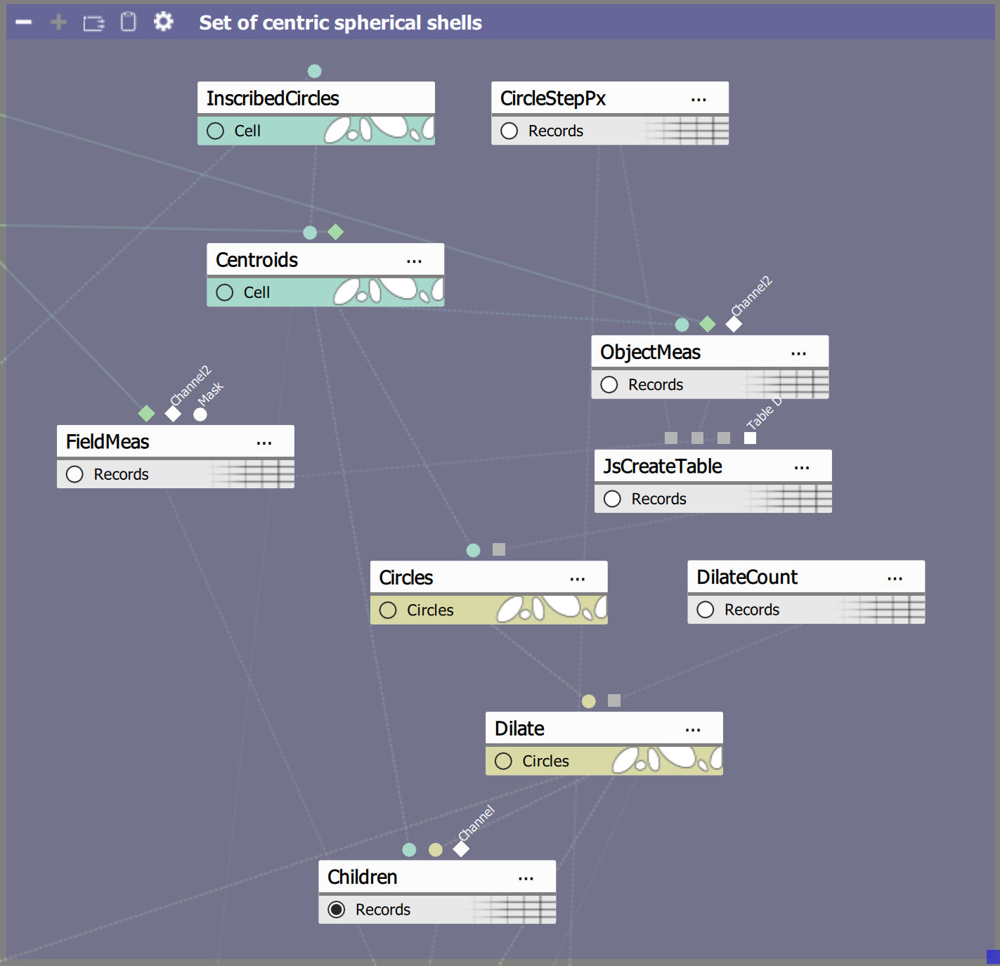

**InscribedCircles** node will find the biggest circle that fits into the neuron binary, essentially finding it's center as shown here:

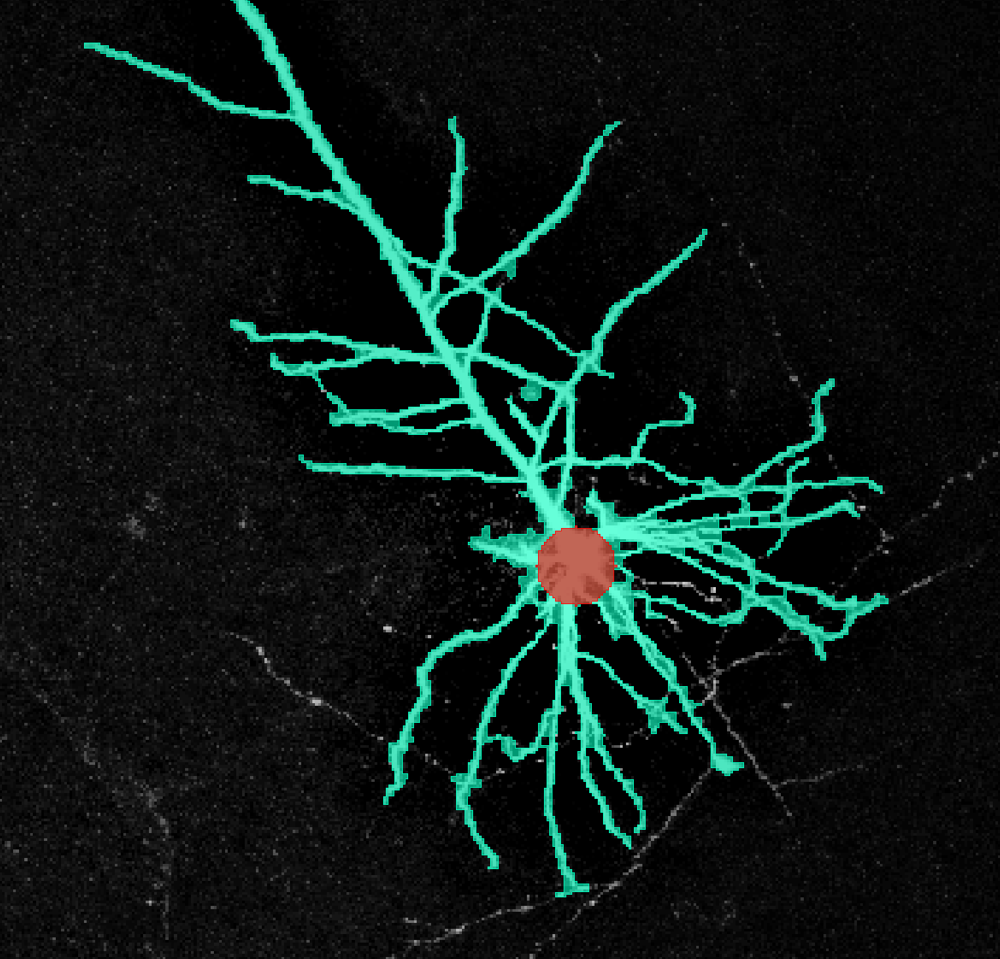

**Centroids** node will then select the center of this inscribed circle, which will be used as the center for spherical shells.

**CircleStepPx** node simply sets value 40 to a variable, this variable will be used as spacing between the spherical shells.

**ObjectMeas** node will be used to get X and Y coordinates for the centroid in the middle of the neuron, it has following settings:

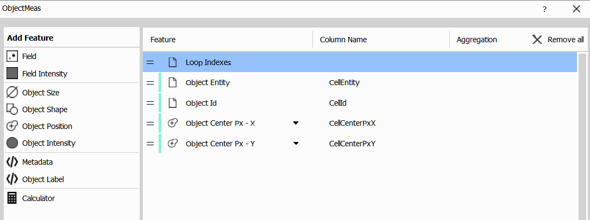

**FieldMeas** node will get X and Y size of the entire frame, here are the settings for this node:

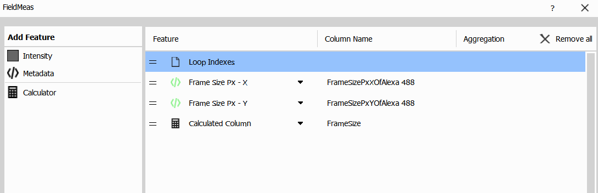

**JsCreateTable** node will use frame size, X and Y coordinates of the neuron center and the distance between between the circles to generate coordinates and radiuses for spherical circles, those are the settings for this node:

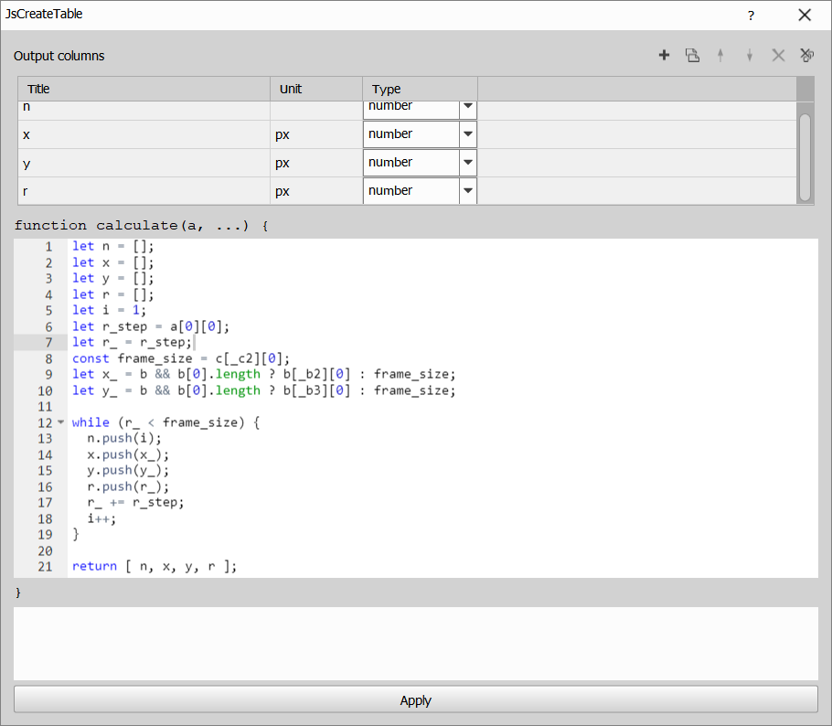

This is the body of the JavaScript function:

```js
let n = [];
let x = [];
let y = [];
let r = [];
let i = 1;
let r_step = a[0][0];
let r_ = r_step;
const frame_size = c[_c2][0];
let x_ = b && b[0].length ? b[_b2][0] : frame_size;
let y_ = b && b[0].length ? b[_b3][0] : frame_size;

while (r_ < frame_size) {
  n.push(i);
  x.push(x_);
  y.push(y_);
  r.push(r_);
  r_ += r_step;
  i++;
}

return [ n, x, y, r ];
```

And this is the resulting table:

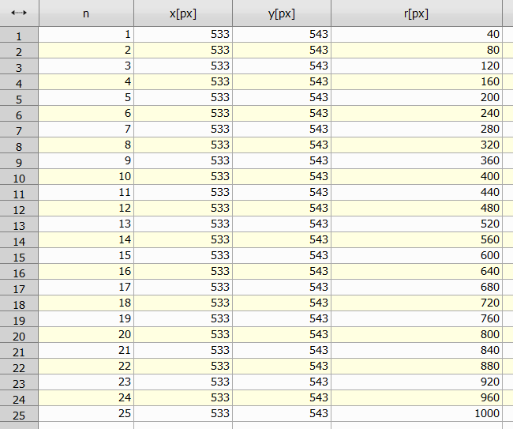

**Circles** node will use the previous table to create circles on the image, this node has following settings:

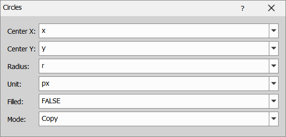

**DilateCount** node is a simple variable holding a value, in this case we set how many times to dilate the circles in the dilate node below, this variable is set to 1.

**Dilate** node will expand drawn circles which so far are only 1 pixel thick, it uses following settings:

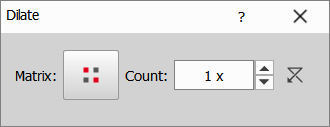

After this node we can see a number of spherical shells centered around the neuron center, 40 pixels apart:

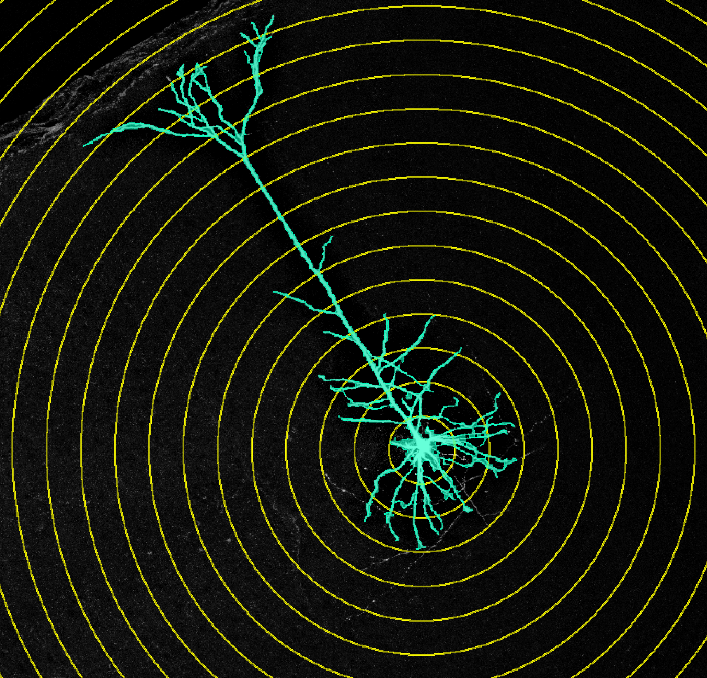

As we can see in the image, some circles go over the edge of the image, which splits the circle into several segments, each such segment has it's own ID, however we can check the distance of each segment to the original neuron center to later bin circle segments back together.

**Children** node will be used to match each circle or circle segment back with the center, we will also check the distance between circle or circle segment with the neuron center. This node has following settings:

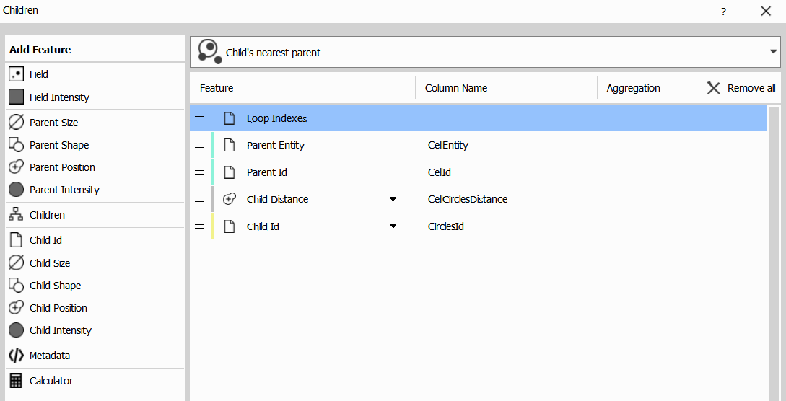

And here is the output of the node:

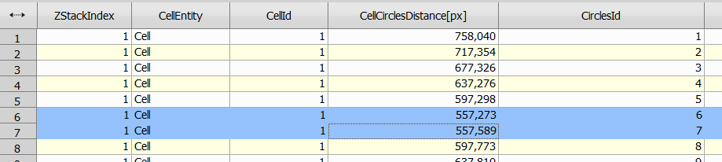

As we can see in highlighted rows 6 and 7, those 2 circle objects have roughly the same distance from the center, which means they make up the same circle that was just split into multiple segments by the edge of the image.

### 4. Highlight intersections of neuron branches and the spherical shells

Neuron and spherical shell intersections will be found using following nodes:

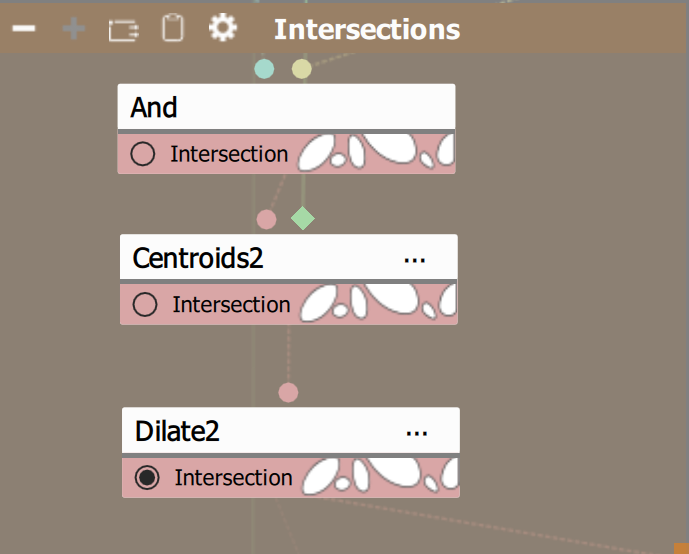

**And** node will simply create intersection between neuron highlighted in step 2 and circles made in step 3.

**Centroids2** node will find a center for each intersection.

**Dilate2** node will make each center bigger and more visible, just like we did with the circles before.

After this node we can see intersections of the neuron with the circles as a red dot:

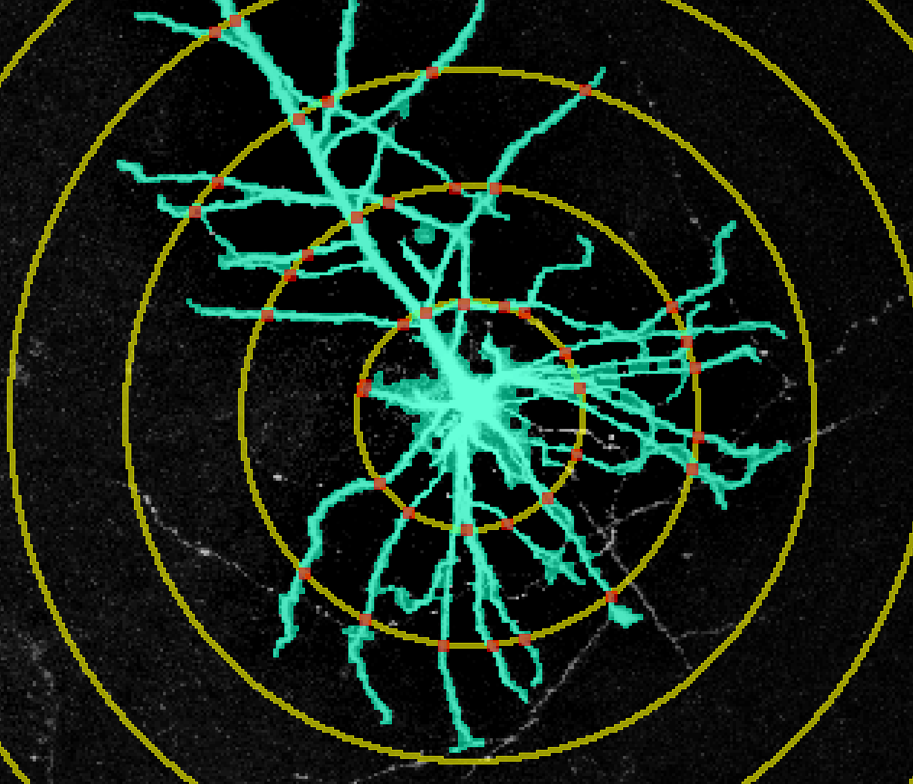

### 5. Plot the results in a graph

At this point, we segmented the neuron, found its center, drew spherical shells around it (which we prepared for binning in case of segmentation) and we found intersections of the neuron with the circles and circle segments.

We will now count the number of intersections in each circle or circle segment, bin circle segments if needed and sum number of intersections for circle segments in the same bin, then we will plot a line chart with number of intersections at each circle.

This will be done with following nodes:

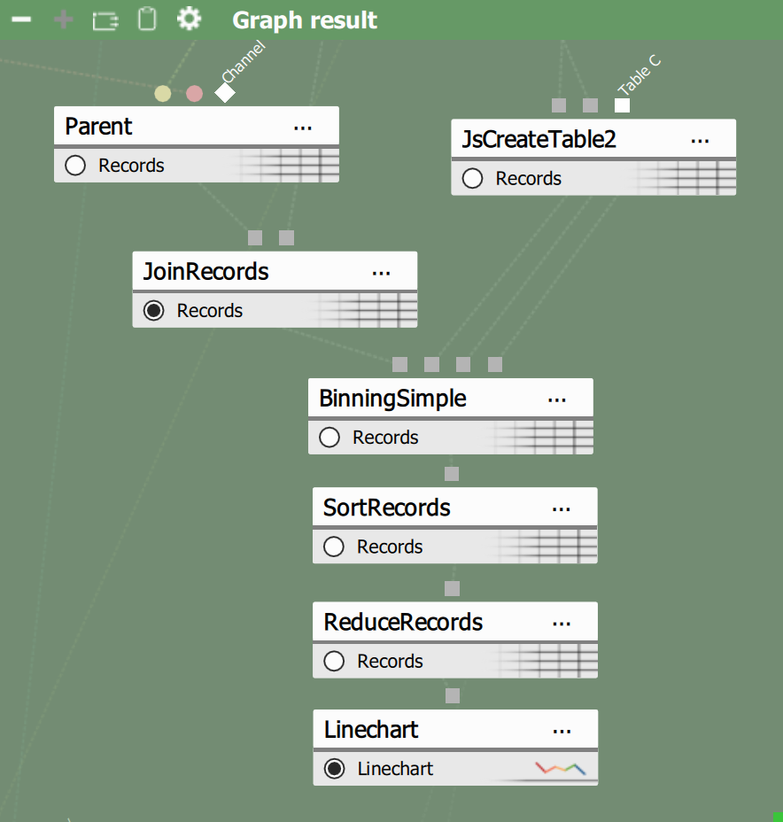

**Parent** node will pair up a parent (circle or circle segment) with all children (intersections from step 4), this node will count the number of intersections per circle or circle segment, those are the settings for this node:

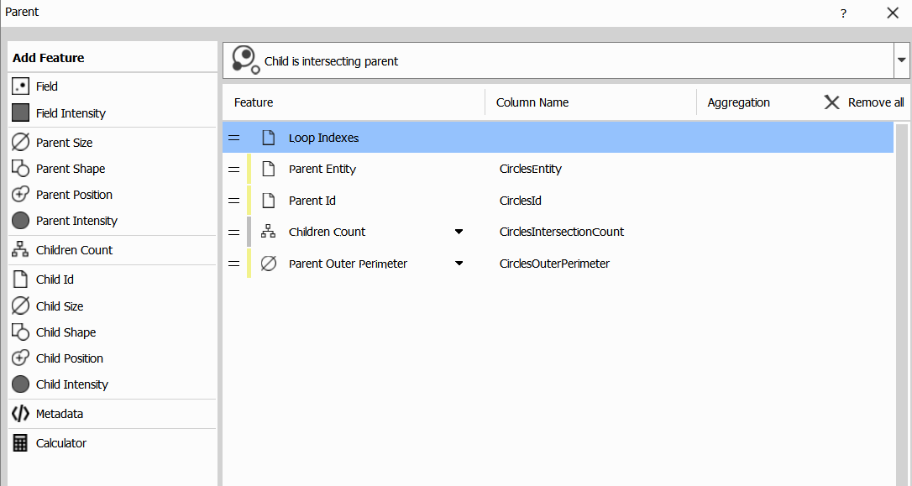

**JoinRecords** node will simply link each circle / circle segment and the respective number of intersections (step Parent node) with data about distance to center from children node in step 3, this is the output table:

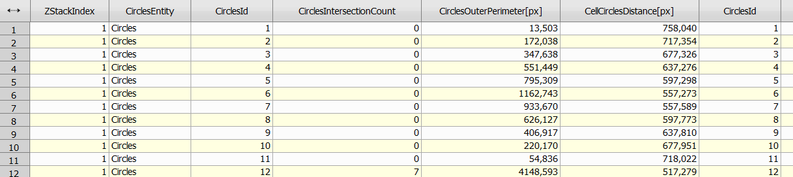

As we can see, for each circle / circle segment we have found the number of intersections on them (CirclesIntersectionCount) and the distance to center (CellCirclesDistance), which we will use to bin circle segments with similar distances from the center together.

**JsCreateTable2** node will simply create variables used for binning circle segments with similar distance from neuron center, these are the settings for this node:

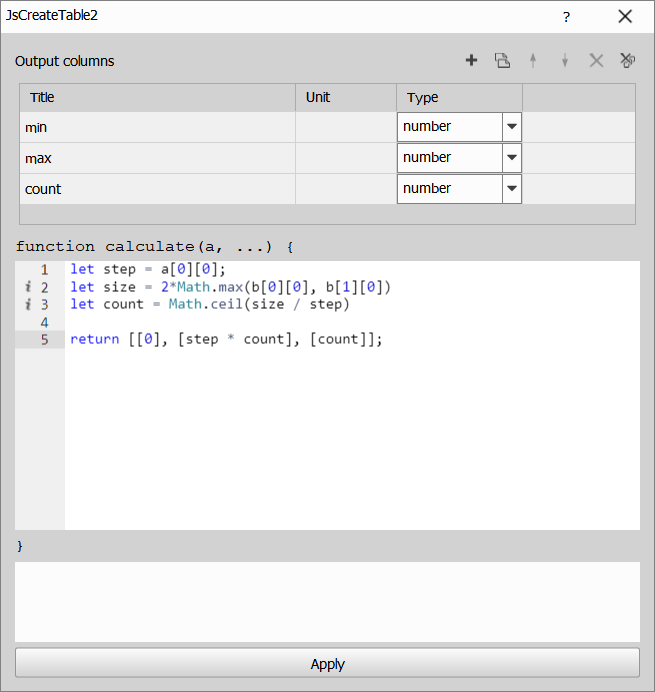

This is the body of the JavaScript function:

```js
let step = a[0][0];
let size = 2 * Math.max(b[0][0], b[1][0])
let count = Math.ceil(size / step)

return [[0], [step * count], [count]];
```

This node will calculate following values used for binning later:

- min = 0
- max = 2080
- count = 52

**BinningSimple** node will bin circle segments with similar distance from center into the same bin, this binning will be shown as a new column with a value based on the starting point of each bin, those are the settings of this node:

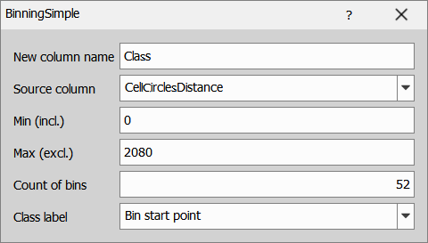

As we identified in step 3, circles with ids 6 and 7 had similar distance to center, which means both are segments of the same circle, in the result table below we can see that those 2 circle segments were placed into the same bin in column Class:

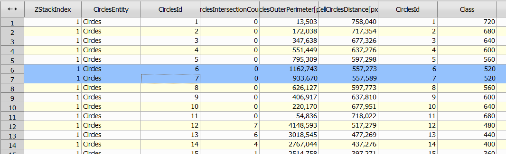

**SortRecords** node simply sorts rows based on the binning result - based on the Class column added in the previous node.

**ReduceRecords** node will finally add counts of intersections for circle segments in the same bin by grouping the table by Class column, those are the settings for this node:

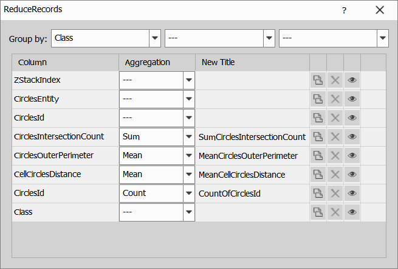

And here is the result table:

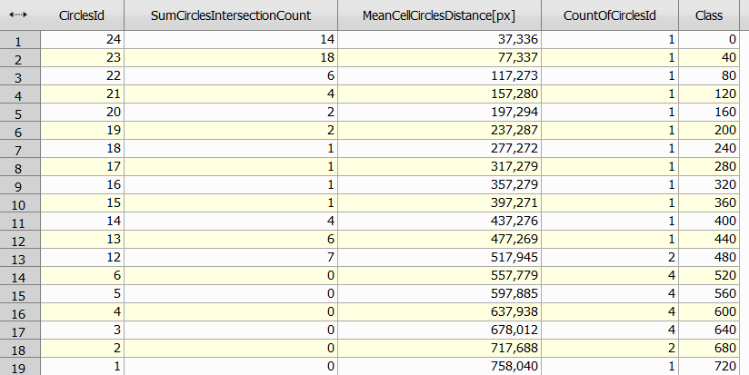

Here we can see how many intersections there are on each circle (SumCircleIntersectionCount), distance of the circle from center (MeanCellCirclesDistance), attribute used for binning (Class) and count of the number of segments per circle split into (CountOfCirclesId).

**LineChart** node will use the number of intersections of the neuron with each circle and the distance from the center to create a line chart, these are the settings for this node:

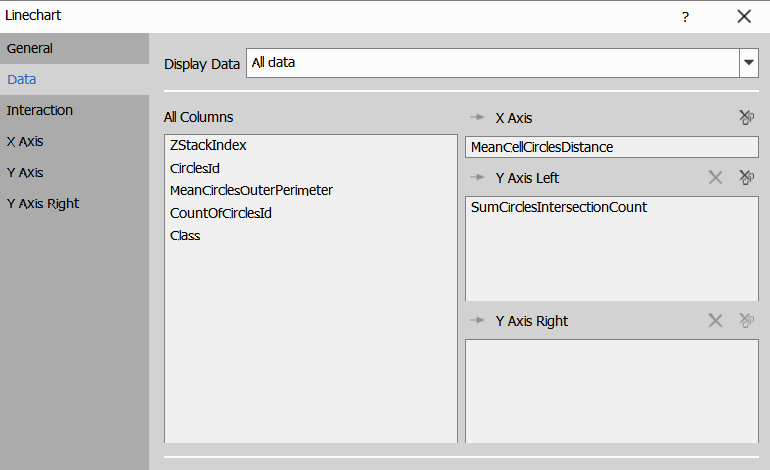

And as we saw in the results section, this is the output chart:


## Conclusion

In this analysis we have detected a neuron, found its center, drew spherical shells around it and summarized the number of intersections between the circle and the neuron, we also plotted the sums as a line chart.
