# Tracking algorithms

> [!IMPORTANT]
>
> ### Tracking algorithms
>
> Tracking in GA3 can be done using those two nodes:
>
> - [**Track Objects**](#track-objects) node tracks binary objects by finding their intersections between consecutive frames. It is intended for large morphing, non rigid objects that move slowly over time. It takes a binary layer as input and outputs a table with objects having TrackId assigned as output. Other object feature columns has to be added to this table.
>
> - [**Track Particles**](#track-particles) node reduces every object to its point of mass (center/centroid coordinate) which is tracked over time. Suitable for small objects moving fast. It takes a table with objects (having Time and Position measured) as input and assigns a TrackId to each object as output.
>
> ### Displaying the tracks
>
> - **AccumTracks** node can be then used to accumulate tracking data from all time points (⚠️ this is usually done with **AccumRecords** node, but it CAN NOT be used when accumulating data for tracked objects), results are also grouped by TrackID.
>
> After you use either one of those nodes for tracking and AccumTracks node, you can display tracks of tracked objects in the image using *Display tracking* button in the result table in Analysis result window:
>
> 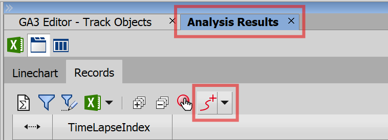
>
> ### Calculate motion features
>
> - **Motion features** node can then be used to calculate features of the movement like changes in time and position, velocity of each tracked object, its heading, acceleration, length of line and so on.
>
> Using those nodes we can track cells, display their movement on the image and calculate features of the motion, which can be used for further calculations or for different kinds of graphs.
>
> On this page we will showcase how to track both objects and particles and how to use all the nodes shown in this section.

# Track objects

Object tracking has to be done in every single-cell analysis which involves time. As the cells move or simply appear and disappear in and out of the frame, their object ID can change. This makes it impossible to relate them reliably from frame to frame. By using tracking we can assign a unique TrackId to every cell. We will demonstrate it in following steps:

- Find cells and Focal Adhesions in an image
- Track those cells over time
- Plot number of FAs in each cell over time

## Input files

Original ND2 image and analysis recipe can be downloaded from this repository:

- ND2 file [[View on GitHub](./GA3_Tracking_Objects.nd2)] [[Download file](https://laboratory-imaging.github.io/GA3-examples/NIS_v6.10/30-Tracking_Algorithms/GA3_Tracking_Objects.nd2)]

- GA3 file [[View on GitHub](./GA3_Tracking_Objects.ga3)] [[Download file](https://laboratory-imaging.github.io/GA3-examples/NIS_v6.10/30-Tracking_Algorithms/GA3_Tracking_Objects.ga3)]

### The source image data

The original image shows several cells moving slowly in an image:

### Complete recipe

The GA3 recipe used in this analysis is also available as an interactive HTML file [[View on GitHub](./recipe.html)] [[View Online](https://laboratory-imaging.github.io/GA3-examples/NIS_v6.10/30-Tracking_Algorithms/recipe.html)]

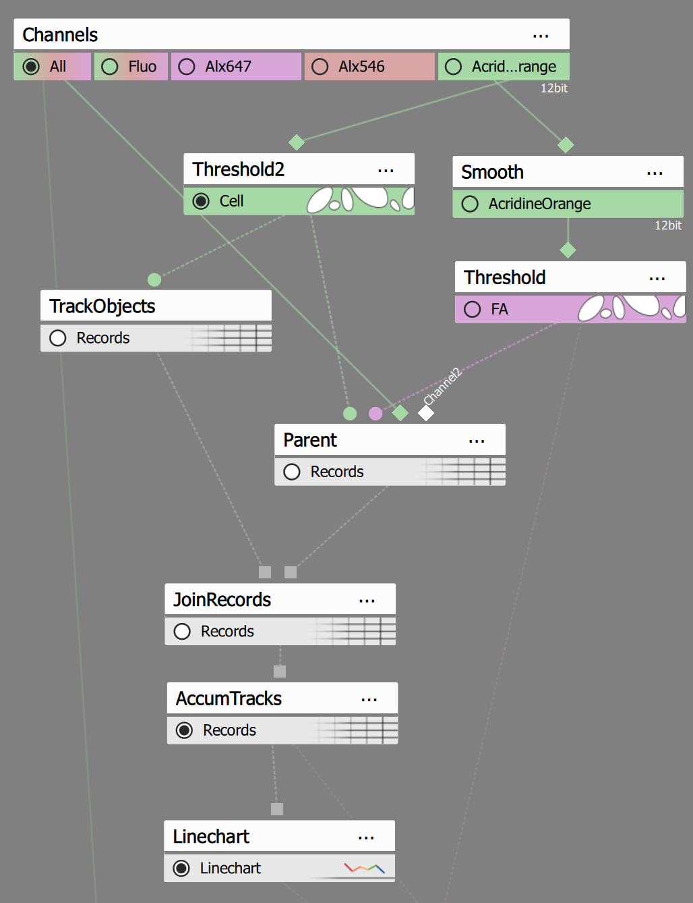

## Result

This analysis will detect moving cells in the image, as well as their FA's and highlight them like this:

We will calculate number of FAs in each cell over time and plot the result using linechart:

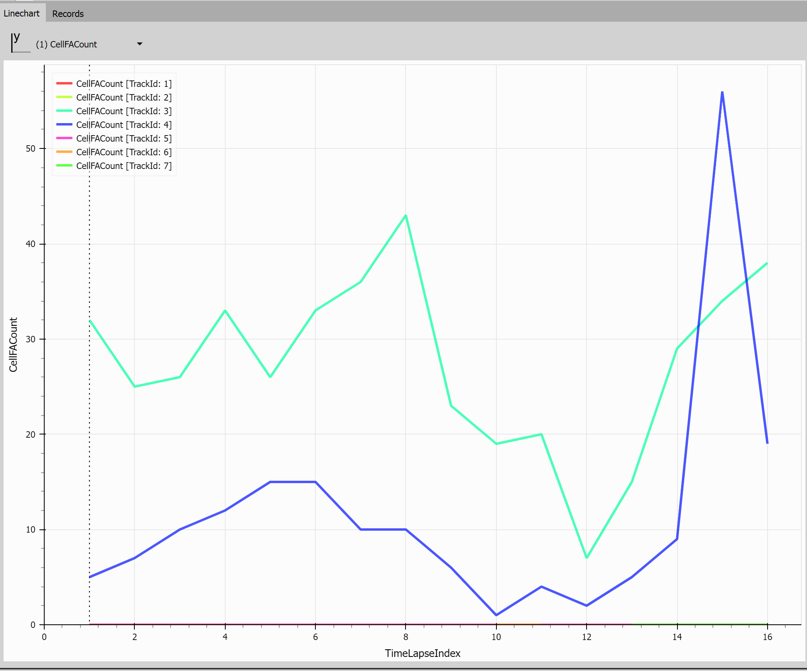

## Analysis

This analysis will be split into three step:

1) [Find cells and their FA's](#1-find-cells-and-their-fas)
2) [Track movement of cells](#2-track-movement-of-cells)
3) [Plot number of FAs in each cell over time](#3-plot-movement-of-tracked-cells-in-a-scatterplot)

### 1. Find cells and their FA's

This step has already been done in another example showcasing Parent and Children node found [HERE](../12-Child_Parent_Relation/).

> [!WARNING]  
> Note following:
>
> - You have to use the ND2 file from this example, which contains data for 16 time points.
> - To get same results, you might need to alter the settings for Threshold node that finds FA's to the following:
>
> 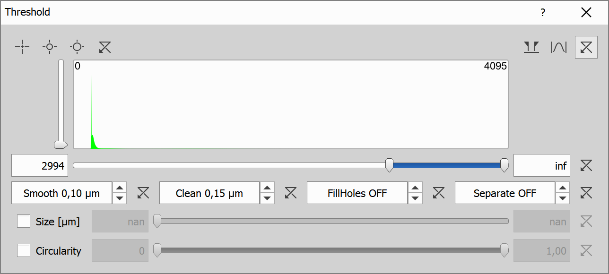

### 2. Track movement of cells

In this step we will track movement of cells and show how to display the tracks in the image.

**TrackObjects** node will assign TrackId to each cell in the picture, even if cells move in a way that will cause them to swap or change the object ID, their track ID will stay the same, this tracking is done by detecting overlapping binaries in consecutive frames.

### 3. Plot number of FAs in each cell over time

Finally we will accumulate data about cells and their FA's, join those with track ID column and display the number of FAs in a cell over time.

**Parent** node will be used to pair parent cells with their FAs (children), count them and to calculate mean intensities for both cell and the FAs and size of each cell, here are the settings for this node:

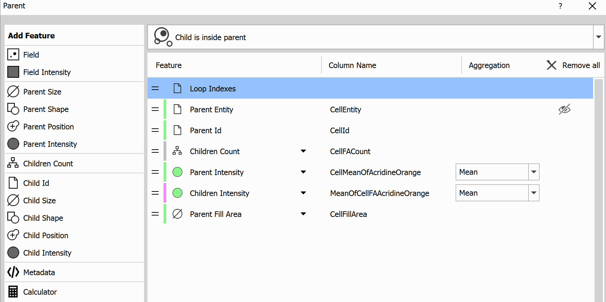

**JoinRecords** node will simply join records from Parent node with Track IDs from AccumRecords node, which accumulated Track IDs from TrackObjects node, we will perform inner join on time index column and on ID of the cell (CellId in table from Parent node, ObjectId in table from AccumRecords node), here are the settings:

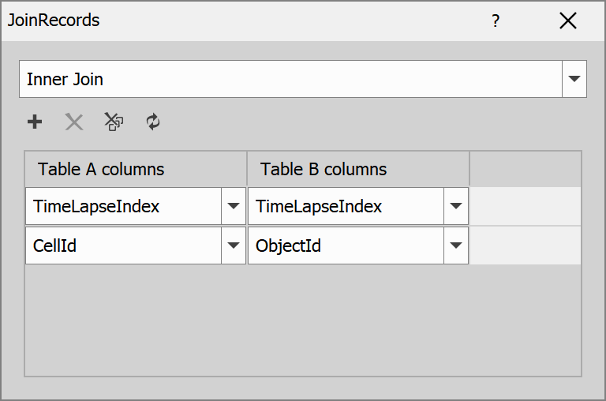

**AccumTracks** node is used to accumulate tracking results from all time points, you can also omit tracks that are shorter then N frames, but here we do not use this option. This node will also group objects by their Track ID.

> [!WARNING]
>
> Even though accumulating records over time points was usually done with AccumRecords node, with result table of object tracking, you HAVE to use AccumTracks node.

As said in the important section at the top of this document, at this point we can enable Display tracking in the Analysis results section:

This will display tracked binaries and their movement in the image preview:

We can see the difference between tracked and untracked binaries between time points 4 and 5:

#### Untracked binaries

If we color the cells using their object IDs, we will run into following problem:

At time point 4, the red cell in the upper left corner is still visible, but moves away from the frame at time point 5. This changes object IDs for all other cells which also changes the color of each cell:

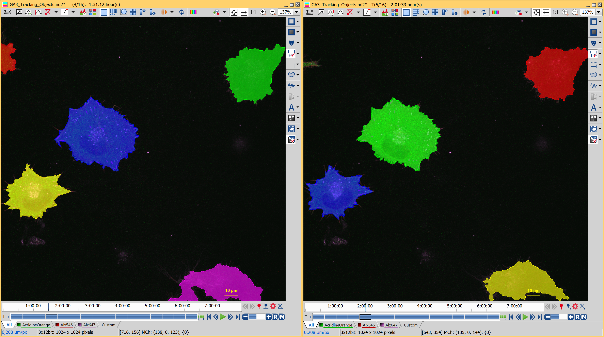

#### Tracked binaries

However if we enable Display tracking in analysis results, cells will be colored not by their Object IDs, but by their Track ID, which will correctly and persistently color each cell even if a cell disappears and Object ID changes:

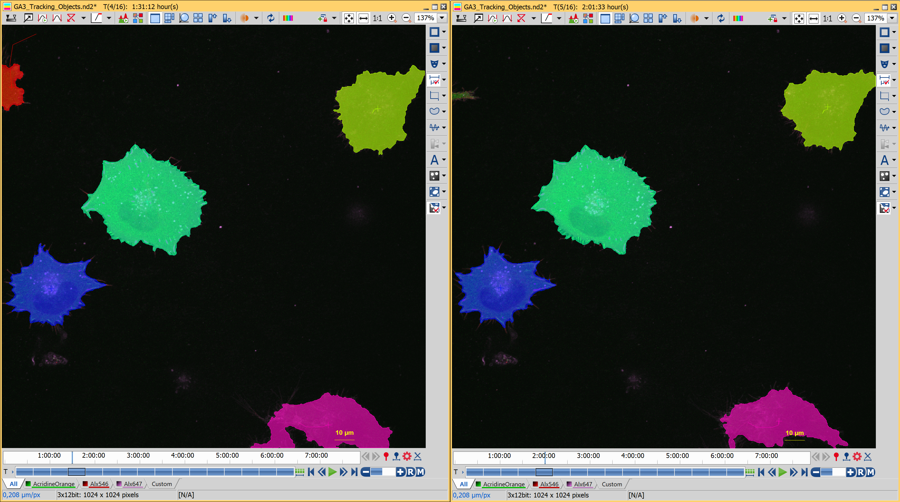

This change is also visible in the table produced by AccumTracks node:

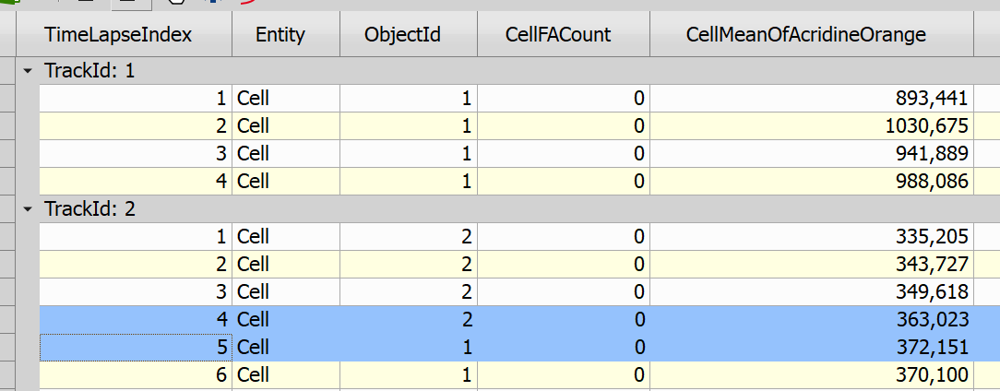

In this image you can see that cell tracked by TrackID 1 is visible only in time points 1-4, cell tracked by TrackID 1 then changes ObjectID from 2 to 1 between those 2 time points.

**Linechart** node will be used to plot the number of FAs over time and such we will use time index and cell count attributes as data, here are the settings for this node:

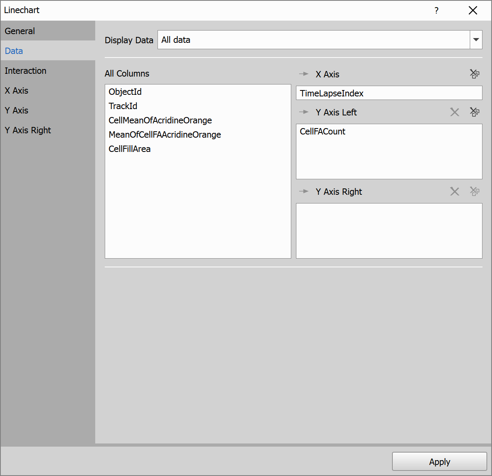

In the General tab we can also select a color palette which is used to color each line, we can use *Track color map* palette so that the color of the lines in the graph matches the colors of the cells when Tracking display is enabled, here is where you can find this option:

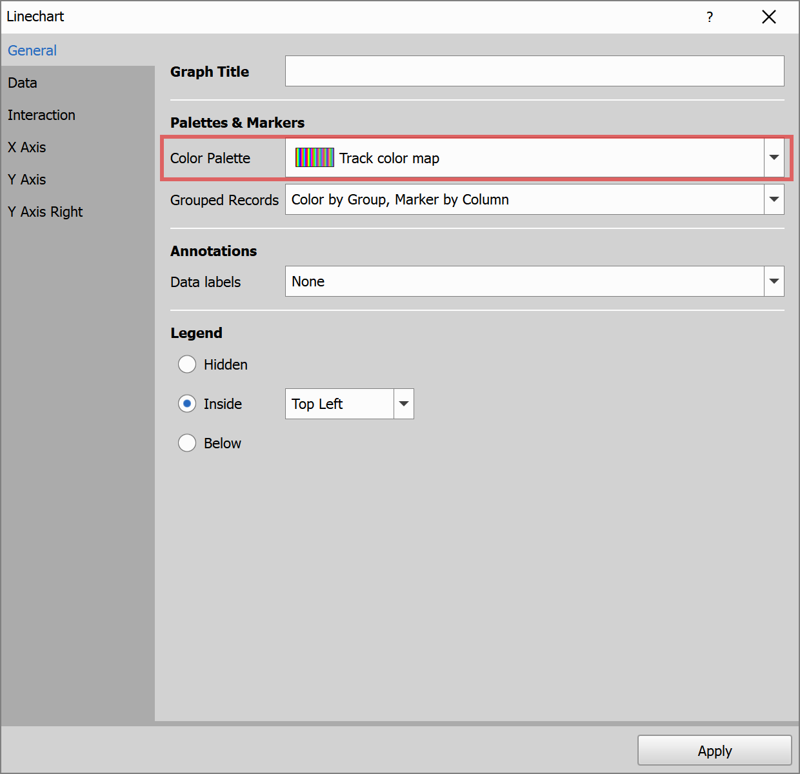

We get following linechart as an result of this node:

We can see the progress of number of FAs in runs with TrackIds 3 and 4, other cells did not contain any FAs, we can also see that the cell with TrackID 3 has overall more FAs than the other one besides a spike at frame 15.

# Track particles

In this section we will track smaller, faster moving objects using the Track particles node, this analysis will be done in following step:

- Find cells in an image
- Track those cells over time
- Plot a scatterplot showcasing how far each cell moved from it's initial position.

## Input files

Original ND2 image and analysis recipe can be downloaded from this repository:

- ND2 file [[View on GitHub](./GA3_Tracking_Particles.nd2)] [[Download file](https://laboratory-imaging.github.io/GA3-examples/NIS_v6.10/30-Tracking_Algorithms/GA3_Tracking_Particles.nd2)]

- GA3 file [[View on GitHub](./GA3_Tracking_Particles.ga3)] [[Download file](https://laboratory-imaging.github.io/GA3-examples/NIS_v6.10/30-Tracking_Algorithms/GA3_Tracking_Particles.ga3)]

### The source image data

The original image shows cells moving in an image:

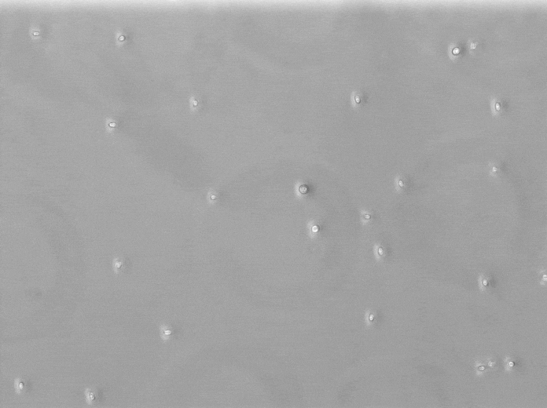

### Complete recipe

The GA3 recipe used in this analysis is also available as an interactive HTML file [[View on GitHub](./recipe2.html)] [[View Online](https://laboratory-imaging.github.io/GA3-examples/NIS_v6.10/30-Tracking_Algorithms/recipe2.html)]

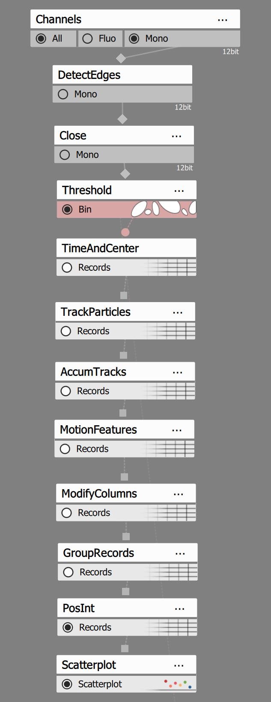

## Result

This analysis will detect moving cells in the frame and track them like this:

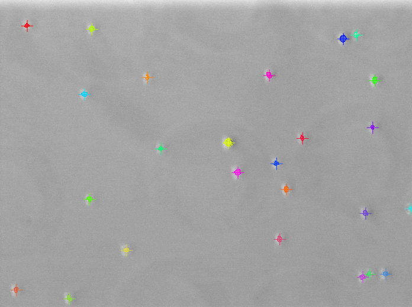

We will also plot movement of those cells from original center in the frame using a scatterplot:

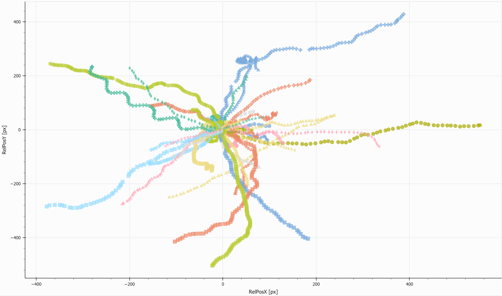

## Analysis

This analysis will be split into three steps:

1) [Find cells in the frame](#1-find-cells-in-the-frame)
2) [Track movement of cells](#2-track-movement-of-those-cells)
3) [Plot movement of tracked cells in a scatterplot](#3-plot-movement-of-tracked-cells-in-a-scatterplot)

### 1. Find cells in the frame

First we need to find the cells themselves, which we will later track, this will be done using following 3 nodes:

**DetectEdges** node will detect edges in the image, this node will especially highlight and brighten edges of cells in the image.

**Close** node will perform morphological closing (erosion followed by the same number of dilations), which will remove small dark spots from the image.

**Threshold** node will create binary layer with found cells for each time point, it will do that by selecting pixels within specified range, these are the settings for this node, notice cleaning and separation is also turned on:

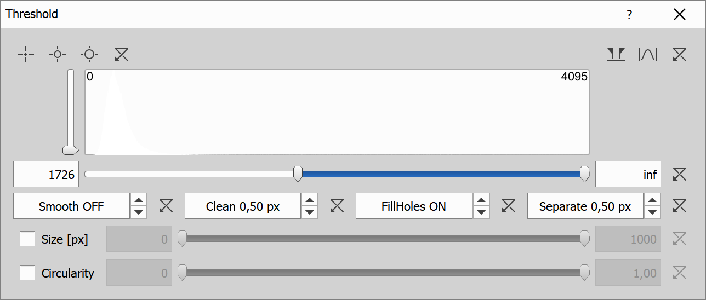

After this step we have found cells in the image as shown in picture below, in the next step we will track movement of those cells.

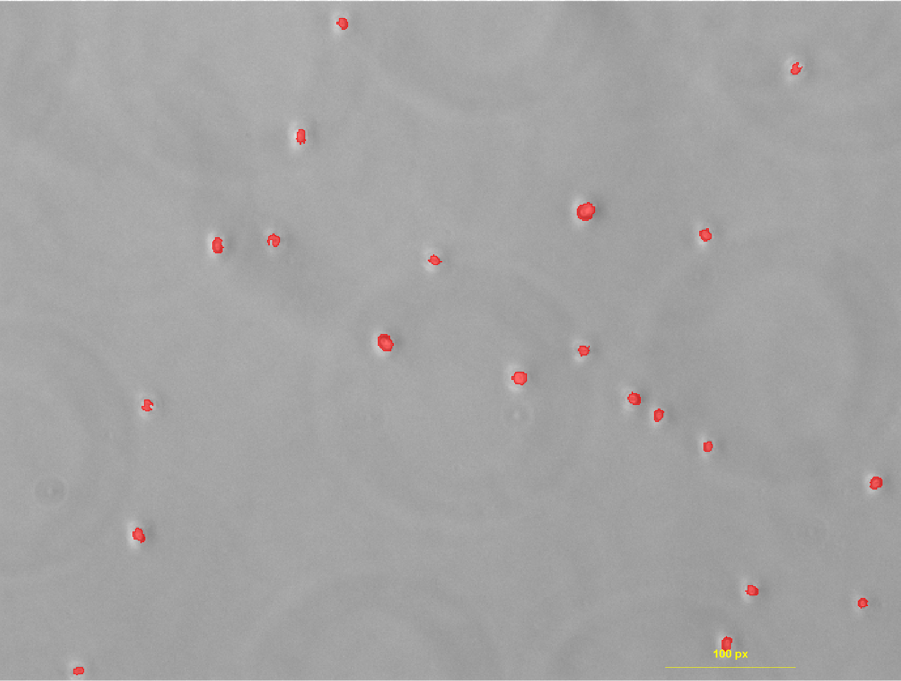

### 2. Track movement of those cells

In this step we will use TrackParticle node to actually track movement of those cells, but first we need to find X and Y coordinates of the center of each cell, then we will use calculate features of the motion.

**TimeAndCenter** node will calculate center (X and Y coordinate) for each detected cell and the time, this node is usually used with TrackParticle node which will be used next.

**TrackParticles** node will perform the actual tracking of the cells, there are several options for the tracking:

*Motion model* specifies how particles are tracked, if cells move with some speed, pick "Constant Speed" model, if objects move randomly use "Random motion" model, in most cases you should use "Constant Speed" model, which we will also use here.

*Stdev Multiplication Factor* - After tracking has started, each tracked particle has an ellipsis in which the particle should be in the next frame, this attribute dictates by how much this ellipsis is supposed to get bigger. In this case we use constant 2.

*Maximum Speed and Distance* attributes dictate maximum speed of tracked object and how far it can travel between one frame.

*Close gaps up to* attribute says for how many frames can a tracked particle be missing, this is useful for example when 2 particles cross each other and thus are temporarily put into single binary and only have one set of X/Y coordinate. In this example, we set this attribute to 2.

*Distinguishing feature* can be used to select some feature of an object and use it for tracking, for example if we tracked particles defined by binaries of different sizes, we could use the size to correctly track movement of particles using their sizes.

*Max dFeature/dTime* attribute says how much the value of a distinguishing feature can change in one time jump.

In this example, we will use following settings:

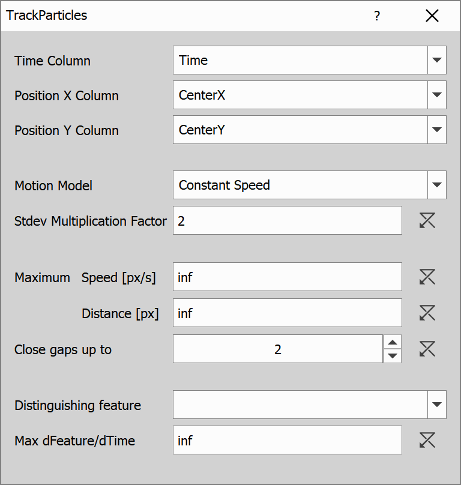

After this node we can see that for each data point, each detected cell has assigned TrackId which tracks the object even if its own ID has changed, this is the result for one data point:

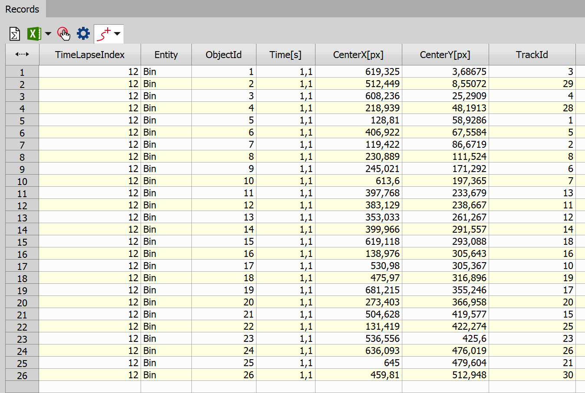

**AccumTracks** node is used to accumulate tracking results from all time points, you can also omit tracks that are shorter then N frames, in this case we remove tracks only lasting of 1 frame.

> [!WARNING]
>
> Even though accumulating records over time points was usually done with AccumRecords node, with result table of particle tracking, you HAVE to use AccumTracks node.

At this point we can once again enable Display tracking in the Analysis Results window to display moving particles on the image.

**MotionFeatures** node will calculate features of the movement in each track, it will calculate features like change in position, velocity, traveled distance, speed, acceleration and so on, since we will plot change in position over time, we will select following features:

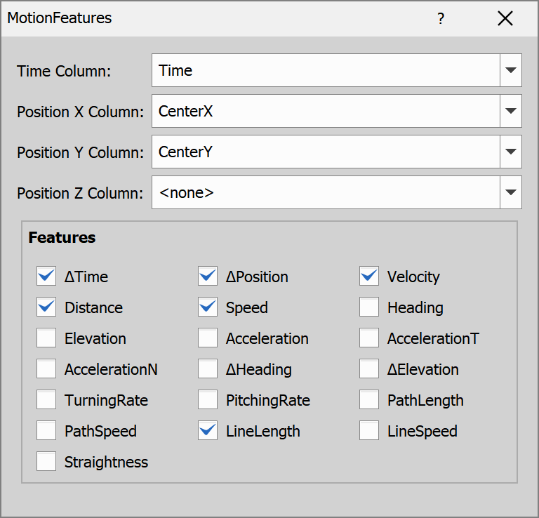

**ModifyColumns** node is simply used to remove some attributes that will not be needed in further calculations like entity, X and Y velocity and speed (though last 3 could have been removed in MotionFeatures node)

**GroupRecords** node will then be used to group results for each tracked particle, here are the results for track 9 and 10:

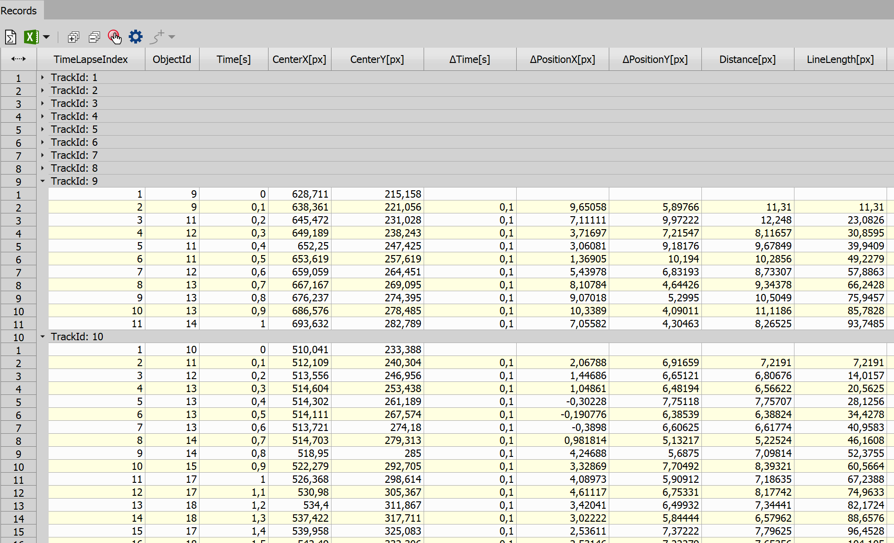

### 3. Plot movement of tracked cells in a scatterplot

In this step we will use tracked particles and features about their motion to plot a scatterplot that will show how much has each particle moved in the frame from its original position.

**PosInt** node will integrate (accumulate) changes in X and Y position, which calculates position of the particle relative to it's origin for each data point, this is the data we will plot using the scatterplot. Here are the settings for this node:

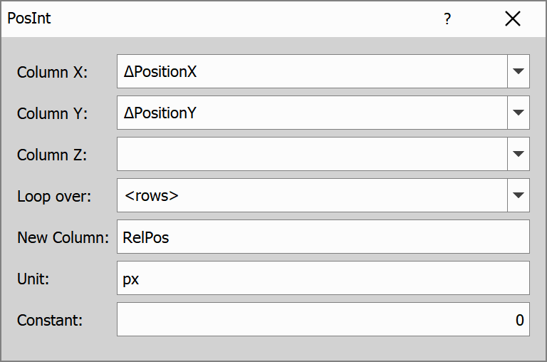

And this the the result table:

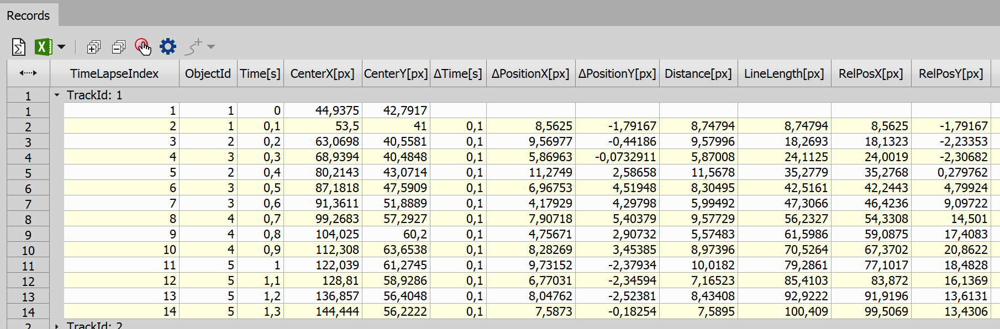

We can see new columns RelPosX and RelPosY that accumulate position deltas and we will use those 2 columns in the scatterplot.

**Scatterplot** node will be used to plot the movements of the particles, as described before, it will plot accumulated movements from last node on X and Y axis, here are the settings for this node:

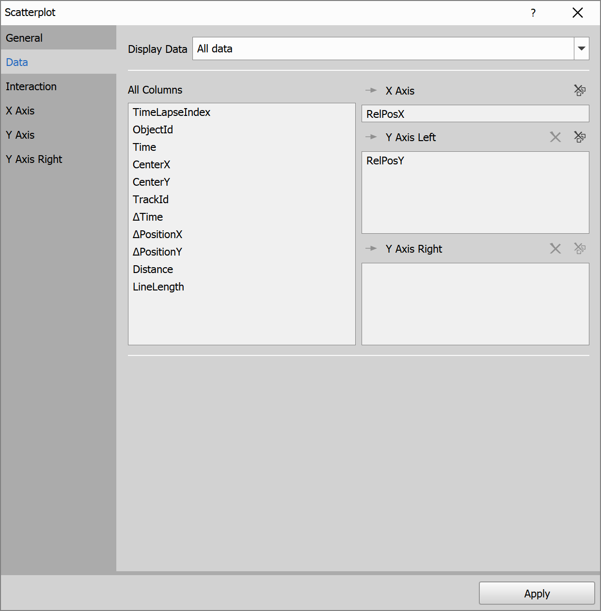

And this is the final scatterplot as shown in the results section:

# Conclusion

In this example we have described two nodes used for tracking, one for tracking bigger objects, other for tracking smaller particles, we have also shown how to use those node in GA3 module and how to use the results for reports.
