# Tracking cells moving between chambers

This example shows how to:

- detect cells moving between different chapters
- track how much time they spend there

## Input files

Original ND2 image and analysis recipe can be downloaded from this repository:

- ND2 file [[View on GitHub](./GA3_Tracking_cells_moving_between_chambers_example.nd2)] [[Download file](https://laboratory-imaging.github.io/GA3-examples/NIS_v6.10/32-Tracking_cells_moving_between_chambers/GA3_Tracking_cells_moving_between_chambers_example.nd2)]

- GA3 file [[View on GitHub](./GA3_Tracking_cells_moving_between_chambers_example.ga3)] [[Download file](https://laboratory-imaging.github.io/GA3-examples/NIS_v6.10/32-Tracking_cells_moving_between_chambers/GA3_Tracking_cells_moving_between_chambers_example.ga3)]

### The source image data

Original image shows movement of cells (visible as dark shadow) between the chambers from bottom to top:

### Complete recipe

The GA3 recipe used in this analysis is also available as an interactive HTML file [[View on GitHub](./recipe.html)] [[View Online](https://laboratory-imaging.github.io/GA3-examples/NIS_v6.10/32-Tracking_cells_moving_between_chambers/recipe.html)]

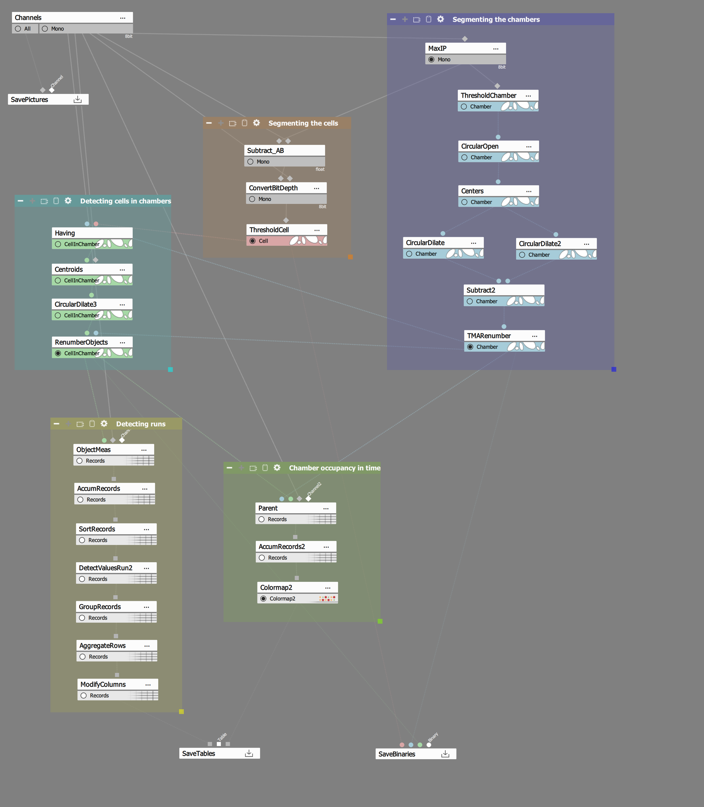

## Result

This analysis will detect and show chambers (blue color), movement of cells (red color) and chambers with cells in them (marked by green circle):

We will also plot occupancy of each chamber using a colormap:

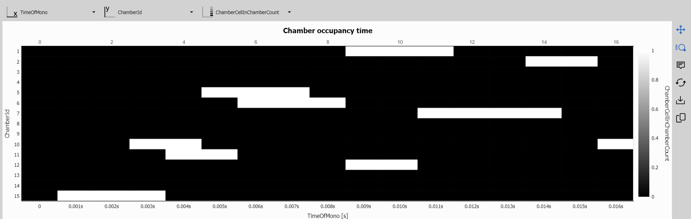

## Analysis

As we can see in the recipe, this detection will be done in 5 steps:

1) [Detect, segment and number chambers](#1-detect-segment-and-number-chambers)
2) [Detect and segment moving cells](#2-detect-and-segment-moving-cells)
3) [Detect cells in chambers](#3-detect-cells-in-chambers)
4) [Detect runs (when a chamber contains the same cell)](#4-detect-runs-when-a-chamber-contains-the-same-cell)
5) [Show the chamber occupancy over time](#5-show-the-chamber-occupancy-over-time)

### 1. Detect, segment and number chambers

Detecting chambers consists of several steps accomplished by using following nodes:

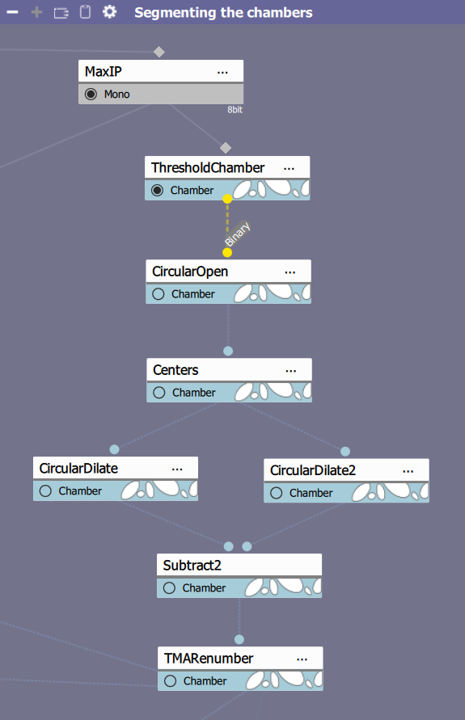

- **MaxIP** node displays the image in maximum intensity projection (maximum brightness for each pixel between all frames), this removes shadows by passing cells.

- **ThresholdChamber** node splits image into a binary based on brightness of each pixel, in this analysis we have set range of displayed pixels from **93 - 255**, settings for this node can be seen here:

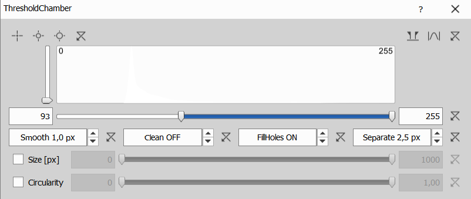

- **CircularOpen** node performs erosion followed by dilation, which removes objects that are too small with respect to specified radius, which was set to **20 pixels** for this analysis, this makes sure that only the chambers are highlighted as shown below:

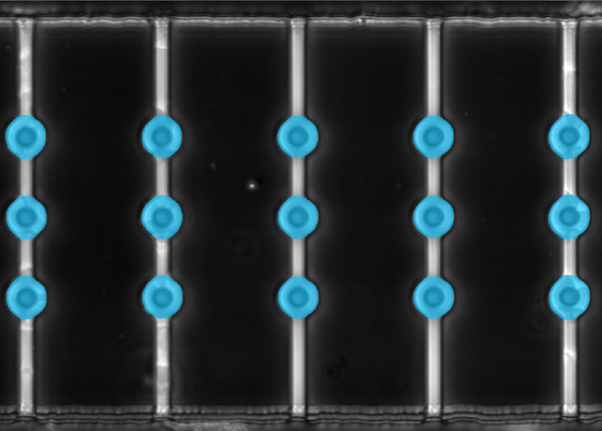

- **Centers** node finds centers of each chamber

- **CircularDilate** node creates circles around each center, first node's radius us set to **30 px**, second one's to **12 px**, those sizes approximately match the outer and inner edge of each chamber.

- **Subtract** node subtracts smaller circle from the bigger one from the previous step, essentially creating doughnuts as shown below:

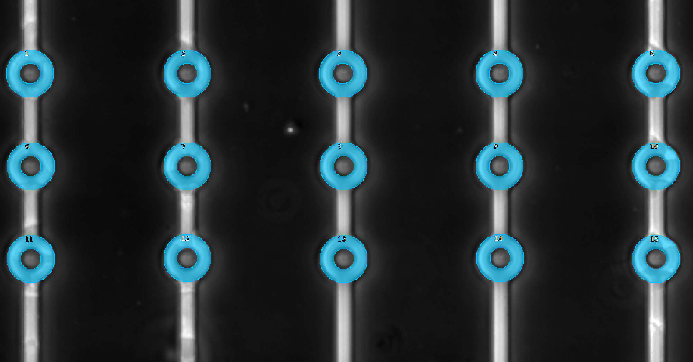

- **TMARenumber** node renumbers chambers as per settings shown below, from left to right, top to bottom.

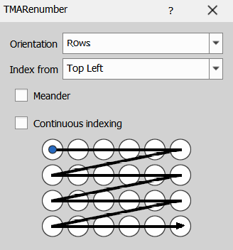

### 2. Detect and segment moving cells

Detecting moving cells is done using those 3 nodes:

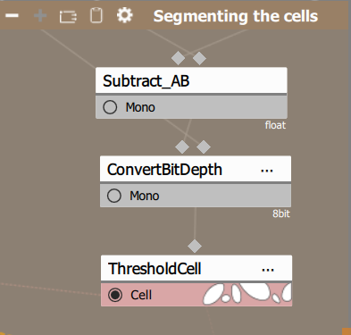

- **SubtractAB** node subtracts current frame from maximum intensity projection image, this highlights differences if brightness, capturing shadows of moving cells.

- As SubtractAB node returns image in float format, **ConvertBitDepth** node converts float image back to 8bit one.

- **ThresholdCell** node again highlights pixels above specified brightness, in this case we set the threshold from **54 to infinity** as shown here:

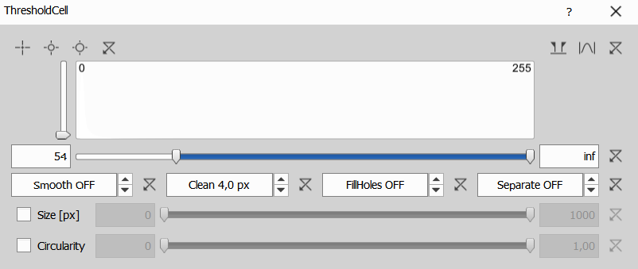

At this point cells are detected and highlighted as shown here:

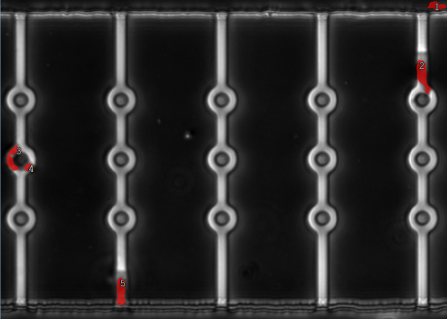

### 3. Detect cells in chambers

Next step allows us to detect which chambers contain a moving cell, this detection is done using following nodes:

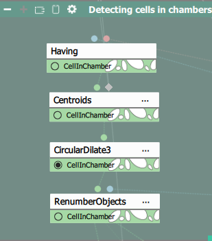

- **Having** node only shows objects A that are connected to aby object B, in this case only chambers touching or overlapping with a cell are shown.

- **Centroids** node finds the centre of each highlighted chamber with a cell.

- **CircularDilate3** node creates a circle inside the doughnut of a chamber with a cell in it, the radius of this circle is set to **15 pixels**.

- **RenumberObjects** node once again renumbers highlighted chambers with cells inside in reference to chamber numbering from step 1.

At this point we should be able to see chambers with cells inside them highlighted by green circle inside individual chamber as shown on image below:

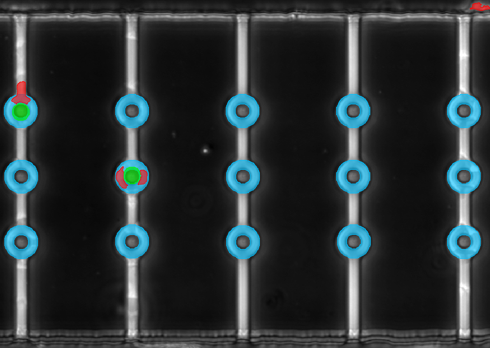

### 4. Detect runs (when a chamber contains the same cell)

Detecting runs can be done with the following nodes:

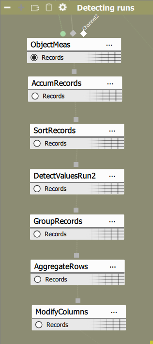

- **ObjectMeas** node will collect all attributes of a binary object into a table, in this case we track data about chambers will cells inside them, thus this node is connected to output of step 3.

- As previous node stores data for one time index only, **AccumRecords** node accumulates data from every time index into one table.

- **SortValues** node simply sorts the table based on time index in an ascending order. Those 3 nodes yield the following table listing activated cells and time of activation:

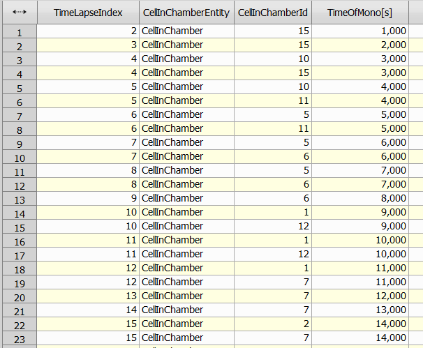

- **DetectValuesRun2** node will detect and index all runs, run is a *consecutive* sequence of chamber activation, each time a new chamber is activated (a cell enters the chamber), new RunID is assigned. This node has following settings:

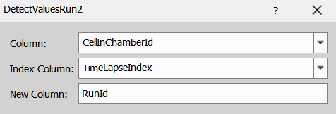

This node yields following table:

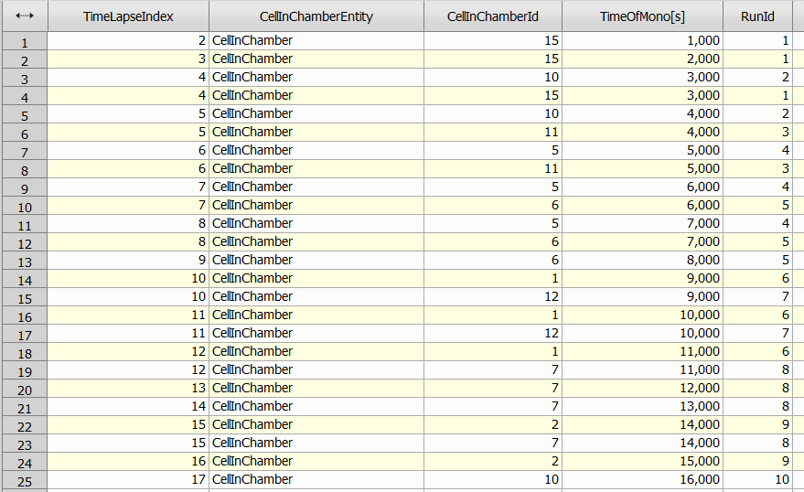

- **GroupRecords** node will group rows based on selected column, in this case we want to group rows with same **RunId**, this will produce following table:

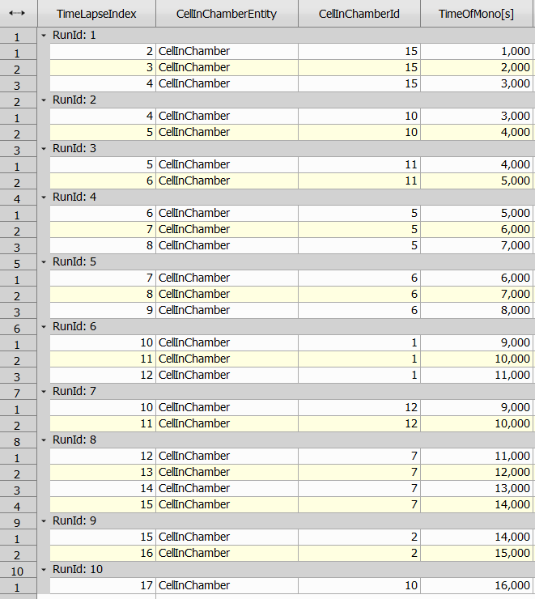

- **AggregateRows** node will allows up to aggregate data within groups from previous result, since we are interested in when a cell entered a chamber and how long it stayed there, we can use following settings:

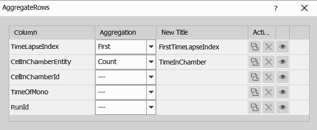

- Finally we use **ModifyColumns** node to simply change order of the columns.

Step 4 of this analysis detected runs of cells and calculated how long did a cell stay inside a chamber, the result is following table:

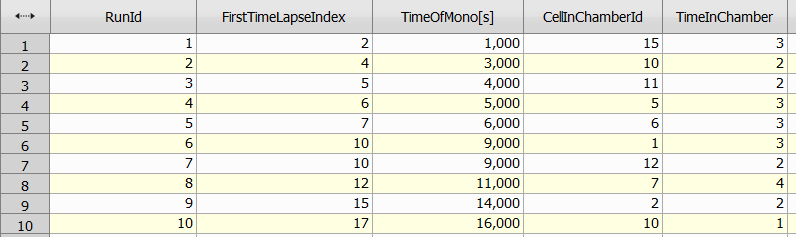

We can see each run, what chamber the run occurred in and how long it was, for example run with id 4 started at time index 6, happened in chamber id 5 and lasted for 3 frames.

### 5. Show the chamber occupancy over time

To plot chamber occupancy in time we can use following nodes:

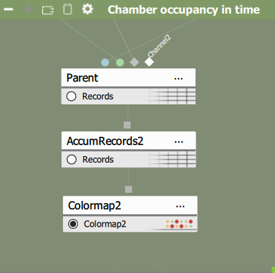

- **Parent** node measures parent and children object features, a result is a table where each row corresponds to one parent, as such we must connect parent and child connection to this node, we will use chambers (result of step 1) as parents and detected cells in chambers (result of step 3) as children, we will use following settings for the parent node itself:

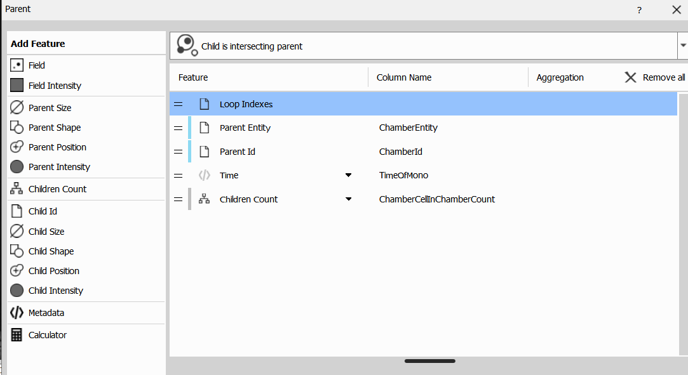

As we can see, we will count how many children (green circles used for activated chambers) intersect with a parent (blue doughnut used for detected chamber), this count will be stored in ChamberCellInChamberCount and the result will be following table for each timelapse index:

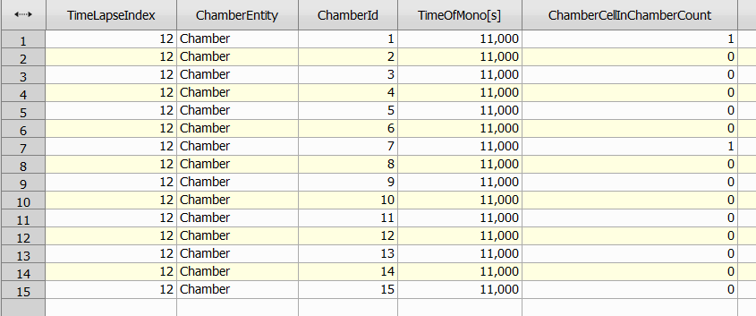

- **AccumRecords2** node then simply uses **TimeLapse** attribute as accumulation loop to accumulate results from each time index into one table.

- **Colormap2** node uses table with time indices, chamber ids and cell in chamber count to make a 2D plot of occupied cells over time, this colormap has following settings:

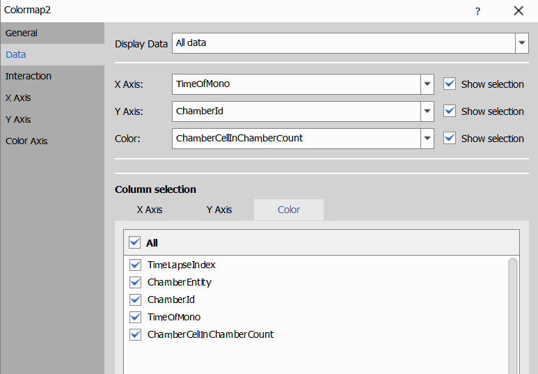

This colormap gives us the result as shown in the results section:

As you may see, this graph directly corresponds with table produced in step 4, but instead visualizes the findings in a 2D graph.

## Conclusion

This GA3 analysis allowed us to detect and track movement of cells in chambers and to measure how long they stayed there.
