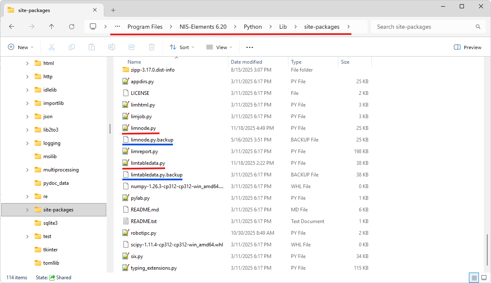

# Fixing issues with Python

The two py files in this folder fix the following issues.

#### 1. Python Generic node requires Python 3.12 for out-of-process python

The requirement is unnecessarily high for many popular packages (e.g. tensorflow).

Fix: the requirement is lowered to Python version 3.10.

#### 2. Tables in out-of-process python do not get updated in the run() function

Tables are not copied back into `out` parameter inside `run(...)` function.
This works in the built-in python.

Fix: the tables are copied as it supposed to be.

#### 3. Environment Library\bin not found

As NIS-Elements is merely executing the `pythonw.exe` in the environment and
not activating it the `Library\bin` gets not added to the PATH.

Fix: It is done silently by the `limnode.py` script.

## Installation

> [!WARNING]
> Backup the original files in order to be able to revert the change in case you experience problems!

1. In the NIS-Elements installation folder (typically `C:\Program Files\NIS-Elements\`)

navigate to `Python\Lib\site-packages` and rename these two files:

- `limnode.py` -> `limnode.py.backup` and
- `limtabledata.py` -> `limtabledata.py.backup`

2. Copy the files from here into the NIS-Elements folder instead of the original files:

- limnode.py and
- limtabledata.py

3. Restart NIS-Elements