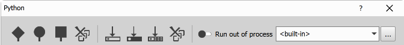
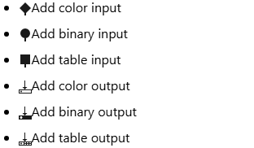
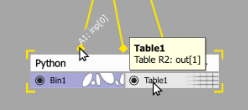
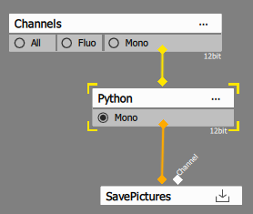

# Overview

The python node is unique in two ways:
1. it doesn't have default Inputs and Outputs so it cannot be connected right away and
2. the whole functionality of the node is implemented in a python script.

## Defining inputs and outputs

Before using the node the user must decide what inputs and outputs it will have. It depends on the
node function:

- **Preprocessing** node will have one Channel Input and one Channel output or
- **Segmentation** node will typically have one or more Channel Input and one Binary output

Inputs and outputs can be added using the buttons in the top toolbar od the node dialog.





After setting a combination of inputs and outputs the node looks lik that:



Note that whe hovering over the input pins or output rectangles a tooltip appear showing `inp[n]` or `out[n]` corresponding to function arguments.

## Writing the script

### Simple processing

1. We will use the [GA3_Cell_Size_Analysis_example.nd2](https://laboratory-imaging.github.io/GA3-examples/NIS_v6.10/10-Cell_Size_Analysis/GA3_Cell_Size_Analysis_example.nd2). Download it and open it in NIS Elements.
2. Add the python node.
5. Add Input color and Output Color
4. Connect the node to the Mono channel and the SavePictures to the python output.
5. Check preview.



The output should be black because we didn't do anything nin the `run()` function.

#### Copy the original

In the script part edit the run function. Instead of `pass` we want to set the data to the output `out` parameter.
From the tooltip we figured out it is `out[0]` (first and only output we have). We will be using the input `inp[0]` data as
a source.

The `data` attribute is a `numpy` [ndarray](https://numpy.org/doc/stable/reference/arrays.ndarray.html).

```py
def run(inp: tuple[limnode.AnyInData], out: tuple[limnode.AnyOutData], ctx: limnode.RunContext) -> None:
    out[0].data[:] = inp[0].data[:]
```

Now, the preview should show the original.

#### What is the shape and type of the data

Lets see some basic properties of the ndarray:

```py
def run(inp: tuple[limnode.AnyInData], out: tuple[limnode.AnyOutData], ctx: limnode.RunContext) -> None:
    out[0].data[:] = inp[0].data[:]
    print("ndim =", out[0].data.ndim)
    print("shape =", out[0].data.shape)
    print("dtype =", out[0].data.dtype)

```

The `print()` output goes to the NIS Elements log file. To see it go the NIS Elements Menu `Help -> Open Log File...`.

> [!WARNING]
> Make sure the logging has is enabled!
>
> `Help -> Enable Logging` must be checked.
> If not check it and restart NIS-Elements.

```
... PYTHON OUT: ndim = 4
... PYTHON OUT: shape = (1, 2800, 2800, 1)
... PYTHON OUT: dtype = uint16
```

##### shape

> [!IMPORTANT]
> In python node the `data` ndarray for both Color Channels and Binaries have `ndim=4` (rank of 4) and following shape:
>
> 0. z - **depth** of 3D Z stack volumes (1 - for 2D)
> 1. y - **height** of 2D image
> 2. x - **width** of 2D image
> 3. c - **component** (a.k.a channel) of image (1 for mono and binaries, 3 for RGB, n for all)

The output `(1, 2800, 2800, 1)` shows that the ndarray
- is 2D (depth=1),
- the image is 2800 x 2800 pixel and
- it has one component.

##### type

Color Channel data are either:
- unsigned integer
  - uint8 where values are in range <0, 256) maximum being 255
  - uint16 where values are in range <0, 65536) maximum being 65535
- floating point
  - float32 where values are unrestricted

Binary data can be:
- uint8 interpreted as 0 - background and all other values as object
- int32 interpreted as 0 - background and all other values as object ID

> [!WARNING]
> Unsigned integers cannot represent negative numbers. As a consequence some
> arithmetic operations may give unexpected results as they **wrap around zero**.
>
> For example in case of uint8: 2 - 3 = 255

#### Playing with pixel values

Lets do some arithmetics with the pixels.

1. Lets multiply the data:

```py
def run(inp: tuple[limnode.AnyInData], out: tuple[limnode.AnyOutData], ctx: limnode.RunContext) -> None:
    out[0].data[:] = inp[0].data[:] * 2
```

The image got brighter.

2. Lets subtract an offset form the data:

```py
def run(inp: tuple[limnode.AnyInData], out: tuple[limnode.AnyOutData], ctx: limnode.RunContext) -> None:
    out[0].data[:] = inp[0].data[:] - 100
```

This doesn't seem right. This is the manifestation of the **wrapping around zero issue** where the values instead
of going negative become high.

> [!IMPORTANT]
> The data type (`dtype`) in which we perform computations must be large enough to hold our temporary results.
> We suggest to always convert the data into float using `astype(float)`.
> Negative values must still be dealt with!
> Typically using [numpy.maximum()](https://numpy.org/doc/stable/reference/generated/numpy.maximum.html) or [numpy.clip()](https://numpy.org/doc/stable/reference/generated/numpy.clip.html)

Before we can use numpy we must import it
```py
import limnode, numpy
```

```py
def run(inp: tuple[limnode.AnyInData], out: tuple[limnode.AnyOutData], ctx: limnode.RunContext) -> None:
    out[0].data[:] = numpy.maximum(inp[0].data[:].astype(float) - 100, 0)
```

We can apply simple auto-contrast to the data using quantile. Note that it makes sense only with integer data (`out[0].bitsPerComponent < 32`).

```py
def run(inp: tuple[limnode.AnyInData], out: tuple[limnode.AnyOutData], ctx: limnode.RunContext) -> None:
    if out[0].bitsPerComponent < 32:
        image = inp[0].data[:].astype(float)
        min = numpy.quantile(image, 0.01)
        max = numpy.quantile(image, 0.99)
        maxval = 2 ** out[0].bitsPerComponent - 1
        out[0].data[:] = numpy.clip((image - min) * maxval / (max - min), 0, maxval)
    else:
        out[0].data[:] = inp[0].data[:]
```

#### Playing with coordinates - indexing and slicing

We saw above that our example image input `inp[0]` is a 2D mono image 2800 x 2800 pixels.

We will be copying only portions of the source image to see how slicing work:

1. Lets first copy a rectangle in the top-left corner (1400x700px). Remember: Y goes before X.

```py
def run(inp: tuple[limnode.AnyInData], out: tuple[limnode.AnyOutData], ctx: limnode.RunContext) -> None:
    out[0].data[:, 0:700, 0:1400, :] = inp[0].data[:, 0:700, 0:1400, :]
```

2. We can move it down by 700px.

```py
def run(inp: tuple[limnode.AnyInData], out: tuple[limnode.AnyOutData], ctx: limnode.RunContext) -> None:
    out[0].data[:, 700:1400, 0:1400, :] = inp[0].data[:, 0:700, 0:1400, :]
```

3. We can copy whole image every second row.

```py
def run(inp: tuple[limnode.AnyInData], out: tuple[limnode.AnyOutData], ctx: limnode.RunContext) -> None:
    out[0].data[:, ::2, :, :] = inp[0].data[:, ::2, :, :]
```

4. We can flip the image horizontally

```py
def run(inp: tuple[limnode.AnyInData], out: tuple[limnode.AnyOutData], ctx: limnode.RunContext) -> None:
    out[0].data[:, :, :, :] = inp[0].data[:, :, ::-1, :]
```

> [!IMPORTANT]
> Slicing notation:
> - : is for all
> - i is for **indexing** of single element (z-slice, row of data, column of data, channel), negative number is from the end
> - a:b:c is for **slicing** where
>   - a is index of the start of the slice, negative number is from the end
>   - b is index of the end (one after) of the slice, negative number is from the end
>   - c is step, when negative it reverses the order


### Simple thresholding

This example uses numpy function [where()](https://numpy.org/doc/stable/reference/generated/numpy.where.html#numpy.where) the perform a threshold.

1. We will use the the same image [GA3_Cell_Size_Analysis_example.nd2](https://laboratory-imaging.github.io/GA3-examples/NIS_v6.10/10-Cell_Size_Analysis/GA3_Cell_Size_Analysis_example.nd2). Download it and open it in NIS Elements.
2. Add the python node.
5. Add Input color and **Output Binary**
4. Connect the node to the Mono channel and the SaveBinaries to the python output.
5. Connect "All" from channels to SavePictures
6. Edit the script by adding the numpy to import line
7. Replace the contents of the `run()` function as shown below

```py
import limnode, numpy
```

```py
def run(inp: tuple[limnode.AnyInData], out: tuple[limnode.AnyOutData], ctx: limnode.RunContext) -> None:
    img = inp[0].data
    bin = numpy.where((img >= 300), 1, 0)
    out[0].data[:] = bin.astype(numpy.uint8)
```

Lets change the color and the name of the binary layer. Lets call it "cell" and make it yellow.

#### The output() function

The `output()` function defines all the aspects of the output parameters.

In general we can either
- **assign** an input from which the output will take all the properties or
- **make new** output and define it.

Here is a complete list of functions per each output type:
```py
class OutputChannelDef:
    def assign(self, param: InputChannelDef) -> OutputChannelDef:
        ...
    def makeNewMono(self, name: str, color: AnyColorDef) -> OutputChannelDef:
        ...
    def makeNewRgb(self, name: str|None = None) -> OutputChannelDef:
        ...
    # change bitdepth
    def makeFloat(self) -> OutputChannelDef:
        ...
    def makeUInt16(self) -> OutputChannelDef:
        ...
    def makeUInt8(self) -> OutputChannelDef:
        ...

class OutputBinaryDef:
    def assign(self, param: InputBinaryDef) -> OutputBinaryDef:
        ...
    def makeNew(self, name: str, color: AnyColorDef) -> OutputBinaryDef:
        ...
    # change bitdepth
    def makeInt32(self) -> OutputBinaryDef:
        ...
    def makeUInt8(self) -> OutputBinaryDef:
        ...

class OutputTableDef:
    def assign(self, param: InputTableDef) -> OutputTableDef:
        ...
    # new empty table
    def makeEmpty(self, name: str) -> OutputTableDef:
        ...
    # optional InputTableDef to copy columns from or if None add just loopCols
    def makeNew(self, name: str, param: InputTableDef|None = None) -> OutputTableDef:
        ...
    # to add all necessary loop columns
    def withLoopCols(self) -> OutputTableDef:
        ...
    # to add Entity and ObjectID columns
    def withObjectCols(self) -> OutputTableDef:
        ...
    # and arbitrary data columns based on type
    def withIntCol(self, title: str, unit: str|None = None, feature:str|None = None, id: str|None = None) -> OutputTableDef:
        ...
    def withFloatCol(self, title: str, unit: str|None = None, feature:str|None = None, id: str|None = None) -> OutputTableDef:
        ...
    def withStringCol(self, title: str, unit: str|None = None, feature:str|None = None, id: str|None = None) -> OutputTableDef:
```

Note that all functions return `self` so they can be concatenated.

By default the node assigns an input to the output so we didn't have to care about it until now. There is no other binary
to be assigned from.

```py
def output(inp: tuple[limnode.AnyInDef], out: tuple[limnode.AnyOutDef]) -> None:
    out[0].makeNew("cell", "#FFFF00")
```
