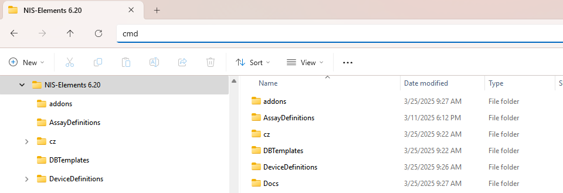
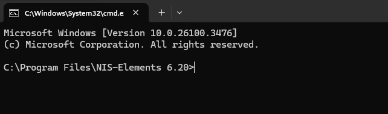
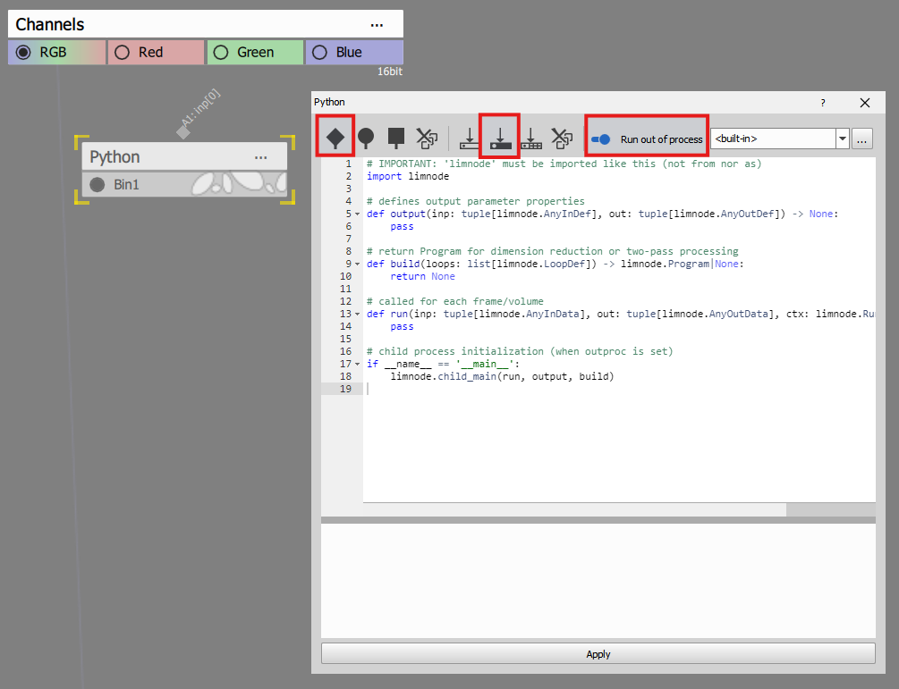
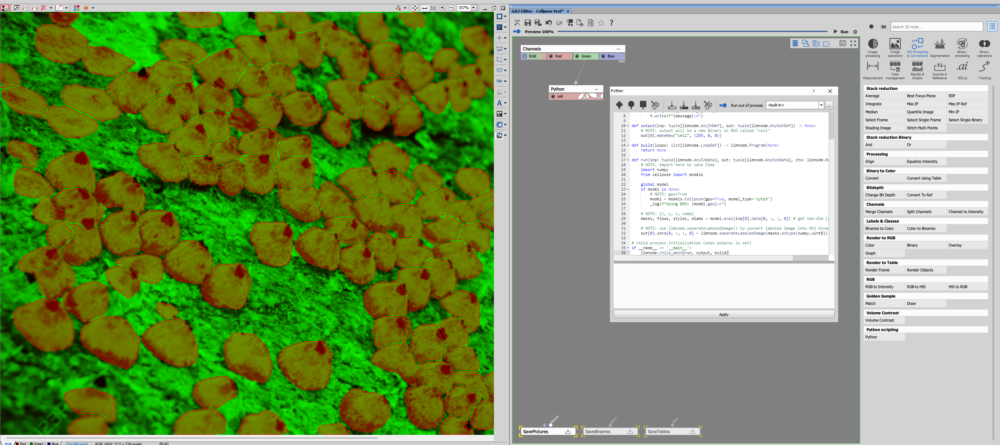
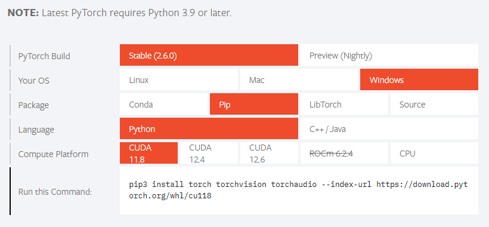
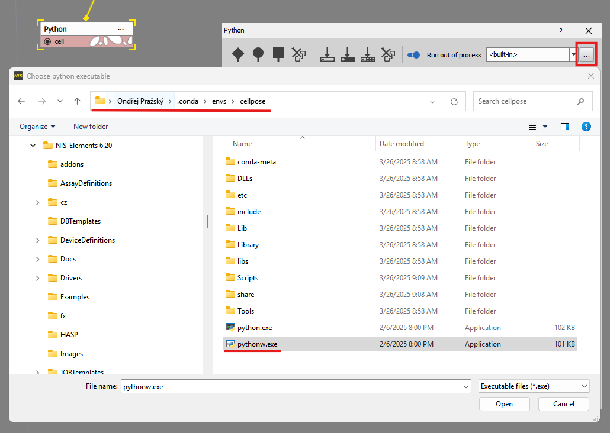
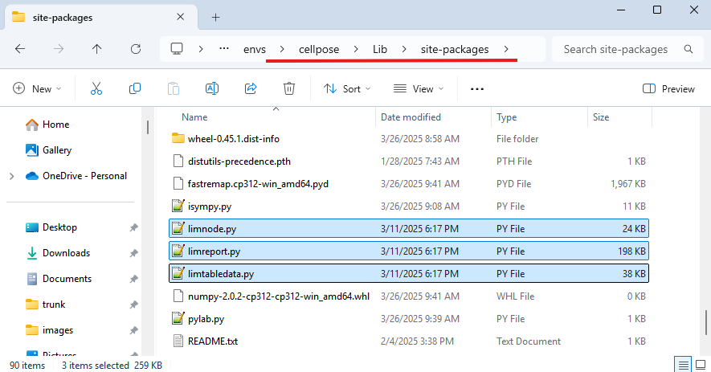

# Running Cellpose from within GA3

This example will show how to:
- [install cellpose](#installing-cellpose)
- [setup the node](#build-the-ga3-graph) for cellpose
- [enable GPU](#enabling-gpu-acceleration-in-cellpose) with cellpose
- [cerate](#creating-conda-environment) and [use](#using-conda-environment-in-the-python-node) with conda environment

## Installing cellpose

NIS-Elements has a python environment that is separate from the system one. These steps will ensure that packages are installed into that
private environment:

1. Open `cmd` terminal and type:

```cmd
c:
cd c:\Program Files\NIS Elements\
```

or Find the folder in the Windows Explorer and type `cmd` into the Folder bar



The terminal should look like this (pointing into the NIS Elements installation folder):



2. To install the cellpose (with GUI):

```cmd
pip.bat install cellpose[gui]
```

3. To check it is installed run: `python.bat` and type:

```py
from cellpose import models
```

If there are no errors models were imported.

4. Download the [datasets](https://www.cellpose.org/dataset) from cellpose to get started


## Build the GA3 graph

#### 1. Inside NIS-Elements open a file from the cellpose dataset (e.g. 650_img.png).

#### 2. Open the GA3 editor and add the Python node. It is located in the `ND Processing & Conversion` at the bottom.

#### 3. Setup the node:
    - add color input,
    - add binary output and
    - check the "Ron out of process" switch



#### 4. Paste the code below into the editor completely replacing the default content.

```python
import limnode

model = None

# NOTE: log from child process
def _log(message):
    with open("d:\\python.log", "a") as f:
        f.write(f"{message}\n")

def output(inp: tuple[limnode.AnyInDef], out: tuple[limnode.AnyOutDef]) -> None:
    # NOTE: output will be a new Binary in RED called "cell"
    out[0].makeNew("cell", (255, 0, 0))

def build(loops: list[limnode.LoopDef]) -> limnode.Program|None:
    return None

def run(inp: tuple[limnode.AnyInData], out: tuple[limnode.AnyOutData], ctx: limnode.RunContext) -> None:
    # NOTE: import here to save time
    import numpy
    from cellpose import models

    global model
    if model is None:
        # NOTE: gpu=True
        model = models.Cellpose(gpu=True, model_type='cyto3')
        _log(f"Using GPU: {model.gpu}\n")

    # NOTE: [z, y, x, comp]
    masks, flows, styles, diams = model.eval(inp[0].data[0, :, :, 0]) # get two-dim [y, x]

    # NOTE: use limnode.separateLabeledImage() to convert labeled image into NIS binary
    out[0].data[0, :, :, 0] = limnode.separateLabeledImage(masks.astype(numpy.uint8))

# child process initialization (when outproc is set)
if __name__ == '__main__':
    limnode.child_main(run, output, build)
```

#### 5. Connect the input to the green channel and switch ON the preview if not already ON.

The result should look like this.



### Notes

#### Logging

Python output normally goes into NIS-Elements log file which is available from the Menu *Help* -> *Open log file...* Note that
*Enable logging* must be enabled (setting it ON requires restarting NIS).

However, whe run as a child process the logging doesn't make it into logs.
Therefore log into an arbitrary file like so:

```py
def _log(message):
    with open("d:\\python.log", "a") as f:
        f.write(f"{message}\n")
```

#### output() function

```py
def output(inp: tuple[limnode.AnyInDef], out: tuple[limnode.AnyOutDef]) -> None:
    out[0].makeNew("cell", (255, 0, 0))
```

#### import inside run()

As the `output()` function is run more frequently it is better to be fast.
If a large module is imported it is better to do so inside run() function.

```py
def run(inp: tuple[limnode.AnyInData], out: tuple[limnode.AnyOutData], ctx: limnode.RunContext) -> None:
    import numpy
    from cellpose import models
```

#### enable GPU

Cellpose is **not** using GPU ny default. It must be explicitly turned ON in the model constructor like so:

```py
model = models.Cellpose(gpu=True, model_type='cyto3')
_log(f"Using GPU: {model.gpu}\n")
```

Check the log file and if the output is False go to [Enabling GPU acceleration in cellpose](#enabling-gpu-acceleration-in-cellpose) section.

#### input/output data shape

The `data` shape of inp[], and out[] has always rank=4 for both Binary and color.

The order is as follows:

0. z - depth of 3D Z stack volumes (1 - for 2D)
1. y - height of 2D image
2. x - width of 2D image
3. c - component (a.k.a channel) of image (1 for mono and binaries, 3 for RGB, n for all)

In order to get a 2D image single channel image use following slicing:

```py
a = inp[0].data[0, :, :, 0]
```

#### Labeled image

NIS-Elements use binaries to describe objects. Individual objects must not touch form left, right, bottom top (4-connectivity)
to form a separate object. However, this is not the case for many other systems where the object ID is in the pixel value and thus
objects can touch - Labeled image.

To convert from the Labels to binary, there is
- a node in Segmentation-> Special detections -> Labels to binary and
- a `separateLabeledImage()` function in limnode

Use the function to fill the binary output:

```py
out[0].data[0, :, :, 0] = limnode.separateLabeledImage(masks.astype(numpy.uint8))
```

## Enabling GPU acceleration in cellpose

Cellpose uses torch so the goal is to make sure the torch can use the gpu.

### Check if torch can see GPU

Run `cmd` terminal and navigate to `C:\Program Files\NIS-Elements` and `python.bat`.

Type the following line by line into the python interpreter:

```py
import torch
torch.cuda.is_available()
torch.cuda.device_count()
exit()
```

If the `is_available()` function returns False it means that the torch cannot find the specific CUDA version.

### Updating NVIDIA drivers

It is always good to update the drivers to the newest ones. The support all the previous version.

Go to the NVIDIA drivers download [page](https://www.nvidia.com/en-us/geforce/drivers/) download ind install it.

After exiting python interpreter, type `nvidia-smi.exe` into the cmd. It should output something like this:

```
+-----------------------------------------------------------------------------------------+
| NVIDIA-SMI 572.83                 Driver Version: 572.83         CUDA Version: 12.8     |
|-----------------------------------------+------------------------+----------------------+
| GPU  Name                  Driver-Model | Bus-Id          Disp.A | Volatile Uncorr. ECC |
| Fan  Temp   Perf          Pwr:Usage/Cap |           Memory-Usage | GPU-Util  Compute M. |
|                                         |                        |               MIG M. |
|=========================================+========================+======================|
|   0  NVIDIA RTX A4000             WDDM  |   00000000:47:00.0  On |                  Off |
| 41%   54C    P2             38W /  140W |    2778MiB /  16376MiB |      0%      Default |
|                                         |                        |                  N/A |
+-----------------------------------------+------------------------+----------------------+

...

```

The important part is the first line, especially the `CUDA Version: XX.Y`.

### Installing correct torch

Go to the [torch.org](https://pytorch.org/) page, scroll down to "Install PyTorch":



Select Stable, Windows, Pip, Python and any CUDA version lower than the version XX.Y from nvidia-smi.exe command.

Last lane shows a pip command to execute. Make sure to replace the pip3 with the `pip.bat`. In this case:

```cmd
pip.bat install torch torchvision torchaudio --index-url https://download.pytorch.org/whl/cu118
```

Check again [if the torch can see the GPU](#check-if-torch-can-see-gpu).

Now it should output True.

## Creating Conda environment

With miniconda installed on the system we run the **Anaconda Prompt** from the Start menu and

1. make a new environment with python 3.12 (minimum for NIS-Elements) called *cellpose*,
2. activate the environment
3. install torch (see [Installing correct torch](#installing-correct-torch)) using pip (NOT pip.bat)
4. optionally run python and check that [torch can see the GPU](#check-if-torch-can-see-gpu)
5. install cellpose and matplotlib (required by NIS)

```cmd
conda create -n cellpose python=3.12
conda activate cellpose
pip install torch torchvision torchaudio --index-url https://download.pytorch.org/whl/cu118
pip install cellpose matplotlib
```

After it installs the location of the environment can be found by typing:
```cmd
conda env list
```

It should output similar list.

```
# conda environments:
#
base                   C:\ProgramData\miniconda3
cellpose             * C:\Users\ondrej.prazsky\.conda\envs\cellpose
```

## Using Conda environment in the python node

In order to use the just created environment:

1. Check the "Run out of process",
2. click the ... button and
3. select "pythonw.exe" in the folder from above.



> [!WARNING]
> These two files from C:\Program Files\NIS-Elements\Python\Lib\site-packages
>
> - limnode.py,
> - limreport.py and
> - limtabletabledata.py
>
> must be copied into Conda environment site-packages folder.
>
> Otherwise there will be
>
> - **ModuleNotFoundError**: No module named **limnode**


