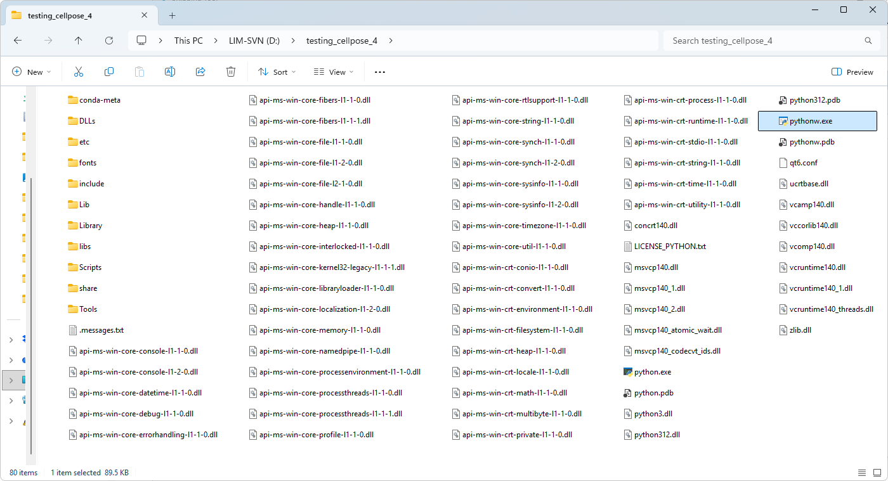
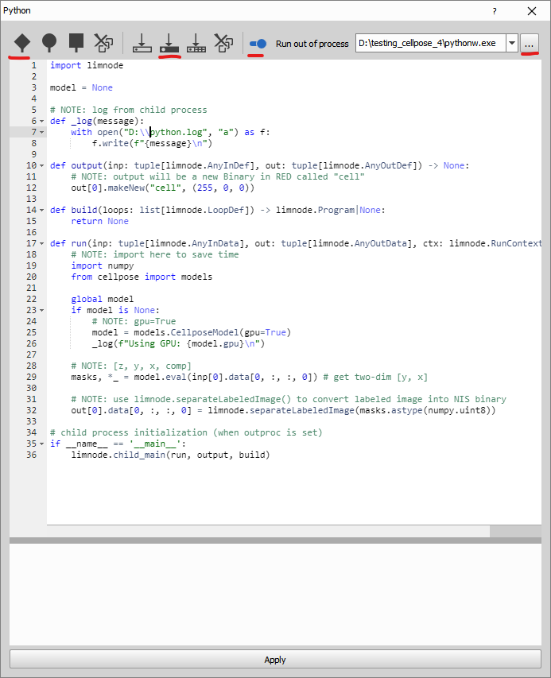
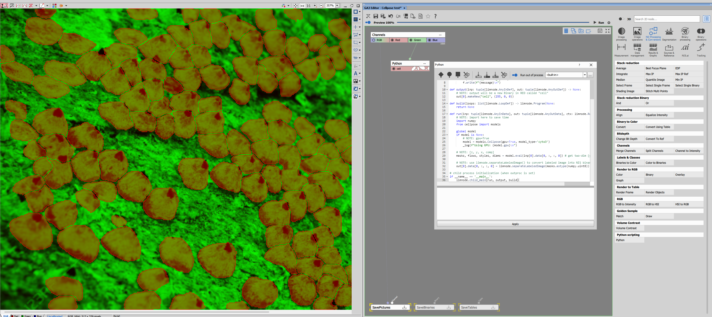

# Running Cellpose from within GA3

> [!NOTE]
> This example has been rewritten based on comments we received and recently adopted suggestion to install
> new packages into separate conda/mamba environments.

> [!WARNING]
> Installing packages inside NIS-Elements built-in python using the `pip.bat` or `python.bat -m pip` may
> break NIS-Elements because of mismatching versions.

> [!IMPORTANT]
> These **three files** from `C:\Program Files\NIS-Elements\Python\Lib\site-packages`
>
> - limnode.py,
> - limreport.py and
> - limtabledata.py
>
> **must be copied** into every Conda environment `Lib\site-packages` folder.
>
> Otherwise there will be **ModuleNotFoundError**: No module named **limnode**
>
> The `matplotlib` **must be installed** in every environment.

This example shows how to:

- [install cellpose](#installing-cellpose-v4-sam) using micromamba,
- [check the GPU](#check-the-gpu) and
- [setup the node](#build-the-ga3-graph) for cellpose

## Installing Cellpose v4 SAM

> [!TIP]
> In case you cannot use conda due to it's license use [micromamba](https://mamba.readthedocs.io/en/latest/user_guide/micromamba.html)
> install it from [here](https://github.com/mamba-org/micromamba-releases).
>
> You may say No (not needed for this example) to: `Do you want to initialize micromamba for the shell activate command?`

1. Create a conda/mamba environment using `environment.yaml` (in this folder)

    ```yaml
    name: Cellpose4
    channels:
        - conda-forge
    dependencies:
        - python=3.12.4
        - pytorch           # isntall GPU support rigth away
        - cellpose          # the up-to-date cellpose
        - pip               # we need pip for the matplotlib
        - pip:
            - matplotlib    # for NIS-Elements to communicate properly
    ```

2. Install it

    With micromamba in one line:

    ```cmd
    micromamba create --prefix "D:\testing_cellpose_4" -f "environment.yaml" -y
    ```

    replace `D:\testing_cellpose_4` with a folder of your choice.

3. Copy the following three files:

    - limnode.py,
    - limreport.py and
    - limtabledata.py

    from `C:\Program Files\NIS-Elements\Python\Lib\site-packages` to `D:\testing_cellpose_4\Lib\site-packages`.

The folder should contain the `pythonw.exe` that will be use as out of process interpreter.



## Check the GPU

We installed the `pytorch` together with the cellpose. Lets check if it can find the GPU:

```cmd
cd D:\testing_cellpose_4
```

Run the python interpreter:

```cmd
python
```

and try following commands:

```python
import torch
torch.cuda.is_available() # should return True
torch.cuda.device_count() # should return at least one
exit()
```

## Troubleshooting CUDA

If the previous check was not successful update to the latest [NVIDIA drivers](https://www.nvidia.com/en-us/geforce/drivers/).

Download and install it.

Check the version using `nvidia-smi.exe`. It should output something like this:

```
+-----------------------------------------------------------------------------------------+
| NVIDIA-SMI 572.83                 Driver Version: 572.83         CUDA Version: 12.8     |
|-----------------------------------------+------------------------+----------------------+
| GPU  Name                  Driver-Model | Bus-Id          Disp.A | Volatile Uncorr. ECC |
| Fan  Temp   Perf          Pwr:Usage/Cap |           Memory-Usage | GPU-Util  Compute M. |
|                                         |                        |               MIG M. |
|=========================================+========================+======================|
|   0  NVIDIA RTX A4000             WDDM  |   00000000:47:00.0  On |                  Off |
| 41%   54C    P2             38W /  140W |    2778MiB /  16376MiB |      0%      Default |
|                                         |                        |                  N/A |
+-----------------------------------------+------------------------+----------------------+

...

```

## Build the GA3 graph

#### 1. Inside NIS-Elements open a file from the cellpose dataset (e.g. 650_img.png).

#### 2. Open the GA3 editor and add the Python node. It is located in the `ND Processing & Conversion` at the bottom.

#### 3. Setup the node:

- add color input,
- add binary output,
- check the "Run out of process" switch and
- select the interpret just installed.



#### 4. Paste the code below into the editor (completely replace the default content).

```python
import limnode

model = None

# NOTE: log from child process
def _log(message):
    with open("D:\\testing_cellpose_4\\python.log", "a") as f:
        f.write(f"{message}\n")

def output(inp: tuple[limnode.AnyInDef], out: tuple[limnode.AnyOutDef]) -> None:
    # NOTE: output will be a new Binary in RED called "cell"
    out[0].makeNew("cell", (255, 0, 0))

def build(loops: list[limnode.LoopDef]) -> limnode.Program|None:
    return None

def run(inp: tuple[limnode.AnyInData], out: tuple[limnode.AnyOutData], ctx: limnode.RunContext) -> None:
    # NOTE: import here to save time
    import numpy
    from cellpose import models

    global model
    if model is None:
        # NOTE: gpu=True
        model = models.CellposeModel(gpu=True)
        _log(f"Using GPU: {model.gpu}\n")

    # NOTE: [z, y, x, comp]
    masks, *_ = model.eval(inp[0].data[0, :, :, 0]) # get two-dim [y, x]

    # NOTE: use limnode.separateLabeledImage() to convert labeled image into NIS binary
    out[0].data[0, :, :, 0] = limnode.separateLabeledImage(masks.astype(numpy.uint8))

# child process initialization (when outproc is set)
if __name__ == '__main__':
    limnode.child_main(run, output, build)
```

#### 5. Connect the input to the green channel and switch ON the preview if not already ON.

The result should look like this.



### Notes

#### Logging

Python output normally goes into the NIS-Elements log file which is available from the Menu *Help* -> *Open log file...* Note that
*Enable logging* must be enabled (setting it ON requires restarting NIS).

However, when run as a child process, the logging doesn't make it into these logs.
Therefore log into an arbitrary file:

```py
def _log(message):
    with open("D:\\testing_cellpose_4\\python.log", "a") as f:
        f.write(f"{message}\n")
```

#### output() function

```py
def output(inp: tuple[limnode.AnyInDef], out: tuple[limnode.AnyOutDef]) -> None:
    out[0].makeNew("cell", (255, 0, 0))
```

#### import inside run()

As the `output()` function is run more frequently it is better to be fast.
If a large module is imported it is better to do so inside run() function.

```py
def run(inp: tuple[limnode.AnyInData], out: tuple[limnode.AnyOutData], ctx: limnode.RunContext) -> None:
    import numpy
    from cellpose import models
```

#### enable GPU

Cellpose is **not** using GPU by default. It must be explicitly turned ON in the model constructor:

```py
model = models.CellposeModel(gpu=True)
_log(f"Using GPU: {model.gpu}\n")
```

Check the log file, if the output is False go to [Check the GPU](#check-the-gpu) section.

#### input/output data shape

The `data` shape of inp[], and out[] has always rank=4 for both binary and color.

The order is as follows:

0. z - depth of 3D Z stack volumes (1 - for 2D)
1. y - height of 2D image
2. x - width of 2D image
3. c - component (a.k.a channel) of image (1 for mono and binaries, 3 for RGB, n for all)

In order to get a 2D, single channel image use following slicing:

```py
inp[0].data[0, :, :, 0]
```

#### Labeled image

NIS-Elements use binaries to describe objects. Individual objects must not touch form left, right, bottom top (4-connectivity)
to form a separate object. However, this is not the case for many other systems where the object ID is in the pixel value and thus
objects can touch - Labeled image.

To convert from labels to binary, there is:
- a node in Segmentation-> Special detections -> Labels to binary and
- a `separateLabeledImage()` function in limnode

Use the function to fill the binary output:

```py
out[0].data[0, :, :, 0] = limnode.separateLabeledImage(masks.astype(numpy.uint8))
```


