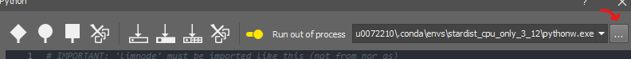
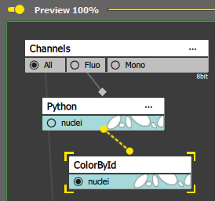

# Stardist in NIS

This workflow was kindly provided by *Nikky Corthout* and *Benjamin Pavie* from
[VIB Bioimaging core Leuven, VIB Technologies, VIB Center for Brain and Disease research, KU Leuven Department of Neurosciences](https://bioimagingcore-leuven.sites.vib.be/en).

## Conda installation

> [!WARNING]
> Since NIS requires python >= 3.12, and tensorflow <2.11 is required for GPU on native windows (not compatible with python 3.12), we cannot support stardist via GPU.

### Install the conda environement
You need the [environment.yml](https://github.com/Laboratory-Imaging/GA3-examples-private/blob/main/NIS_v6.20/53-Python_stardist/environment.yml)
```bash
conda env create -f environment.yml
conda activate stardist_cpu_only_3_12
```

## Download the pre-trained model
Model is available here : https://github.com/stardist/stardist/tree/main/models/paper

Download it and save it locally :

`C:\GBW_MyDownloads\2D_dsb2018\2D_versatile_fluo`
- config.json
- thresholds.json
- weights_last.h5

```bash
stardist_model_path = 'C:\\Users\\u0094799\\.keras\\models\\StarDist2D\\2D_versatile_fluo'
```

## Installation & configuration to run cellpose from the above conda environment with NIS
- Follow the [NIS Github instruction](https://github.com/Laboratory-Imaging/GA3-examples/tree/main/NIS_v6.20/52-Python_cellpose#using-conda-environment-in-the-python-node) to copy the needed python files (`limnode.py`,
`limreport.py` and `limtabletabledata.py`) from the NIS folder (e.g., `C:\GBW_MyPrograms\NIS_6.20.00_b2057_64bit_14032025\Python\Lib\site-packages`) into the created conda env folder in `Lib\site-packages` (e.g., `C:\Users\u0094799\.conda\envs\stardist_gpu_only\Lib\site-packages`)

## With NIS

- Start NIS, e.g. `NIS-Elements AR 6.20.00 64-bit`

- Start the Analysis Explorer `Image > Analyze Explorer`

### Open an image
Drag and drop the image `sample.tif`

### Create a new recipe
- Create a new `Recipe > General Analysis 3`

### Adding the Nodes

- `Source & References > Channels` *if the channel node is not present already*


- `ND Processing  Conversion > Python scripting > Python`

- `Binary processing > Colors & Numbers > Color by Id`

### Edit the python script
Click on the `...` on the python3 node
```python
# IMPORTANT: 'limnode' must be imported like this (not from nor as)
import limnode
import numpy
from csbdeep.utils import normalize
from stardist.models import StarDist2D
import sys


# defines output parameter properties
def output(inp: tuple[limnode.AnyInDef], out: tuple[limnode.AnyOutDef]) -> None:
    out[0].makeNew("nuclei", (0, 255, 255)).makeInt32()

# return Program for dimension reduction or two-pass processing
def build(loops: list[limnode.LoopDef]) -> limnode.Program|None:
    return None

# called for each frame/volume
def run(inp: tuple[limnode.AnyInData], out: tuple[limnode.AnyOutData], ctx: limnode.RunContext) -> None:
    #ZYXC
    img = inp[0].data[0, :, :, 0]

    stardist_model_path = 'C:\\GBW_MyDownloads\\2D_dsb2018'
    model = StarDist2D(None, '2D_versatile_fluo', basedir=stardist_model_path)
    labels,_= model.predict_instances(normalize(img, 1, 99.8, axis=(0, 1)))

    separated = limnode.separateLabeledImage(labels)
    out[0].data[:, :, :, 0] = separated.astype(numpy.int32)

# child process initialization (when outproc is set)
if __name__ == '__main__':
    limnode.child_main(run, output, build)
```

## Select the python executable
Select the pythonw.exe file within the environment. Otherwise a python window will pop up during the process.



## Connect the node



## Preview
Click on preview to initialize the processing
