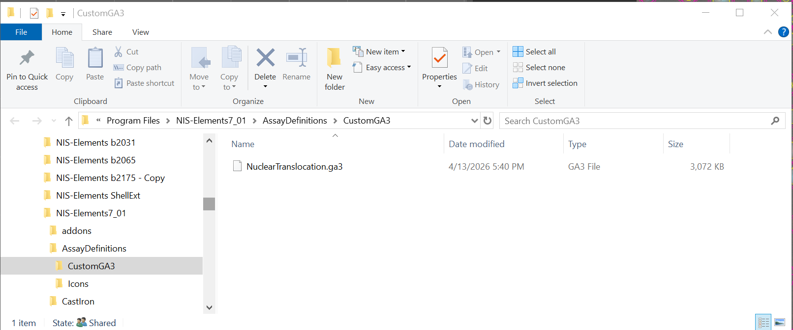
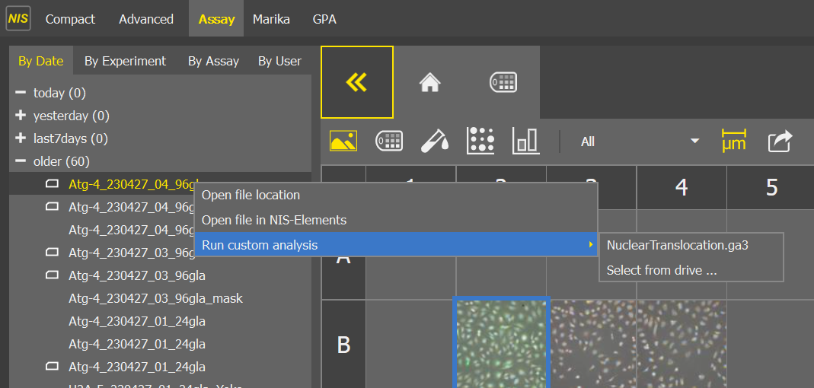
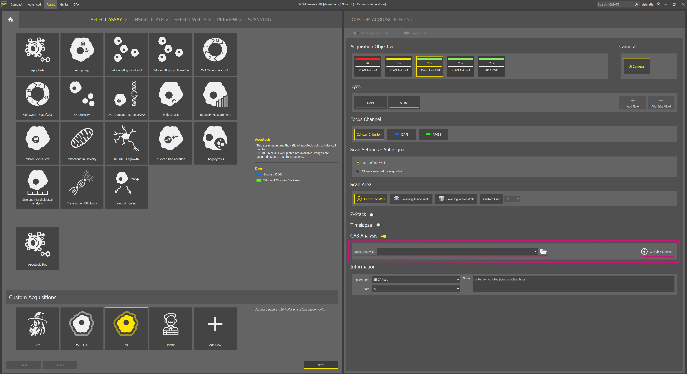

# How to import GA3 recipes

To use this recipe in Custom Acquisition (in Smart Experiment), first locate the **CustomGA3** folder on your computer and copy the recipe into this folder:

This recipe can now be run from the **Results page** under the Assay tab::

 or imported through the **Custom Acquisition Settings**:

There is also a link that will take you to a GitHub page containing additional examples for Smart Experiment – Custom Acquisition.
