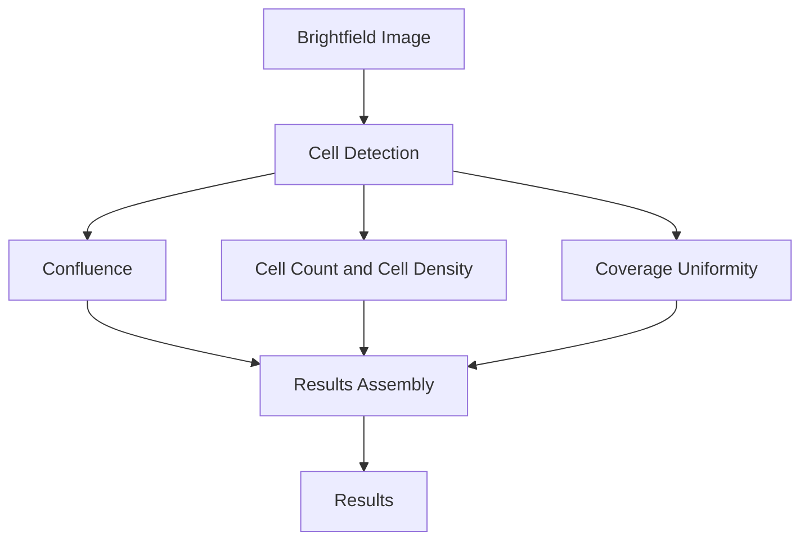
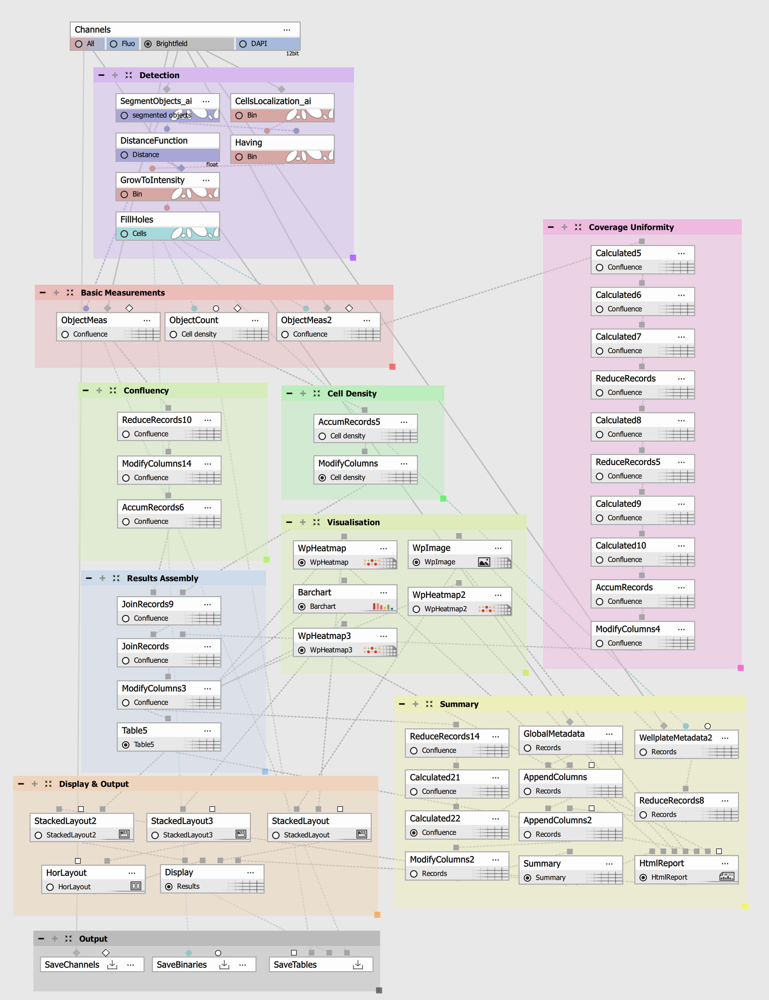
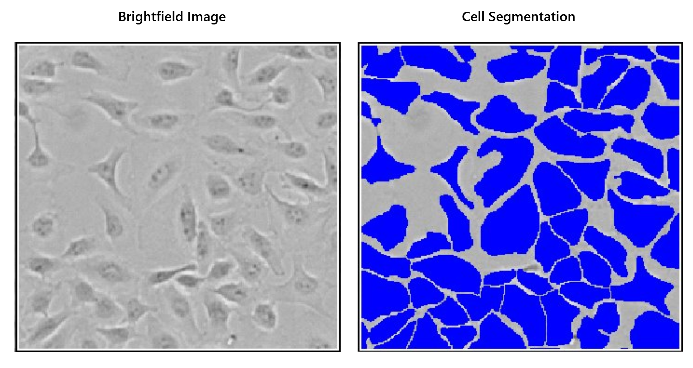
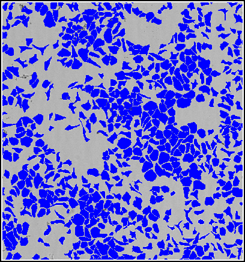
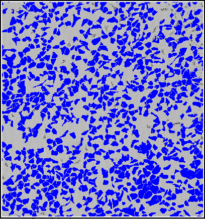
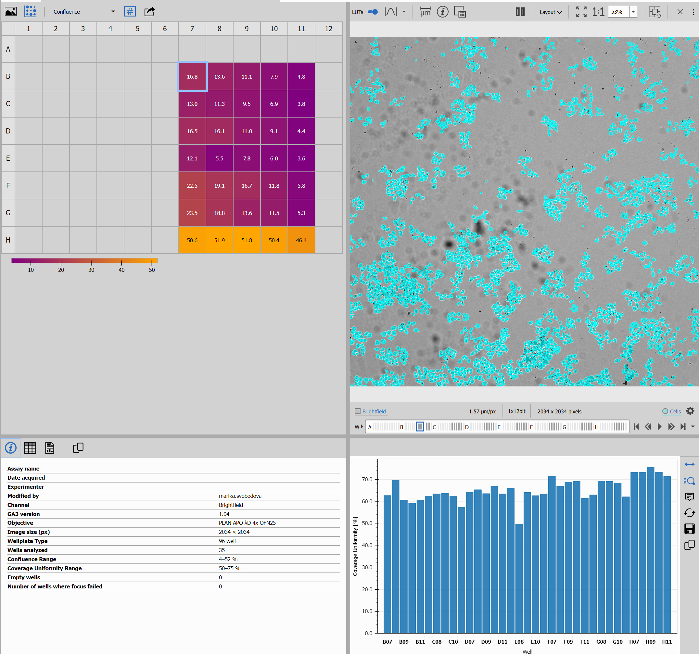

# Confluence and Coverage Uniformity - GA3 Recipe

This recipe measures **Confluence, Cell Count, Cell Density, and the spatial uniformity of cell coverage** in each analyzed well.

It provides the following measurements for each well:

- **Confluence [%]** – percentage of the image covered by cells.
- **Cell Count** – number of detected cells.
- **Cell Density [cells/mm²]** – number of detected cells per square millimeter
- **Coverage Uniformity [%]** – shows how evenly cells cover the image.

This example uses brightfield images taken with a **4× objective**.

The diagram below shows the workflow:

## Input files

Original ND2 image and analysis recipe can be downloaded from this repository:

- ND2 file [[Download file](https://lim-public-af010c85-0d3e-4156-9378-5adc1bbef7b3.s3.eu-central-1.amazonaws.com/GitHubAssets/GA3_Examples/NIS_v7.00/20-Confluency_Morphology/confluency.nd2)]

- GA3 file [[Download file](https://lim-public-af010c85-0d3e-4156-9378-5adc1bbef7b3.s3.eu-central-1.amazonaws.com/GitHubAssets/GA3_Examples/NIS_v7.00/20-Confluency_Uniformity_Coverage/Confluency_uniformity.ga3)]

- The AI Classifier is included as a pretrained model in NIS versions 7.01.03 and up. For lower versions, please [Download AI Classifier file](https://lim-public-af010c85-0d3e-4156-9378-5adc1bbef7b3.s3.eu-central-1.amazonaws.com/GitHubAssets/GA3_Examples/NIS_v7.00/10-AI_Classifiers/4x_cells_brf.oai)

The GA3 recipe used in this analysis is also available as an interactive HTML file [[View Online](https://laboratory-imaging.github.io/GA3-examples/NIS_v7.00/20-Confluence_Coverage_Uniformity/Confluency_uniformity.html)]

## Outputs

The recipe provides:

- An interactive display
- An HTML report
- A wellplate overview
- A Confluence heatmap
- A Coverage Uniformity heatmap
- A results table

## Image Requirements

This example uses **HeLa** cells imaged in the **brightfield channel** using a **4× objective**.

Use these settings for reliable results:

- **Brightfield imaging**
- **4× objective**
- Condenser Aperture: **Opened (NA 0.09)**
- **Single field of view per well** (stitched images are not supported)

If you use **Smart Experiment Custom Acquisition**, use the image acquisition settings listed below:

> **Important**
>
> Use the recommended image settings for best results. Different imaging settings may reduce cell detection quality and measurement accuracy

> **Segmentation model**
>
> The segmentation model was trained on **HeLa** cells in a 96-well plate. For other adherent cell lines, check that cell detection and measurements are correct before using the results.

## Workflow Overview

1. **Cell Detection** – Detects cells and calculates Confluence, Cell Count, and Cell Density.
2. **Coverage Uniformity** – Divides the image into smaller regions and checks how evenly cells cover the image.
3. **Results Assembly** – Combines the measurements for each well.
4. **Display and Reporting** – Shows the results in the interactive display and HTML report.

## Scope and Limitations

### Supported

Use this recipe for:

- measuring Confluence, Cell Count, Cell Density, and Coverage Uniformity
- comparing cell coverage between wells
- checking if cells are evenly distributed

### Not Supported

The recipe is not designed for:

- multiple cell populations
- multiple images per well
- stitched images
- 3D images or Z-stacks
- time-lapse analysis
- cell tracking
- datasets without wellplate information

### Typical Applications

- monitoring cell confluence
- comparing cell density between wells
- assessing the spatial uniformity of cell coverage
- finding uneven cell coverage across wells

## How to Adapt the Workflow

### Detection and Basic Measurements

Cells are detected in the **brightfield channel** using the **Segment Objects.ai** node and the pretrained segmentation model included with this recipe.

If the pretrained AI model is not available in the dropdown menu of the SegmentObjects.ai node, click on From file and select **4x_cells_brf.oai**.

The detected cells are used to calculate:

- **Confluence [%]**
- **Cell Count**
- **Cell Density [cells/mm²]**

## Basic Measurements

### Confluence

**Confluence [%]** is the percentage of the image covered by detected cells.

It is calculated as:

`Confluence [%] = Cell-covered Area / Analyzed Area × 100`

Confluence shows how much of the image is covered by cells. **Higher Confluence** indicates **greater cell coverage**.
It does not show if the cells are evenly distributed. 
### Cell Count and Cell Density

**Cell Count** is the total number of detected cells in the image.

**Cell Density [cells/mm²]** is the number of detected cells per square millimeter.

It is calculated as:

`Cell Density = Cell Count / Analyzed Area`

---

## Coverage Uniformity

**Coverage Uniformity [%]** shows how evenly cells cover the image.

The image is divided into an **8 × 8 grid (64 regions)**. Local **Confluence** is calculated for each region, and the variation between these values is used to calculate the Coverage Uniformity score.

Coverage Uniformity is calculated from the coefficient of variation (CV) of the Local Confluence values:
`CV = Standard Deviation of Local Confluence / Mean Local Confluence`

`Coverage Uniformity = 100 / (1 + CV)`

### Interpreting Coverage Uniformity

- **Higher Coverage Uniformity** – cell coverage is more even across the image.
- **Lower Coverage Uniformity** – cell coverage is less even across the image.

Coverage Uniformity should be used together with **Confluence [%]**. Images with similar Confluence can have different Coverage Uniformity if the cells are distributed differently.

| Lower Coverage Uniformity (72.0%) | Higher Coverage Uniformity (82.3%) |
|:---------------------------------:|:----------------------------------:|
|  |  |
| **Confluence:** **41.5%** | **Confluence:** **41.0%** |

*Both images have a similar Confluence (~41%), but different Coverage Uniformity because the cell coverage is distributed differently across the image.*

## Results Assembly

The Results Assembly section combines all measurements into the final results table for each well.

This section is already configured and normally does not need to be changed.

## Interactive Display

The recipe includes an interactive display for viewing and comparing the results.

It also creates an HTML report with the assay summary, wellplate overview, heatmaps, and results for each well.

## Related Recipes

Other confluence-based recipes are available:

- [Confluence and Cell Morphology](../20-Confluence_Morphology) – measures cell size and shape.
