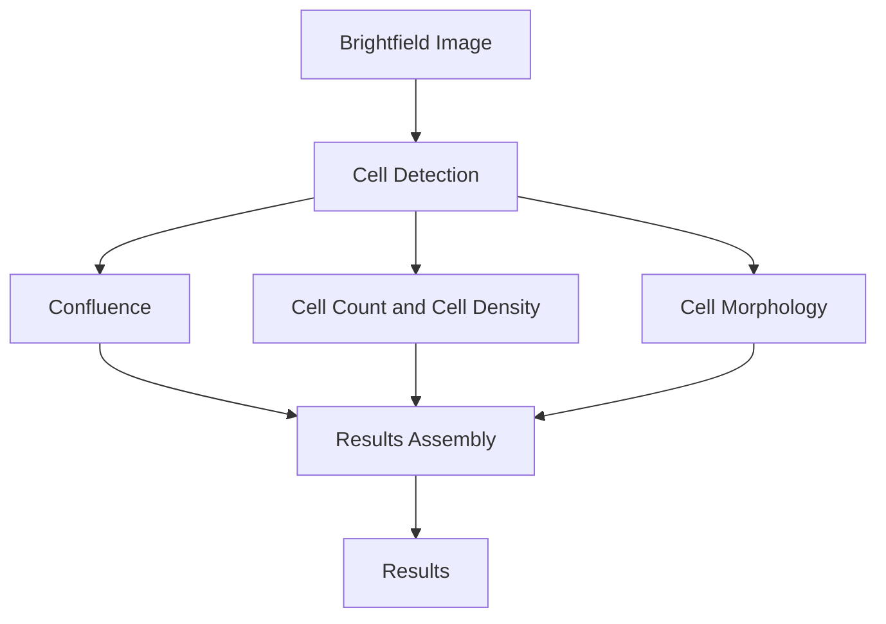
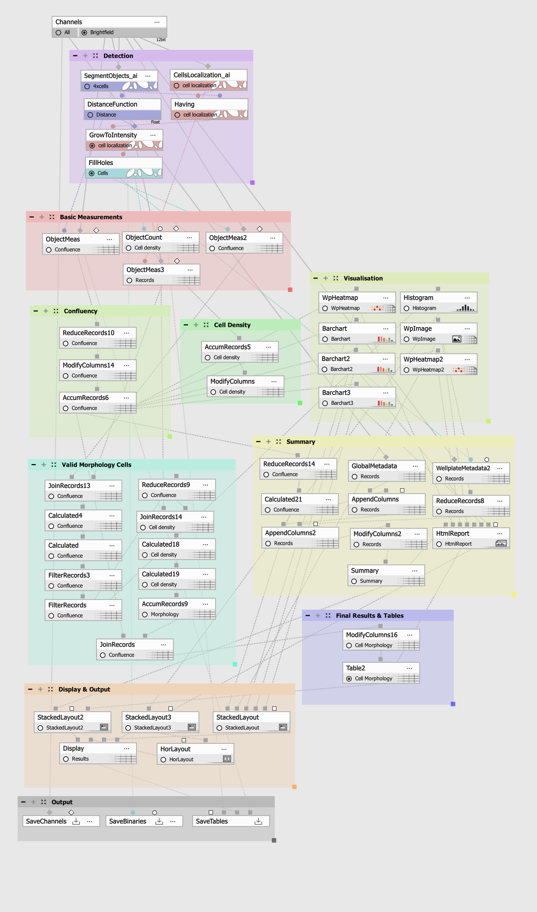
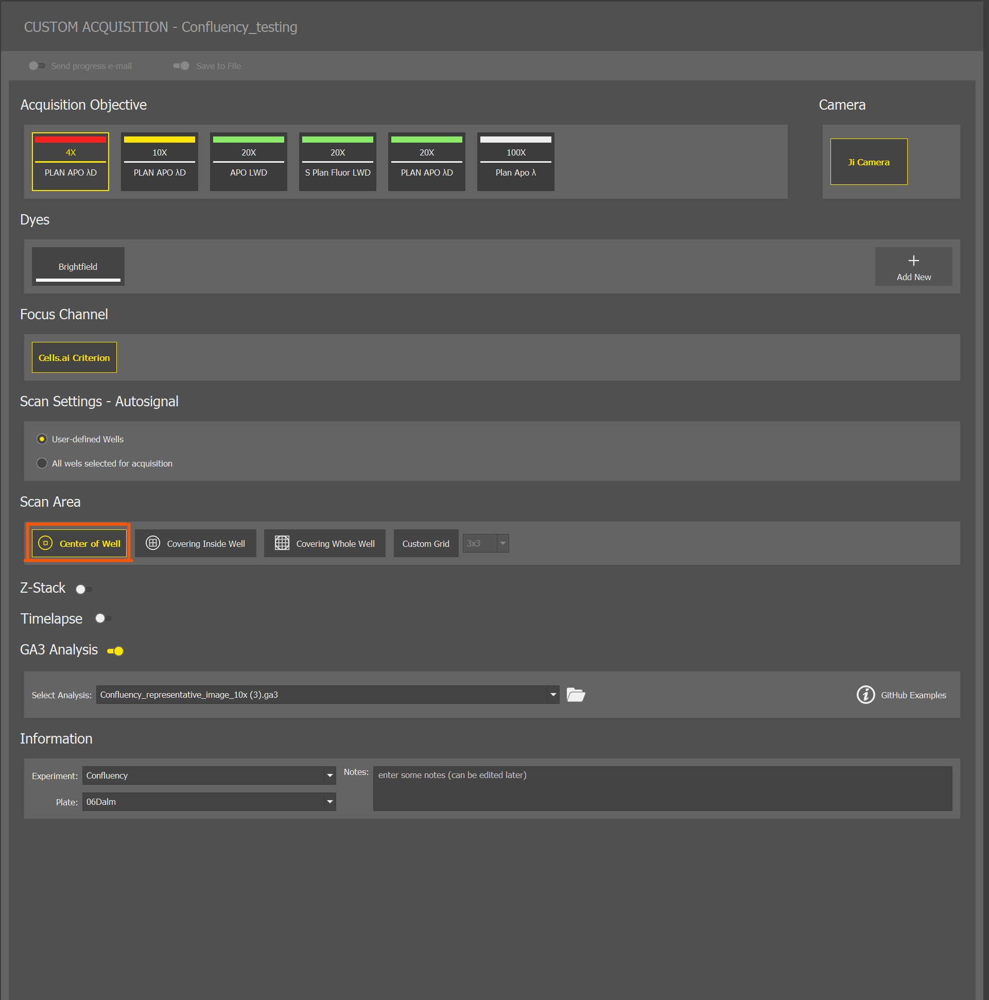
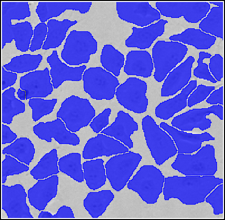
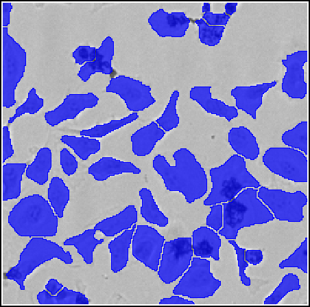
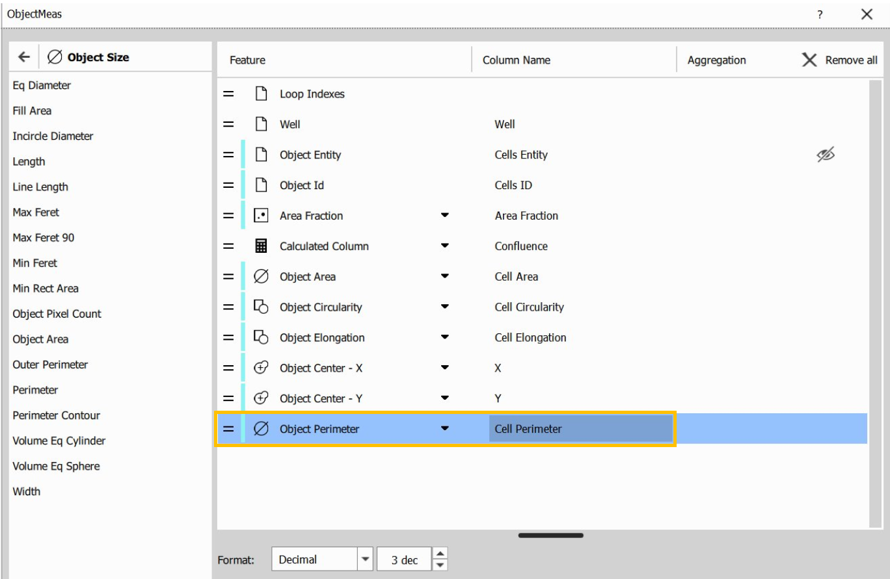
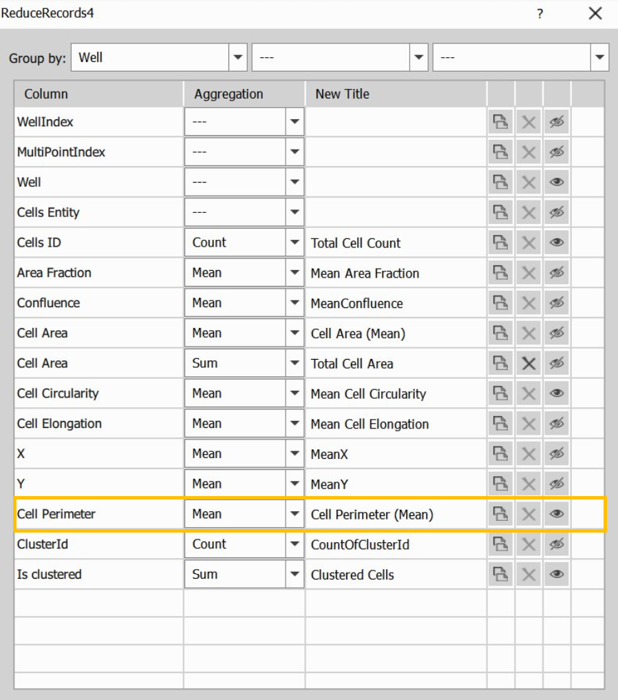
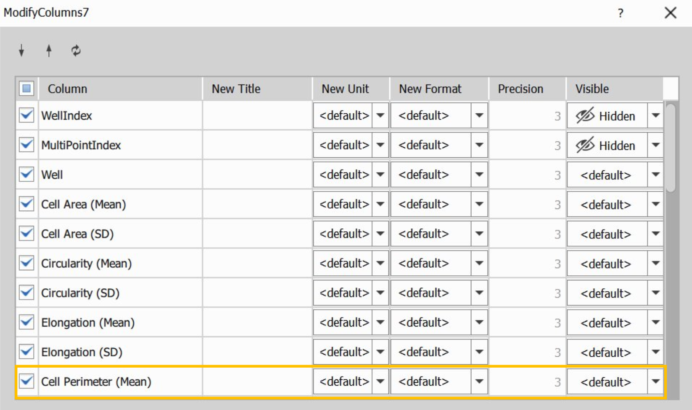
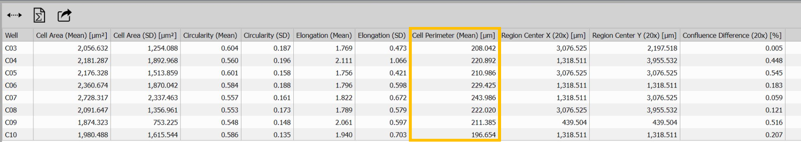
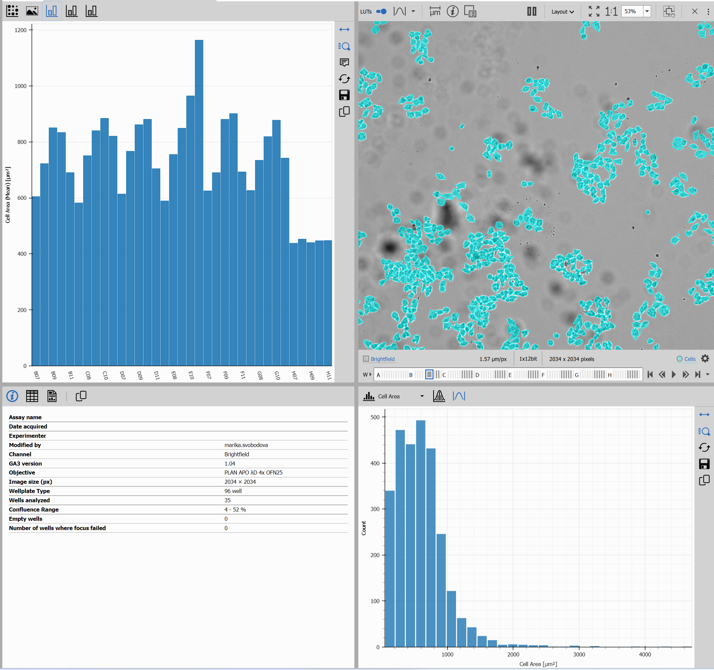

# Confluence and Cell Morphology - GA3 Recipe

This recipe measures **Confluence, Cell Count, Cell Density, and Cell Morphology** in each analyzed well.

It provides:

- **Confluence [%]** – percentage of the image covered by cells.
- **Cell Count** – number of detected cells.
- **Cell Density [cells/mm²]** – number of detected cells per square millimeter
- **Cell Morphology** – shows the size and shape of cells.

This example uses **brightfield images** taken with a **4× objective**.

The diagram below shows the workflow:

## Input files

Original ND2 image and analysis recipe can be downloaded from this repository:

- ND2 file [[Download file](https://lim-public-af010c85-0d3e-4156-9378-5adc1bbef7b3.s3.eu-central-1.amazonaws.com/GitHubAssets/GA3_Examples/NIS_v7.00/20-Confluency_Morphology/confluency.nd2)]

- GA3 file [[Download file](https://lim-public-af010c85-0d3e-4156-9378-5adc1bbef7b3.s3.eu-central-1.amazonaws.com/GitHubAssets/GA3_Examples/NIS_v7.00/20-Confluency_Morphology/Confluency_morphology.ga3)]

- The AI Classifier is included as a pretrained model in NIS versions 7.01.03 and up. For lower versions, please [Download AI Classifier file](https://lim-public-af010c85-0d3e-4156-9378-5adc1bbef7b3.s3.eu-central-1.amazonaws.com/GitHubAssets/GA3_Examples/NIS_v7.00/10-AI_Classifiers/4x_cells_brf.oai)

The GA3 recipe used in this analysis is also available as an interactive HTML file [[View Online](https://laboratory-imaging.github.io/GA3-examples/NIS_v7.00/20-Confluence_Morphology/Confluency_Morphology.html)]

## Outputs

The recipe provides:

- An interactive display for result exploration
- An HTML report
- A wellplate overview
- A confluence heatmap
- Cell morphology comparison charts
- A results table

## Image Requirements

This example uses **HeLa** cells imaged in the **brightfield channel** using a **4× objective**.

Use these settings for reliable results:

- **Brightfield imaging**
- **4× objective**
- Condenser Aperture: **Opened (NA 0.09)**
- **Single field of view per well** (stitched images are not supported)

If you use **Smart Experiment Custom Acquisition**, use the image acquisition settings listed below:

> **Important**
>
> Use the recommended image settings for best results. Different imaging settings may reduce cell detection quality and measurement accuracy

> **Segmentation model**
>
> The segmentation model was trained on **HeLa** cells in a 96-well plate. For other adherent cell lines, check that cell detection and measurements are correct before using the results.

## Workflow Overview

1. **Cell Detection** – Detects cells and calculates Confluence, Cell Count, and Cell Density.
2. **Cell Morphology** – Measures the size and shape of cells.
3. **Results Assembly** – Combines the results for each well.
4. **Interactive Display and Reporting** – Shows the results in the interactive display and HTML report.

## Scope and Limitations

### Supported

Use this recipe for:

- measuring Confluence, Cell Count, Cell Density, and Cell Morphology
- comparing cell morphology between wells
- checking changes in cell size and shape

### Not Supported

This recipe does not support:

- multiple cell populations
- multiple images per well
- stitched images
- 3D images or Z-stacks
- time-lapse analysis
- cell tracking
- datasets without wellplate information

### Typical Applications

- monitoring cell growth and confluence
- comparing cell density between wells
- checking changes in cell morphology after treatment
- checking differences in cell morphology within a well

## How to Adapt the Workflow

### Detection and Basic Measurements

Cells are detected in the **brightfield channel** using the **Segment Objects.ai** node and the pretrained segmentation model included with this recipe. 

If the pretrained AI model is not available in the dropdown menu of the SegmentObjects.ai node, click on From file and select **4x_cells_brf.oai**.

The detected cells are used to calculate:

- **Confluence [%]**
- **Cell Count**
- **Cell Density [cells/mm²]**
- **Cell Morphology**

## Basic Measurements

### Confluence

**Confluence [%]** is the percentage of the image covered by detected cells.

It is calculated as:

`Confluence [%] = Cell-covered Area / Analyzed Area × 100`

Confluence shows how much of the image is covered by cells. **Higher Confluence** indicates **greater cell coverage**.
It does not show if the cells are evenly distributed. 
### Cell Count and Cell Density

**Cell Count** is the total number of detected cells in the image.

**Cell Density [cells/mm²]** is the number of detected cells per square millimeter.

It is calculated as:

`Cell Density = Cell Count / Analyzed Area`

---
## Cell Morphology

While **Confluence** measures cell coverage, **Cell Morphology** measures the size and shape of detected cells.

Not all detected cells are used for morphology measurements. Cells that do not meet the required criteria are excluded.

The recipe also reports:

- **Valid Morphology Cells** – number of detected cells included in morphology measurements after excluding cells that did not satisfy the morphology validity criteria (for example, insufficient growth from the localization seed or cells touching the image border).

- **Valid Morphology Cells [%]** – percentage of detected cells used for morphology measurements.

For each well, the recipe reports:

- Cell Area (Mean and SD)
- Circularity (Mean and SD)
- Elongation (Mean and SD)

### Understanding Morphology Results

| Morphological Change | What It Means   |
|----------------------|--------------------------|
| **Cell Area ↑** | Cells are larger or more spread. |
| **Cell Area ↓** | Cells are smaller or more compact. |
| **Circularity ↑** | Cells are more round. |
| **Circularity ↓** | Cells are less round or more irregular. |
| **Elongation ↑** | Cells are more elongated. |
| **Elongation ↓** | Cells are less elongated, more compact, and rounded. |
| **Morphology SD ↑** | More variation between cells. |
| **Morphology SD ↓** | Less variation between cells. |

### Interpreting Morphology Variability

**The Mean** shows the average value for all analyzed cells in the well.

**The Standard Deviation (SD)** shows how much the values vary between cells.

- Lower SD – less variation between cells.
- Higher SD – more variation between cells.

| Lower Morphology Variability | Higher Morphology Variability |
|:----------------------------:|:-----------------------------:|
|  |  |

*Illustrative examples of lower and higher morphology variability.*

#### Adapting the Morphology Measurements

You can add or remove morphology measurements and change how the results are calculated and displayed.

To change the morphology measurements:

1. Open **Object Measurements** and select the measurements you want to use. For example, Area, Circularity, Elongation, or Perimeter. In this example, **Perimeter** is added:

   

2. In **Reduce Records**, choose how to calculate the results for each well. For example, use Mean for the average value or Standard Deviation to show how much the values differ between cells:

3. In **Modify Columns**, select the measurements you want to show. You can also change their names, units, number format, and decimal places:

4. Check the morphology results table:

5. You can also add the selected measurements to graphs, wellplate views, or the HTML report.

> **Note**
>
> Check the **units** for each measurement. For example, Cell Area is reported in µm². Circularity and Elongation have no units.

## Results Assembly

The **Results Assembly** section combines all measurements into the final results table.

This section is already configured and normally does not need to be changed.

## Interactive Display

The recipe includes an interactive display for viewing and comparing the results. The morphology charts show Cell Area, Circularity, and Elongation for each well.

The recipe also creates an HTML report with the assay summary, wellplate overview, heatmaps, and results table.

## Related Recipes

Other confluence-based recipes are available:

- [Confluence and Coverage Uniformity](../20-Confluence_Coverage_Uniformity) – shows how evenly cells cover the image.
