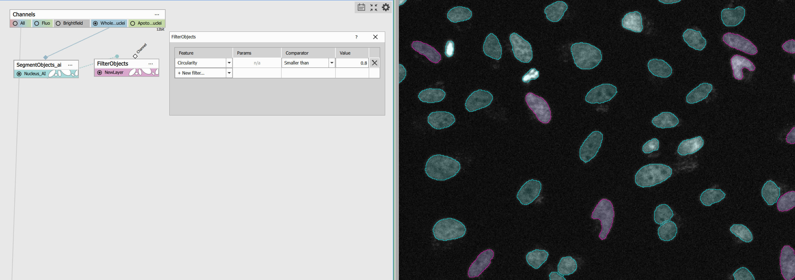
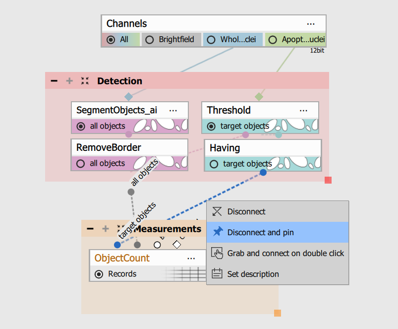
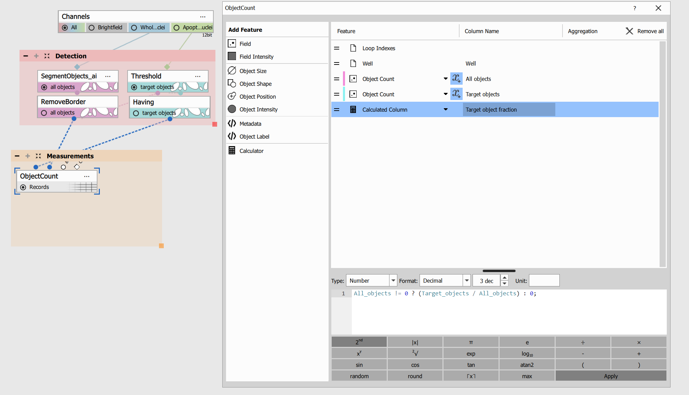

# Population Fraction GA3 Recipe

The Population Fraction Recipe is a flexible workflow for measuring how many objects (**Target Objects**) meet a defined condition  within a  population (**All Objects**). For example, all cells are counted as All Objects, while cells expressing a proliferation marker are counted as Target Objects. Target Objects are simply objects that meet your defined condition — this can be based on signal, morphology, or any measured feature. The result is always expressed as the **fraction of Target Objects within All Objects**.

This example workflow demonstrates **apoptosis analysis** using Caspase 3/7 Green signal detection.

## Input files

Original ND2 image and analysis recipe can be downloaded from this repository:

- ND2 file [[Download file](https://lim-public-af010c85-0d3e-4156-9378-5adc1bbef7b3.s3.eu-central-1.amazonaws.com/GitHubAssets/GA3_Examples/NIS_v7.00/20-Population_fraction/Apoptosis_Pop_Fraction.nd2)]

- GA3 file [[Download file](https://lim-public-af010c85-0d3e-4156-9378-5adc1bbef7b3.s3.eu-central-1.amazonaws.com/GitHubAssets/GA3_Examples/NIS_v7.00/20-Population_fraction/Population_Fraction_recipe.ga3)]

The GA3 recipe used in this analysis is also available as an interactive HTML file [[View Online](https://laboratory-imaging.github.io/GA3-examples/NIS_v7.00/20-Population_Fraction/recipe.html)]

## Outputs

- Target Objects count and All Objects count
- Fraction of Target Objects
- Dose-response metrics (EC50/IC50)

## Image Requirements

This workflow can be used without modification for two-channel images: one channel for detecting **All Objects** (e.g., DAPI or Hoechst nuclei) and one channel for identifying **Target Objects** based on marker signal, reporter signal, or morphology.

## Common Workflow Principle

1. **Detection** - First, All Objects are segmented. The target channel is then thresholded, and Target Objects are identified based on overlap with the thresholded signal. Target Objects are then detected by thresholding the reference signal.
2. **Measurements** - All Objects and Target Objects are counted, and the Fraction of target objects is calculated.
3. **Figures, tables, derived metrics** - Results are summarized using object counts and the calculated target fraction.
4. **Summary and report** - The rest of the sections are to optimize the content and the look of the final tables, figures and report.

## Scope and Limitations

### Supported

This workflow is suitable for assays that measure the **fraction of objects meeting a defined condition** within a population.  It assumes that **Target Objects are a subset of All Objects**.

The workflow is primarily count-based but can be extended to other metrics (e.g. intensity, area) if consistently applied to both populations.

### Not Supported

- analyses where Target Objects are not part of the reference population
- workflows comparing separate object populations
- parent–child or tracking workflows
- region-based intensity measurements (e.g., nucleus vs cytoplasm)
- multinucleated cells or workflows where one nucleus does not represent one cell
- analyses without a defined reference population

### Compatible Assay Types

- live/dead and apoptosis assays (dead or apoptotic cells are measured as a fraction of all detected cells)
- proliferation assays (where marker-positive cells such as EdU or Ki67 are quantified)
- transfection and infection assays (where reporter-positive/infected cells are measured relative to the total cell population)
- marker-based assays, e.g. protein expression, reporter signal, differentiation markers
- DNA damage assays, e.g. γH2AX, 53BP1
- senescence assays, e.g. SA-β-gal, p21/p16
- morphology-based classification assays
- quality-control assays, e.g. valid objects

## How to Adapt the Workflow

In this example, two object groups were segmented: **All Objects** and **Target Objects** with apoptotic signal (Caspase 3/7 Green).

All Objects were segmented using *Segment Objects.ai*. The subset of objects with apoptotic signal was identified using *Thresholding* followed by the *Having* node, which keeps only objects overlapping with the thresholded signal:

Depending on your data, other approaches can be used. In most applications, the workflow detects objects containing a specific signal, but **object shape, size, or other measured features** can also define the target population. For example, All Objects can be segmented using *Segment Objects.ai*, measured for features such as circularity, and filtered using the *Filter Objects* node to identify the Target Objects:

To make it easier to reconnect nodes, some connections (particularly in the Detection section) include **labels**. To use this feature, open the context menu on a connection and select *Disconnect and pin*. This will anchor the connection at the point where you opened the menu, with its label visible:

In the Measurements section, All Objects and Target Objects are counted, and the Fraction of target objects is calculated:

If you follow our recipe, your results will look like this:

## Final note

This overview introduces the basic workflow of the Population Fraction GA3 Recipe. For a step-by-step guide, see [Population Fraction - Detailed Guide](../20-Population_fraction_Detailed_Guide)
