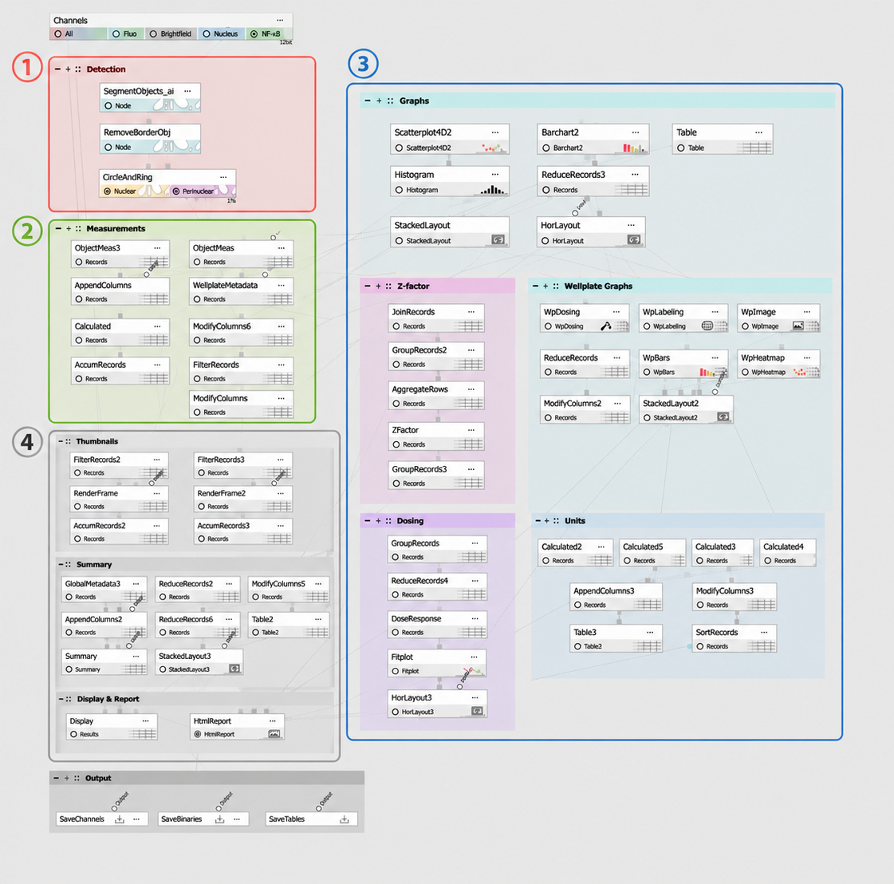
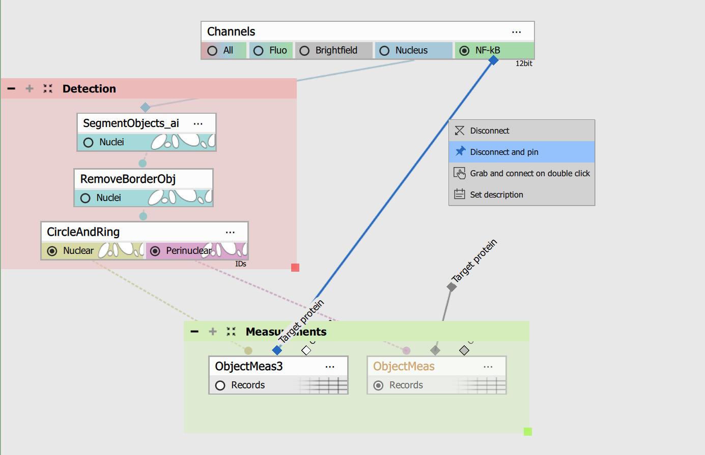
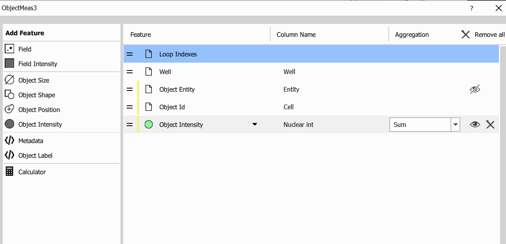
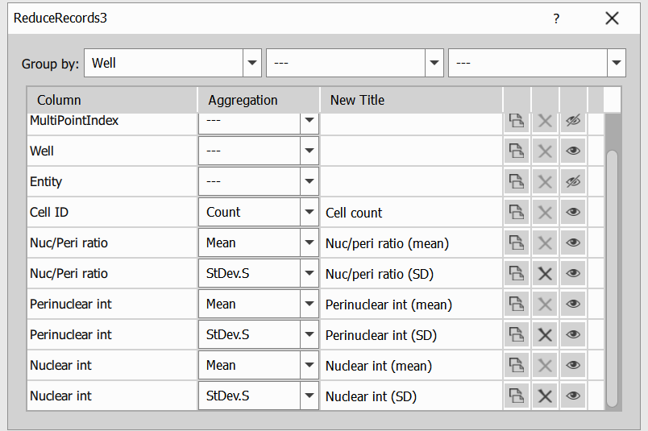

# Nuclear Translocation GA3 Recipe

This workflow was originally developed for a translocation assay, where signal moves between the cytoplasm and nucleus in response to treatment. It can also be applied to related assays that measure **signal distribution between the nucleus and the cytoplasmic or perinuclear region**.
Any assay that compares signal between these regions using intensity and ratio-based outputs can be analyzed using this workflow with minimal adaptation.

## Input files

Original ND2 image and analysis recipe can be downloaded from this repository:

- ND2 file [[Download file](https://lim-public-af010c85-0d3e-4156-9378-5adc1bbef7b3.s3.eu-central-1.amazonaws.com/GitHubAssets/GA3_Examples/NIS_v7.00/40-Nuclear_Translocation/Nuclear_Translocation.nd2)]

- GA3 file [[Download file](https://lim-public-af010c85-0d3e-4156-9378-5adc1bbef7b3.s3.eu-central-1.amazonaws.com/GitHubAssets/GA3_Examples/NIS_v7.00/40-Nuclear_Translocation/NuclearTranslocation.ga3)]

The GA3 recipe used in this analysis is also available as an interactive HTML file [[View Online](https://laboratory-imaging.github.io/GA3-examples/NIS_v7.00/40-Nuclear_Translocation/recipe.html)]

## Outputs

- nuclear intensity
- cytoplasmic or perinuclear intensity
- region-based ratios (nuclear/cytoplasmic ratio, nuclear/perinuclear ratio)
- dose-response metrics (EC50/IC50)

## Image Requirements

This workflow can be used without modification for images acquired with two channels: one for **nuclei** (e.g., DAPI, Hoechst) and one for the **target protein/reporter** (e.g., NF-κB).

## Common Workflow Principle

1. **Detection** - Cells are segmented into distinct regions. In this example, segmentation is based on the nucleus and a surrounding circular region representing the perinuclear space. Alternatively, regions can be defined as nucleus and cytoplasm.
2. **Measurements** - Signal intensity is measured in each region for all detected cells.
3. **Figures, tables, derived metrics** - These measurements are compared, and the results are summarized using intensity values and ratios between regions.
4. **Summary and report** - The rest of the sections are to optimize the content and the look of the final tables, figures and report.

## Scope and Limitations

### Supported

This workflow is suitable for assays that measure signal distribution between the nucleus and the cytoplasmic or perinuclear region. It assumes one nucleus per cell.

### Not Supported

- cell count or live/dead (viability) assays
- morphology-only analysis
- total whole-cell intensity without region separation
- multi-nucleated cells 
- organelle-specific measurements requiring different segmentation strategies

### Compatible Assay Types

- transcription factor nuclear translocation assays (e.g., NF-κB, FOXO, STAT, GR)
- kinase translocation reporter (KTR) assays (e.g., ERK-KTR, AKT-KTR)
- nuclear import/export assays (e.g., NLS/NES reporters)
- nucleocytoplasmic localization assays (e.g., YAP/TAZ, β-catenin, p53)
- …

## How to Adapt the Workflow

In this example, the nucleus and perinuclear region are **segmented** using *Segment Objects.ai* and *Make Ring & Circle* nodes:

Depending on your data, other approaches can be used. For example, nucleus and cytoplasm can be segmented using a **cell formation workflow** (i.e. *Growing to Intensity* → *Smooth Objects* → *Remove Border Objects* → *Make Cell*). Alternatively, *Cellpose3* or *CellposeSAM* can be used to segment nuclei and cells, from which the cytoplasmic region can be derived. Additional filtering or cleanup steps can be used to further refine the segmentation.

To make it easier to reconnect nodes, some connections (particularly in the Detection section) include **labels**. To use this feature, open the context menu on a connection and select *Disconnect and pin*. This will anchor the connection at the point where you opened the menu, with its label visible:

In the Measurements section, you select which **features to calculate**, such as mean, sum, or other intensity-based metrics, depending on your data:

**Column names and labels** shown in tables and graphs are usually defined in nodes such as *Reduce Columns*, *Calculated Column*, or *Modify Columns*. If you want to rename variables or adjust outputs, these are the easiest places to do it:

## Final note

This overview introduces the basic workflow of the Nuclear Translocation GA3 Recipe. For a step-by-step guide, see [Nuclear Translocation GA3 Recipe - Detailed Guide](../40-Nuclear_Translocation_Detailed_Guide)