# Nuclear Translocation GA3 Recipe - Detailed Guide

## Overview

This recipe is split into several sections that reflect a typical analysis workflow:

- **Detection** – identification of objects (e.g. cells, nuclei)  
- **Measurements** – quantitative features are obtained (e.g. intensity)  
- **Outputs** – tables, graphs, and figures for reporting (Graphs, Wellplate Graphs, Thumbnails)  
- **Calculated outputs** – derived metrics such as Z-factor and Dose response  
- **Summary** – contains all final tables and graphs, where you can adjust layout and presentation  
- **Display & Report** – stores the final Display node and the generated HTML report  
- **Units** (optional) – allows management of units in final tables (can be ignored if not needed)  

## Input files

Original ND2 image and analysis recipe can be downloaded from this repository:

- ND2 file [[Download file](https://lim-public-af010c85-0d3e-4156-9378-5adc1bbef7b3.s3.eu-central-1.amazonaws.com/GitHubAssets/GA3_Examples/NIS_v7.00/40-Nuclear_Translocation/Nuclear_Translocation.nd2)]

- GA3 file [[Download file](https://lim-public-af010c85-0d3e-4156-9378-5adc1bbef7b3.s3.eu-central-1.amazonaws.com/GitHubAssets/GA3_Examples/NIS_v7.00/40-Nuclear_Translocation/NuclearTranslocation.ga3)]

The GA3 recipe used in this analysis is also available as an interactive HTML file [[View Online](https://laboratory-imaging.github.io/GA3-examples/NIS_v7.00/40-Nuclear_Translocation/recipe.html)]

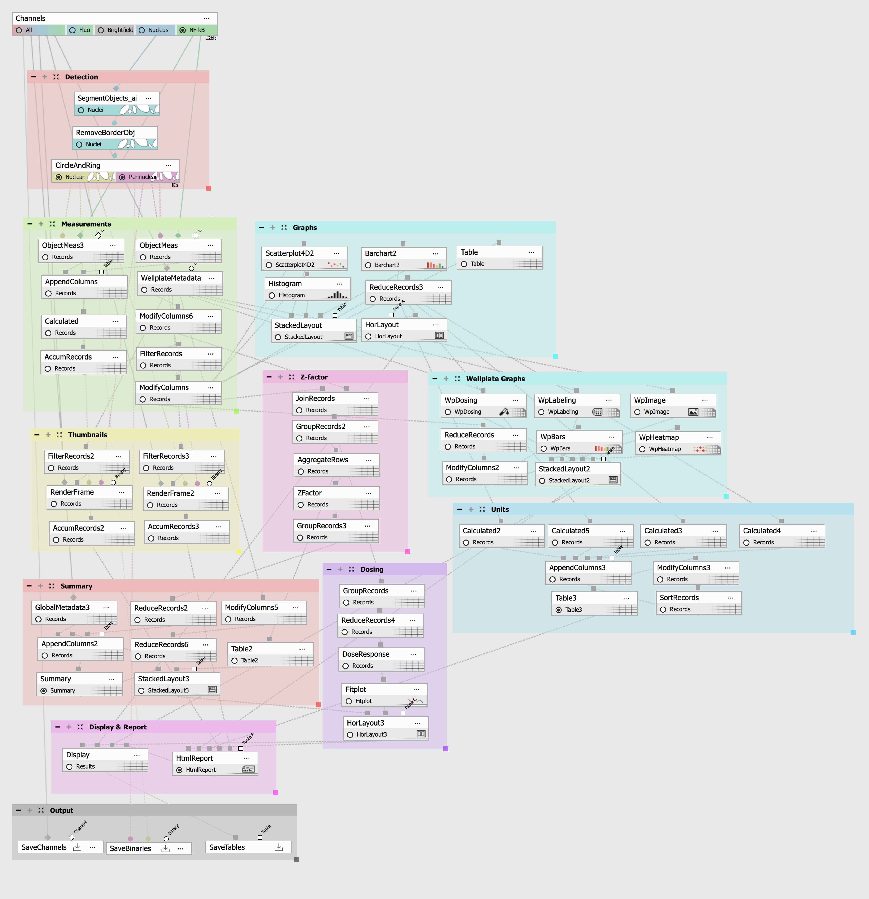

## Scope and Limitations

### Supported

This workflow is suitable for assays that measure signal distribution **between the nucleus and the cytoplasmic or perinuclear region**. It assumes one nucleus per cell.

### Not Supported

- cell count or live/dead (viability) assays
- morphology-only analysis
- total whole-cell intensity without region separation
- multi-nucleated cells
- organelle-specific measurements requiring different segmentation strategies

### Compatible Assay Types

- transcription factor nuclear translocation assays (e.g. NF-κB, FOXO, STAT, GR)
- kinase translocation reporter (KTR) assays (e.g. ERK-KTR, AKT-KTR)
- nuclear import/export assays (e.g. NLS/NES reporters)
- nucleocytoplasmic localization (e.g. YAP/TAZ, β-catenin, p53)
- ...

## Preparing data for outputs

Before data can be used for graphs, tables, or calculated metrics, it needs to be transformed into the correct format.
This is why the workflow contains nodes such as *Modify Columns*, *Group Records* and *Reduce Records*.
These nodes **aggregate, format and rename** data, meaning you move from: **object-level** measurements (individual cells) to **well-level** summaries (across all cells in one plate).

**A single value per well** is obtained by calculating the mean, standard deviation, or similar metrics. Since new columns are created at this step, this is also where you define how your measurements will appear in the final outputs.

## Workflow Step-by-step

To better understand the workflow, let’s look at a few sections and how they are constructed:

### Detection

We start with segmentation: by connecting *Segment Objects.ai* to *Nucleus* channel, we detect all nuclei in a well. To remove incomplete nuclei that are on the image border, we use *Touching borders*. *Make Circle & Ring* creates an interior circle (nuclei) and a surrounding ring (perinuclear space):

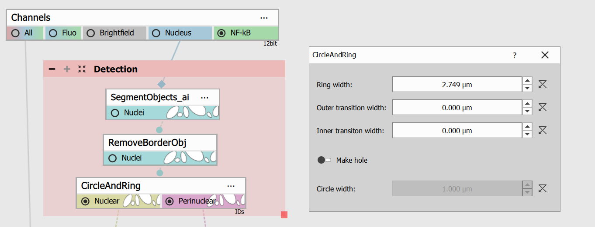

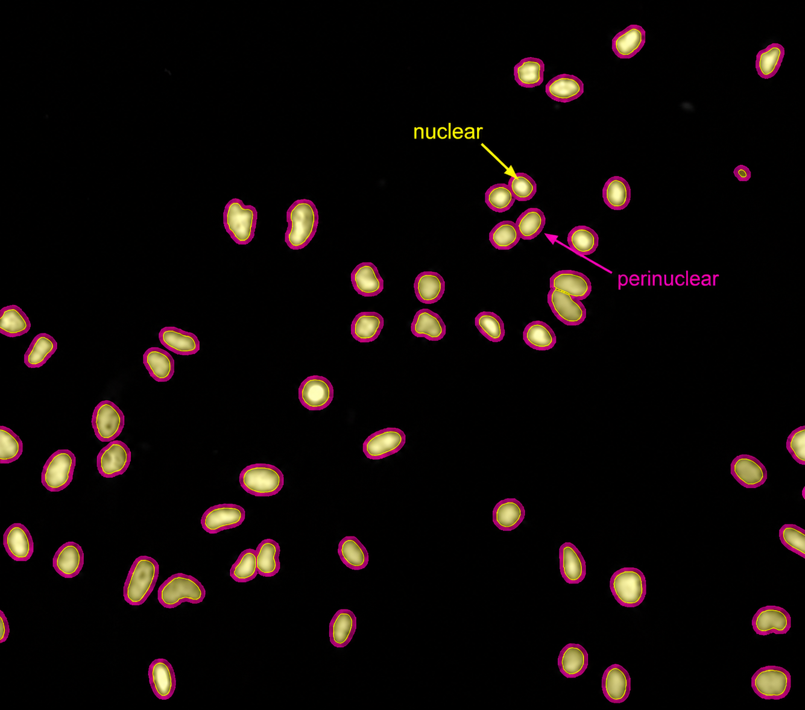

### Measurements

Here, measurements are calculated for **individual cells** (i.e. objects).
Two object measurement nodes are used to measure intensity:

- one for the perinuclear region
- one for the nuclear region  

Each *Object Measurement* node is also connected to the *Target protein* channel to measure the intensity of the protein, in this case NF-κB. Here we used *Sum*, but you can choose whichever aggregation method best fits your data. You can also change the column name based on your segmentation input:

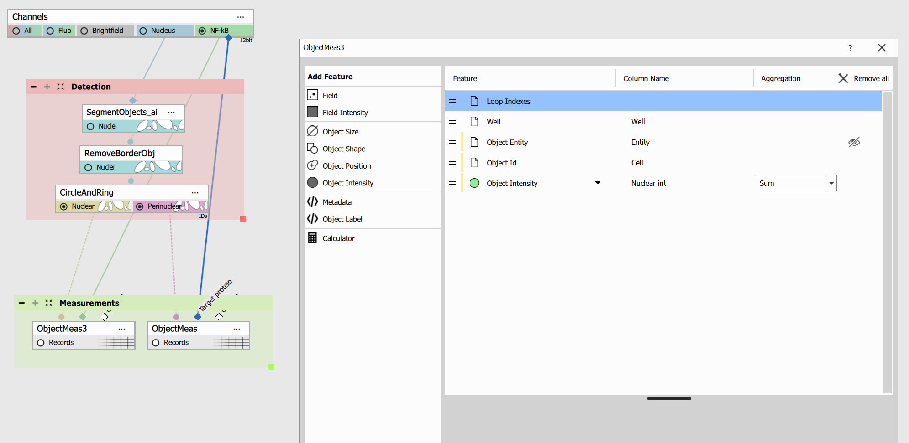

These measurements are combined using *Append Columns*, creating a single table with nuclear and perinuclear intensity for each object in the selected well. A *Calculated Column* is then used to compute the Nuclear/Perinuclear ratio for each object, adding a new column to the table:

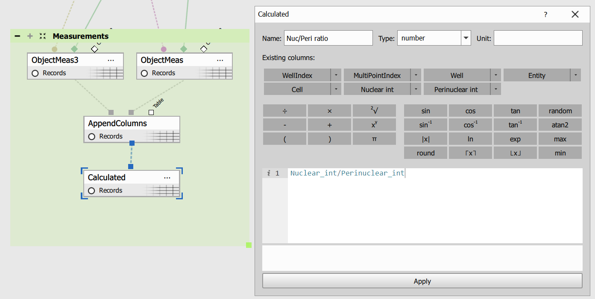

At this stage, the data still represents individual cells in a **selected well** (e.g. A1). To gather measurements for all cells **across all wells** (e.g. A1–D6), we use *Accumulate Records*, followed by *Filter Records* to remove empty wells:

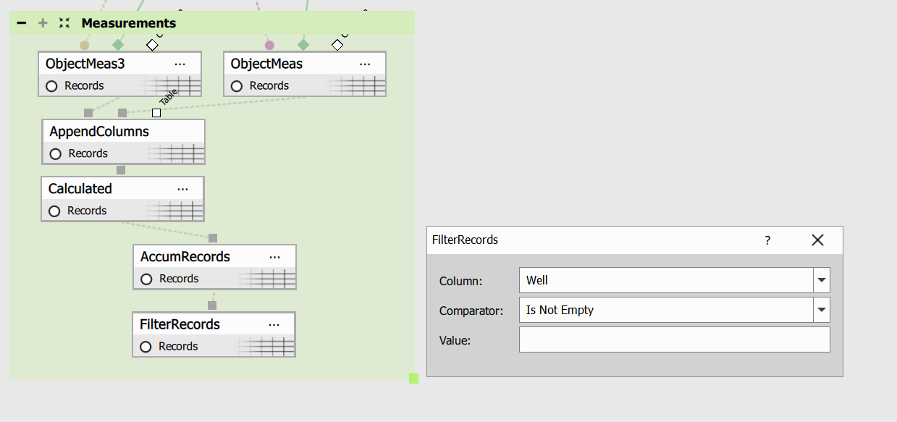

A *Modify Columns* node is used to clean up naming (e.g. Cell → Cell ID):

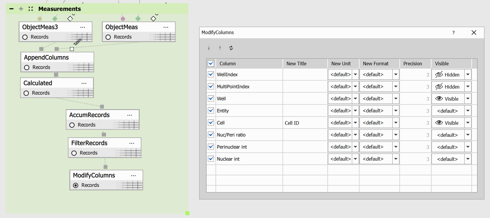

This results in a complete table containing measurements for **all cells across all wells**. This is what our table looks like right now:

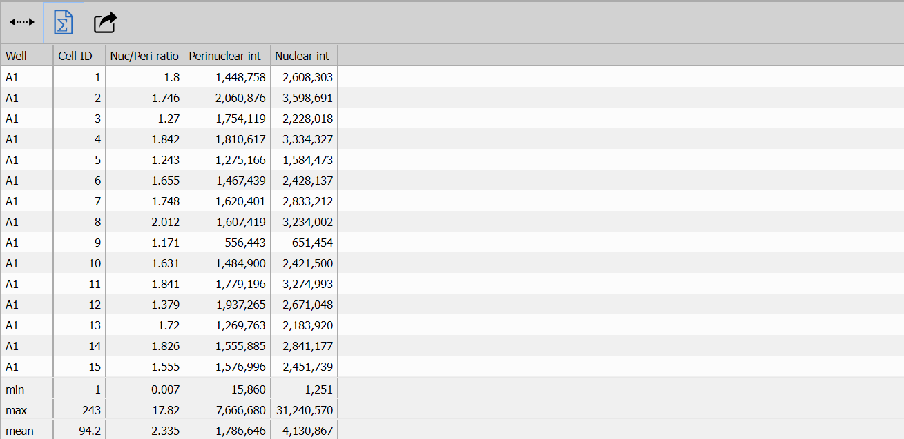

### Graphs

The table we created can be used directly for figures that require **all of the measured objects**:

- **Scatter plots** - each cell is plotted as a single point
- **Histograms** - each cell contributes one value
- **Interactive tables** - each cell can be displayed in the image

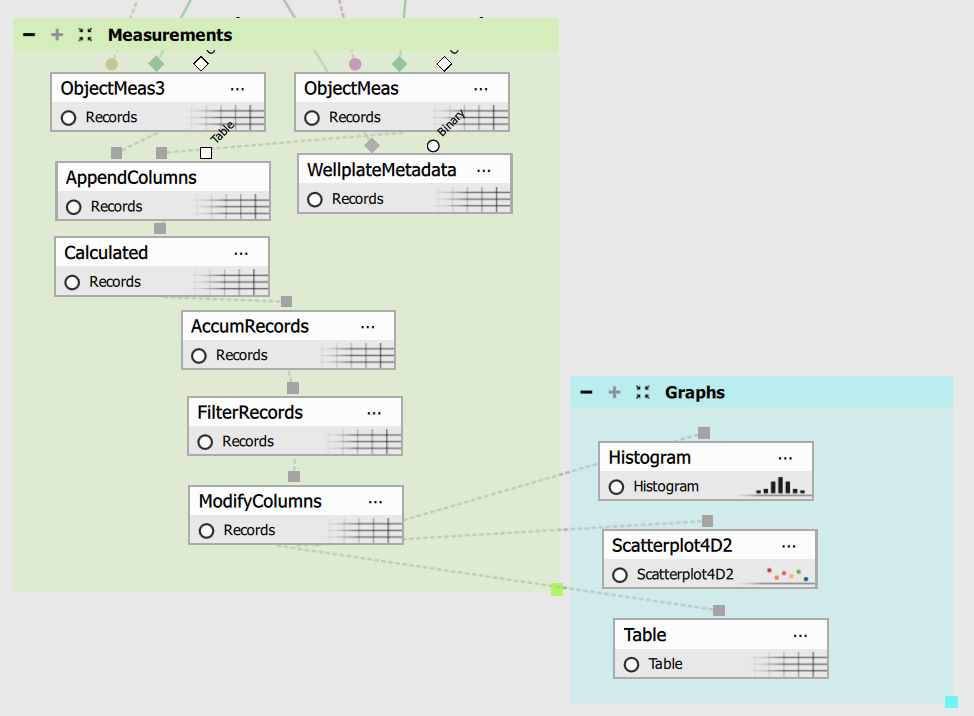

Most downstream analyses, however, require a **single value per well** rather than per object. This means that all values within a well need to be aggregated into a single result. To achieve this, the workflow uses *Reduce Records* (with *Group by* set to *Well*), which aggregates the object-level table into one row per well:

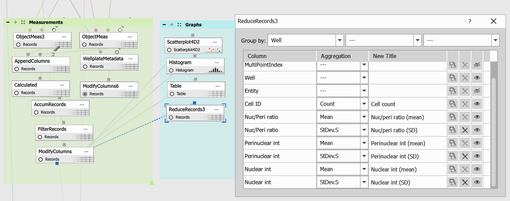

Here, measurements such as nuclear intensity are **aggregated across a well** (typically using mean and standard deviation), and new variables are created (e.g. *Nuc/peri ratio (mean)*, *Nuclear int (SD)*). Our table is looking like this right now:

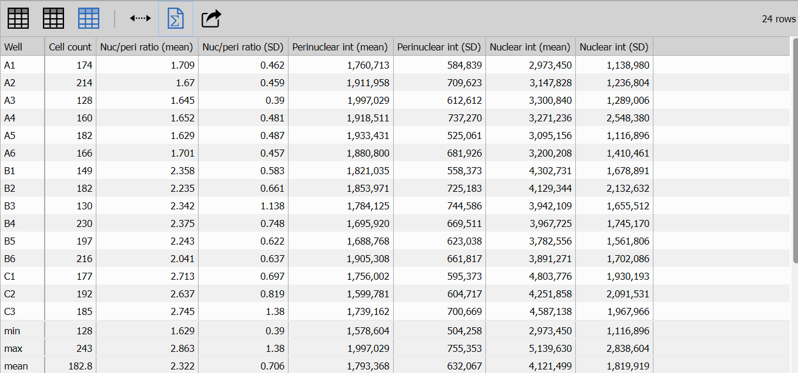

This table can be used to create other figures or can be passed directly to a *Table* node which can then be connected to *HTML Report* as a final table. Optionally, you can further clean up the table to make it easier to interpret (See the *Units* section below).

### Units (*optional*)

Since the aggregation method is set to *Sum*, the resulting values can be relatively large. To make them easier to interpret, the table is passed to the Units section, where unit conversions can be applied using *Calculated Column* nodes.

Here, new columns are created (Mean Perinuclear Intensity, Perinuclear Intensity (SD), Mean Nuclear Intensity, Nuclear Intensity (SD)), where the original values are divided by 1000 and expressed in thousands (K).

This step is optional and only needed if unit adjustment is required.

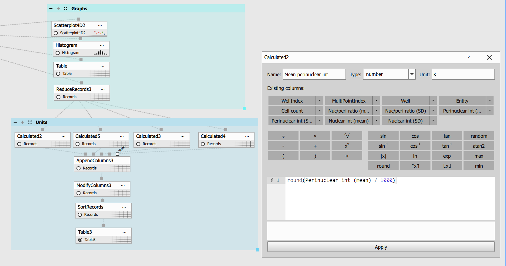

The *Calculated Columns* are then combined into a single table using *Append Columns*. The *Modify Columns* node is used to control which columns are displayed, hiding the original values and keeping only the converted ones:

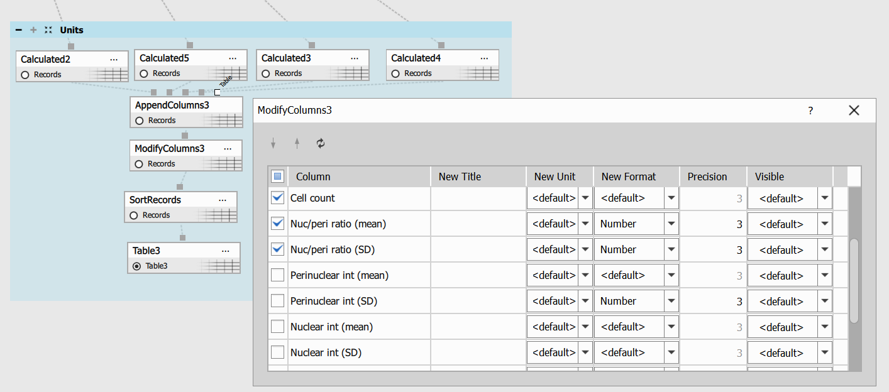

*Sort Records* is used to sort the table in ascending order. The result is then passed to a *Table* node for presentation:

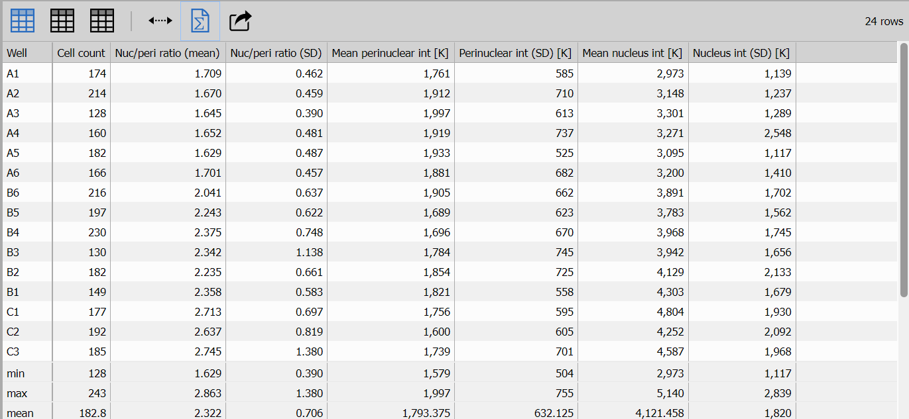

### Wellplate Graphs

Now that we have a **single value per well** for nuclear/perinuclear ratio, nuclear intensity and perinuclear intensity, we can pass the values to figures such as:

- **Bars** - each value is proportional to the height of the bar (mean nuclear intensity, mean perinuclear intensity)
- **Heatmap** - one feature value (Nuc/peri ratio) in each well

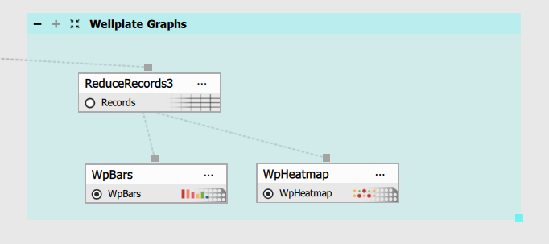

Some outputs do not depend directly on signal measurements, but instead on **well plate–level metadata**. The metadata is included in your scanned images and provides additional information (e.g. compound details and concentrations, positive and negative controls). The *Wellplate Metadata* node (connected to *All Channels*) extracts metadata associated with the wellplate:

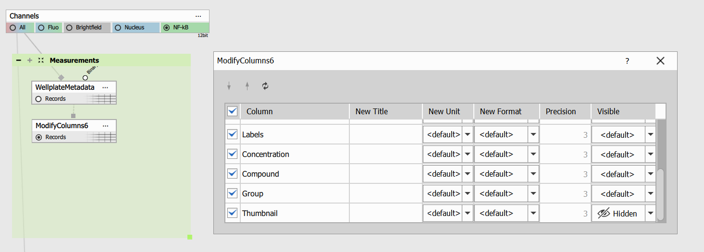

*Optional*: A *Modify Columns* node can be used here to hide unnecessary information (e.g. thumbnail-related fields).  Otherwise, this node can be skipped.

This table can be used directly for figures that require only **wellplate metadata**:

- **WP Dosing**
- **WP Labeling**
- **WP Image**

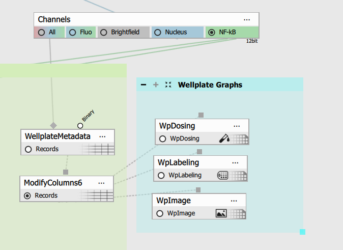

For these figures to appear in the final results, we arranged them in a layout using *Stacked Layout* and then connected to *Display*:

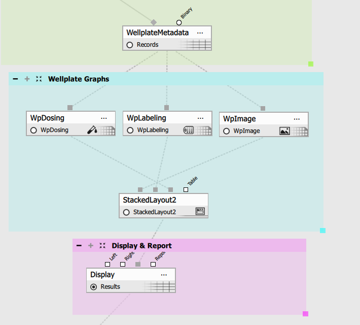

### HTML Report

The HTML Report provides a summary of your results. To keep the same report format and ensure it displays correctly, keep the nodes connected as shown and **do not change their order**, as each section in the report corresponds to a specific node in the workflow.

## Final note

We have covered several sections of the recipe and demonstrated how to detect, measure, and transform data into clear graphs and tables. Before you begin, keep the following in mind:

When *creating a figure*, consider what type of data it requires:

- **all cell measurements** (e.g. scatter plot, histogram, interactive table)
- **a single measurement per well** (e.g. WP Bars, WP Heatmap, Z-factor, Dose response)

When *gathering data*, consider what type of information you need:

- measurements derived from **the measured signal** (e.g. Scatterplot, Histogram, Interactive table)
- data stored in **the wellplate metadata** (e.g. WP Dosing, WP Labeling, WP Image)
- combination of **both** (e.g. Z-Ratio, Dose Response)
