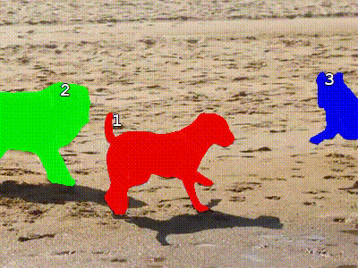
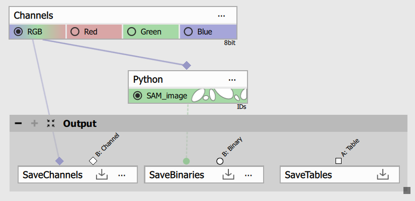
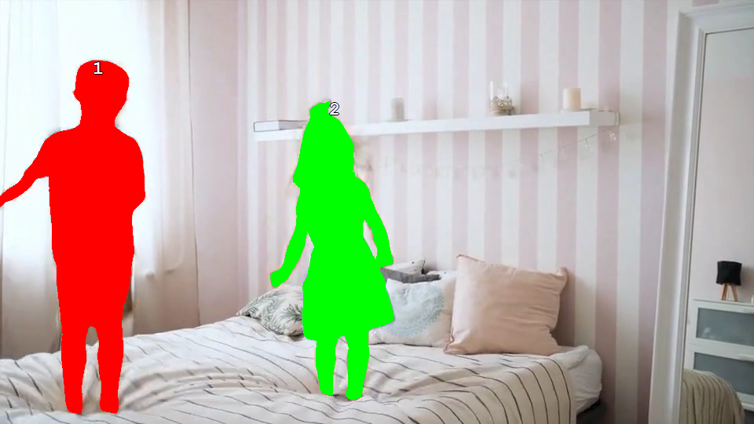

# Running SAM 3 from a custom Python node in GA3

This example shows how to run a custom GA3 Python node in NIS-Elements v7 with `sam3` for text-prompted image segmentation.

## What this example covers

- creating a Python environment for `sam3`,
- configuring the generic Python node in GA3,
- inserting the real node script from this folder and
- using a text prompt to segment people in single image

### 1) Detection in single image

The node script used in this example is [codes/sam3_image.py](./codes/sam3_image.py). It loads a SAM 3 image model, applies the text prompt `people`, and writes the detected objects into a GA3 Binary output.

This example was tested with the current [SAM3 GitHub](https://github.com/facebookresearch/sam3) `main` branch commit `e54adc4` from March 30, 2026.

It can be tested, for example, on the sample data from the SAM3 GitHub repository such as
[assets\videos\bedroom.mp4](https://github.com/facebookresearch/sam3/blob/main/assets/videos/bedroom.mp4).

### 2) Detection in timelapse
The animation below shows the video variant, [codes/sam3_video.py](./codes/sam3_video.py), used for object tracking in a timelapse sequence. The text prompt is applied on the first frame, and SAM 3 then propagates the tracked objects through the remaining frames while keeping their IDs.



To try this workflow yourself:
1) use an ND2 dataset with a time loop,
2) follow the same setup steps as in this example,
3) paste [codes/sam3_video.py](./codes/sam3_video.py) into the Python node instead of [codes/sam3_image.py](./codes/sam3_image.py) and
4) adjust the text prompt so it matches the objects in your image.

## Setup overview

The setup process has these main steps:

1. Add a generic `Python` node to the GA3 graph.
2. Configure it as described in `Configure the Python node`.
3. Install SAM3 from GitHub as described in `Install SAM3 from GitHub`.
4. Authenticate Hugging Face access as described in `Authenticate Hugging Face access`.
5. Paste [`sam3_image.py`](./codes/sam3_image.py) into the Python node.
6. Connect `Channels -> Python -> Save Binaries` and run preview.

## Configure the Python node

For this example:

1. Add the generic `Python` node from `ND Processing & conversions`.
2. Open the Python node dialog.
3. Add one color input and one binary output using the buttons in the top toolbar of the node window.
4. Switch the interpreter mode from `Internal Python` to `Managed environment`.
5. Set `Environment name` to `Sam3`, or choose another name if you prefer.
6. In the environment definition field, select or paste the contents of [`environment.yaml`](./codes/environment.yaml).
7. Start the environment installation from the node dialog and wait until it finishes. The progress is written in the built-in command window.
8. Locate the environment folder created by NIS. You can open it directly using the button in the environment settings window.
   It is usually created under:

   `C:\ProgramData\Laboratory Imaging\NIS-Express\<User>\PythonEnvs\`

   Replace `<User>` with your Windows username.

9. Close the environment settings window, then open it again before installing SAM3.

> [!NOTE]
> GA3 starts a Python process immediately after the environment installation finishes, and that
> process can prevent SAM3 from being installed cleanly into the environment.

10. The commands in the next sections assume the `Environment name` is `Sam3`.
    If you use a different environment name, replace `Sam3` in the example paths with your actual name.

Use this environment definition:

```yaml
channels:
    - conda-forge
dependencies:
    - python=3.12.4
    - pip
    - pip:
        - numpy
        - torch==2.7.0
        - torchvision
        - "--extra-index-url=https://download.pytorch.org/whl/cu126"
        - setuptools<81
        - psutil
        - triton-windows
        - einops
        - pycocotools
        - huggingface_hub
```

This is the base environment used with the provided script.
It prepares Python 3.12, CUDA 12.6 PyTorch wheels, and the supporting packages.
The `sam3` package itself is installed later from the GitHub checkout.

## Install SAM3 from GitHub

1. Download or clone the SAM3 repository from GitHub to a local folder.
   If you do not use Git, you can click `Code -> Download ZIP` on GitHub and extract it to a local folder.
2. Open a terminal in the SAM3 repository root, where `pyproject.toml` is located.
   On Windows, you can open the folder in File Explorer, click the address bar, type `cmd`, and press `Enter`.
3. The commands below use these example paths:

   - managed environment:
     `C:\ProgramData\Laboratory Imaging\NIS-Express\<User>\PythonEnvs\Sam3`
   - local SAM3 repository:
     `C:\Users\<User>\Downloads\sam3`

   Replace `<User>` with your Windows username.
   If your managed environment or SAM3 repository is stored in a different location, adjust the paths accordingly.
4. Install SAM3 into the NIS Python environment with:

```cmd
"C:\ProgramData\Laboratory Imaging\NIS-Express\<User>\PythonEnvs\Sam3\python.exe" -m pip install -e "C:\Users\<User>\Downloads\sam3"
```

This installs the SAM3 package from your local GitHub checkout into the managed environment.

## Authenticate Hugging Face access

1. Create a Hugging Face access token:

   - sign in to `https://huggingface.co/`
   - open `Settings -> Access Tokens`
   - click `New token`
   - create at least a `read` token
   - copy the generated token

2. Request access to the SAM3 model repository:

   - open `https://huggingface.co/facebook/sam3`
   - sign in with the same Hugging Face account
   - review the access conditions
   - agree to share the requested contact information with Meta
   - wait until the model page becomes accessible from your account

3. Authenticate Hugging Face downloads with:

```cmd
"C:\ProgramData\Laboratory Imaging\NIS-Express\<User>\PythonEnvs\Sam3\Scripts\hf.exe" auth login
```

When prompted, paste the token you created in the previous step.

## Model files

The current script calls:

```python
model = build_sam3_image_model()
```

That means model file resolution is handled by the installed `sam3` package or its default configuration,
not by explicit hardcoded paths in the GA3 script.

### Automatic model download location

If the model is downloaded automatically through Hugging Face, the files are typically stored in the
Hugging Face local cache under the current user profile.

Typical default location on Windows:

```text
C:\Users\<User>\.cache\huggingface\hub
```

For the `facebook/sam3` repository, the cached folder typically contains a path like:

```text
C:\Users\<User>\.cache\huggingface\hub\models--facebook--sam3
```

This location can be changed by setting the `HF_HOME` or `HF_HUB_CACHE` environment variables.

### Manual model linking

If you want to point the node to downloaded model files explicitly, replace:

```python
model = build_sam3_image_model()
```

with a version that passes the required paths as parameters, for example:

```python
model = build_sam3_image_model(
    checkpoint_path=r"<ModelFolder>\sam3.pt",
    bpe_path=r"<ModelFolder>\bpe_simple_vocab_16e6.txt.gz",
)
processor = Sam3Processor(model)
```

Use this approach when:

- the package cannot find the downloaded weights automatically,
- you want to keep the model files in a custom location or
- you need to switch between multiple checkpoints manually

Update the paths to match your local files.

## Build the GA3 graph

1. Add or keep the `Channels` source node in the graph.
2. Connect the desired image channel to the Python node input.
3. Connect the Python binary output to a node that displays or saves binaries.
4. Open the Python node and paste the code from [`sam3_image.py`](./codes/sam3_image.py) into the script editor if it is not there already.
5. Confirm that the node has one image input and one binary output.
6. Run preview or execute the workflow.

### Minimal graph

A minimal graph for this example is:

`Channels -> Python -> Save Binaries`



## Python node code

Paste the content of [`sam3_image.py`](./codes/sam3_image.py) into the Python node.

> [!NOTE]
> This folder also contains a video-tracking variant, [`sam3_video.py`](./codes/sam3_video.py).
> The Python node setup and package installation are the same. To track objects through a video,
> replace the image script with the video script in the node editor.

```python
# IMPORTANT: 'limnode' must be imported like this (not from nor as)
import limnode
import numpy as np

model = None
processor = None

# defines output parameter properties
def output(inp: limnode.InDefTuple, out: limnode.OutDefTuple, par: limnode.UserParTuple) -> None:
    out[0].makeNew("SAM_image", "#00ff00").makeInt32()

# return Program for dimension reduction or two-pass processing
def build(par: limnode.UserParTuple, loops: limnode.LoopDefs) -> limnode.Program|None:
    pass

# called for each frame/volume
def run(inp: limnode.InDataTuple, out: limnode.OutDataTuple, par: limnode.UserParTuple, ctx: limnode.RunContext) -> None:
    global model, processor
    if model is None or processor is None:
        from sam3.model_builder import build_sam3_image_model
        from sam3.model.sam3_image_processor import Sam3Processor
        model = build_sam3_image_model()
        processor = Sam3Processor(model)

    import torch

    src = inp[0].data[0, :]
    if src.ndim == 3 and src.shape[2] == 1:
        src = np.repeat(src, 3, axis=2)

    src = torch.from_numpy(src)
    src = src.permute(2, 0, 1)
    src = src.contiguous()
    src = src.float()
    src_min, src_max = src.min(), src.max()
    src = (src - src_min) / (src_max - src_min)

    with torch.autocast("cuda", dtype=torch.bfloat16):
        inference_state = processor.set_image(src)
        inference_state = processor.set_text_prompt(state=inference_state, prompt="people")
    nb_objects = len(inference_state["scores"])

    for i in range(nb_objects):
        m = inference_state["masks"][i].squeeze(0).cpu().numpy()
        out[0].data[0, :, :, 0][m] = i + 1

# child process initialization (when outproc is set)
if __name__ == '__main__':
    from limnode import print
    limnode.child_main(run, output, build)
```

## How the script works

### Output definition

The script creates one new binary output named `SAM_image`:

```python
def output(inp: limnode.InDefTuple, out: limnode.OutDefTuple, par: limnode.UserParTuple) -> None:
    out[0].makeNew("SAM_image", "#00ff00").makeInt32()
```

The output uses `int32`, so each object can be written with its own label value.

### Lazy model initialization

The SAM 3 model is loaded only once:

```python
if model is None or processor is None:
    from sam3.model_builder import build_sam3_image_model
    from sam3.model.sam3_image_processor import Sam3Processor
```

That avoids rebuilding the model for every frame.

### Input conversion

The GA3 image tensor is read from:

```python
src = inp[0].data[0, :]
```

If the image is single-channel, it is duplicated into 3 channels:

```python
if src.ndim == 3 and src.shape[2] == 1:
    src = np.repeat(src, 3, axis=2)
```

Then it is converted to a PyTorch tensor in `C, H, W` order and normalized to `0..1`.

### Text-prompted segmentation

The prompt used in the example is:

```python
inference_state = processor.set_text_prompt(state=inference_state, prompt="people")
```

You can change `"people"` to another prompt if needed.

### CUDA autocast

The model call is wrapped in:

```python
with torch.autocast("cuda", dtype=torch.bfloat16):
    inference_state = processor.set_image(src)
    inference_state = processor.set_text_prompt(state=inference_state, prompt="people")
```

This example is intended for CUDA execution.
The `torch.autocast("cuda", dtype=torch.bfloat16)` wrapper is included as a workaround for
a dtype mismatch bug in the current SAM3 version on GitHub, where some CUDA operations mix
`float32` with lower-precision tensors.

### Writing results back to GA3

Each returned SAM mask is written to the binary output with a unique object ID:

```python
for i in range(nb_objects):
    m = inference_state["masks"][i].squeeze(0).cpu().numpy()
    out[0].data[0, :, :, 0][m] = i + 1
```

## Result

The result below shows that the children in the image were successfully detected as separate objects.


