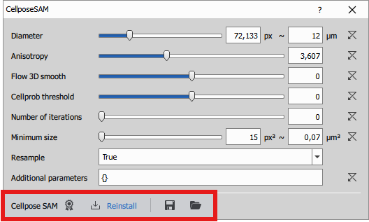
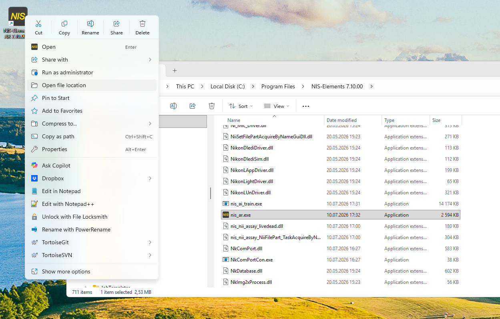
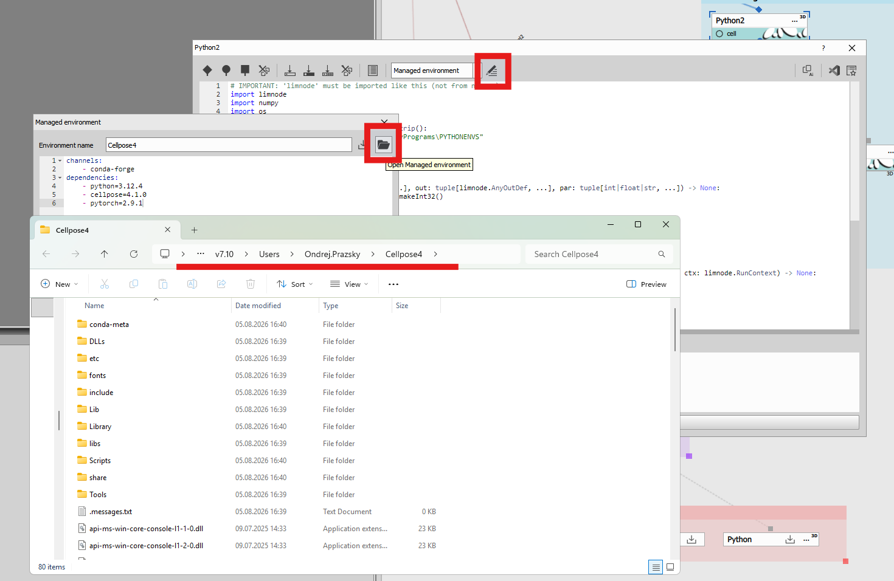

# Python environments

## Overview

Python nodes support running the python code in an **external python process**.

Python nodes like
[Cellpose](https://nis-express-help.laboratory-imaging.com/ref/nodes/segmentation/#czlimga3nodepycellpose4node),
[Stardist](https://nis-express-help.laboratory-imaging.com/ref/nodes/segmentation/#czlimga3nodepystardist),
[InstanSeg](https://nis-express-help.laboratory-imaging.com/ref/nodes/segmentation/#czlimga3nodepyinstanseg) and optionally
[Python](https://nis-express-help.laboratory-imaging.com/ref/nodes/nd-processing-conversions/#czlimga3nodepygenericnode) use separately installed
python **environment** that bundle everything needed for the given task without affecting the system python nor the NIS built-in python.

The environments are managed by NIS hence they are called **Managed environments**. Their definition can be saved within python node
and recreated on different machine from the ga3 recipe alone. They are typically big - several gigabytes. Thats the why the environments are
not installed automatically. They must be installed explicitly from the NIS GUI when a node complains that a given environment
is not installed (GAExecutor installs it silently).



The built-in nodes have buttons to:

- display the license of the main package,
- install/reinstall button that triggers the micromamba installation as described below,
- save the environment definition yaml and
- open the folder with the environment (or the parent when not installed yet).

Managed environments are analogous to the well known *conda environments* where "[mamba](https://github.com/mamba-org/mamba) is
a reimplementation of the conda package manager in C++" that has a commercial friendly license.

NIS uses the bundled **micromamba** executable to create managed Python environments from an `environment.yml` definition file.
Micromamba installs the exact Python version and package dependencies declared by the node without touching system or NIS internal
Python installation. Micromamba uses *root prefix* to store the package cache and it's own internal state; each node environment has
its own *environment prefix*, which contains the actual interpreter and packages used by that node.

### Environment definition

The environment is defined using a YAML file here referred to as `environment.yml`.

For example the **Cellpose SAM** node uses a definition like this:

```yaml
name: NisCellpose4
channels:
    - conda-forge
dependencies:
    - python=3.12.4
    - cellpose=4.1.0
    - pytorch=2.9.1
```

The name is the last folder in the environment prefix folder where the NIS expects to find the python environment.
It looks specifically for `pythonw.exe`.

For this example, the NIS-Elements shared environment prefix is:
```
C:\ProgramData\Laboratory Imaging\NIS-Elements\PythonEnvs\vX.YY\System\NisCellpose4
```

### Environment prefix

The environment prefix is a folder where NIS expects to find the environment.

- built-in python nodes have this name predefined
- for Python node it is the Environment name specified in the node dialog

| Application | Shared prefix for built-in nodes | Per-user prefix for the Python node |
| --- | --- | --- |
| NIS-Elements | `%PROGRAMDATA%\Laboratory Imaging\NIS-Elements\PythonEnvs\vX.YY\System` | `%PROGRAMDATA%\Laboratory Imaging\NIS-Elements\PythonEnvs\vX.YY\Users\%USERNAME%` |
| NIS-Express (current-user installation) | `<executable folder>\PythonEnvs` | `<executable folder>\PythonEnvs` |
| NIS-Express (all-users installation) | `%PROGRAMDATA%\Laboratory Imaging\NIS-Express\PythonEnvs\vX.YY\System` | `%PROGRAMDATA%\Laboratory Imaging\NIS-Express\PythonEnvs\vX.YY\Users\%USERNAME%` |
| GAExecutor | `%PROGRAMDATA%\Laboratory Imaging\GAExecutor\PythonEnvs\vX.YY\System` | `%PROGRAMDATA%\Laboratory Imaging\GAExecutor\PythonEnvs\vX.YY\Users\%USERNAME%` |

NOTES:
- the locations above can be pasted into the Windows file browser to reveal the contents of the folder
- `%PROGRAMDATA%` is an environment variable typically pointing to `C:\ProgramData`
- `%USERNAME%` is the current Windows user name
- `vX.YY` is derived from the NIS major/minor version and is formatted as `vX.YY`
- NIS-Express (allusers) is an
[installation of NIS-Express](https://nis-express-help.laboratory-imaging.com/docs/installation/) using `/ALLUSERS`


> [!NOTE]
>
> The locations in the above table can be altered by defining the `LIM_PYTHON_ENVS_PREFIX` environment variable.
>
> It replaces the `%PROGRAMDATA%\Laboratory Imaging` part of these paths. The <product>, `PythonEnvs`, <version> and `System`/`Users`
> subfolders are still appended. `System` is for built-in nodes and `Users\%USERNAME%` for Generic Python-node
> environments.
>
> This is not available for NIS-Express current-user installation.

### Mamba root prefix

Is a folder that contains downloaded cached python packages, mamba internal settings and scripts that may be executed
during installation.

| Application | root prefix |
| --- | --- |
| NIS-Elements | `%PROGRAMDATA%\Laboratory Imaging\MambaRoot` |
| NIS-Express (current-user installation) | `<executable folder>\MambaRoot` |
| NIS-Express (allusers) | `%PROGRAMDATA%\Laboratory Imaging\MambaRoot` |
| GAExecutor | `%PROGRAMDATA%\Laboratory Imaging\MambaRoot` |

> [!NOTE]
>
> The locations can ba altered using `LIM_MAMBA_ROOT` that replaces the complete Mamba root path.
>
> This is not available for NIS-Express current-user installation.

## Manual environment installation

```bat
"C:\Program Files\NIS-Elements\micromamba.exe" --no-rc --root-prefix "<mamba_root>" create --prefix "<environment_folder>" -f "<environment.yml>" -y
```

Where:
- **"<mamba_root_folder>"** is to be replaced with actual folder according to the application (keep the quotes around the path),
- **"<environment_folder>"** is to be replaced with actual folder according to the application and followed by the environment name (keep the quotes around the path) and
- **"<environment.yml>"** is to be replaced by the actual file containing the environment.

## Troubleshooting environments

When the environment is not working inside NIS python. Try if it is working by itself:
1. Activate it,
2. Run the `python.exe` from the environment and
3. Test the modules (for AI load the models to see if they download, load and use GPU).

### Interactive activation in `cmd.exe`

1. Right-click the 'NIS-Elements AR 7.10.00 64-bit' icon,
2. Select the 'Open file location' (you should see the Windows file browser with the executable selected),
3. in the top location bar type `cmd` (this should run the command-prompt)
4. type `micromamba.exe --version` to verify it is available (it should return `2.3.0`)



5. Find out the environment location (in the folders described above) and copy it to the clipboard



6. Set the paste the folder into a variable like this:

```
SET "ENV=<PASTE HERE!!!>"
```

7. Run this command (from the NIS location where we tested `micromamba.exe --version`):

```bat
FOR /F "delims=" %A IN ('micromamba.exe shell activate -p "%ENV%" --shell cmd.exe') DO CALL "%A"
```

> [!NOTE]
>
> It may throw some error for an unquoted path in OpenCL hook:
>
> ```
> ...Cellpose4\Library\etc\OpenCL\vendors\temp.txt
> The system cannot find the path specified
> ```
> but otherwise it should be OK.
>
> Test the environment is activated by:
> ```bat
> echo %CONDA_PREFIX%
> ```
> should output the `ENV` folder.

8. Run the python:

```bat
"%ENV%\python.exe"
```

9. Test the environment.

For Cellpose try to import it and instantiate a model

```py
from cellpose import models
model = models.CellposeModel(gpu=True)
```

## About environment variables

For in-depth understanding see the article on [Wikipedia](https://en.wikipedia.org/wiki/Environment_variable).

To set an environment variable temporarily in a terminal session:
```bat
SET "LIM_MAMBA_ROOT=D:\NIS-Python\MambaRoot"
SET "LIM_PYTHON_ENVS_PREFIX=D:\NIS-Python"
"C:\Program Files\NIS-Elements\micromamba.exe" --no-rc --root-prefix "%LIM_MAMBA_ROOT%" create --prefix "%LIM_PYTHON_ENVS_PREFIX%\NIS-Elements\PythonEnvs\vX.YY\System\NisCellpose4" -f environment.yml -y
```

`LIM_PYTHON_ENVS_PREFIX` is a prefix override, not a full environment-prefix override. `LIM_MAMBA_ROOT` is a full
Mamba-root override.

To set a variable permanently per user or system:

Press `Win` + `R` and run:

```
rundll32 sysdm.cpl,EditEnvironmentVariables
```

This opens the Environment Variables dialog directly.

> [!IMPORTANT]
>
> Applications must be restarted in order to see the new variable.
